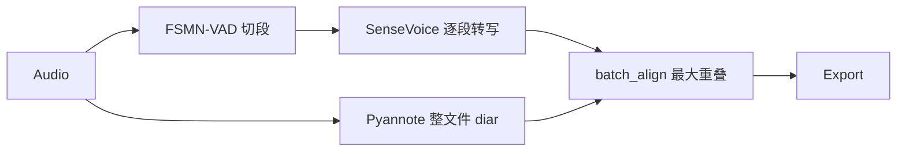

# Diar-First 说话人分离改进 — 实施方案

## 一、背景

当前批处理采用 **VAD-first + 后对齐**（见 [batch_pipeline.py](c:\python\workspace\python_voicetotext\src\voicetotext\asr\batch_pipeline.py)）：



实测 `20260506_001.m4a`（约 101 秒）仅产出 **13 段**，其中 #2 为 **30 秒整段** 混有提问方与回答方多轮对话，却整段标为 `SPEAKER_01`；结尾短句因 `last_speaker_id` 回退连锁标错。

根因：**ASR 段粒度（VAD/30s 硬切）远粗于说话人切换粒度**，`align_batch_segments()` 只能给整段 ASR 贴一个「重叠最多」的说话人，无法细分文本。

## 二、实施目的

1. 使每条导出 segment 的时间边界 **来源于 Pyannote 说话人段**（经规范化后），而非 VAD 语音活动段。
2. 使每条 segment 的 `speaker_id` **直接来自 diar 标签**，消除「长段最大重叠」与 `last_speaker_id` 连锁错误。
3. 对 2 人会议场景，通过配置约束 Pyannote 输出 2 个说话人簇，提升 diar 稳定性。
4. 保留现有 CLI / HTTP / 导出 Schema 不变，仅改进 segment 切分质量与说话人准确度。

## 三、方案内容（Diar-First 管线）

用 **Diar-First** 完全替换批处理中的 VAD-first 路径（不保留双模式开关）：


**核心规则（全部必须实现）：**

| 步骤 | 行为 |
|------|------|
| 1. 整文件 diar | 调用已有 `PyannoteOfflineDiarizer.diarize()` |
| 2. diar 规范化 | 合并相邻同说话人、过滤极短段、切分超长段 |
| 3. 按 diar 窗口 ASR | 每个规范化窗口单独 `SenseVoice.transcribe()` |
| 4. 直接贴标签 | `speaker_id` 取自 diar `speaker_label`，不经 overlap 对齐 |
| 5. diar 为空则失败 | 抛出明确错误，不静默回退 |
| 6. 空文本段跳过 | ASR 返回空白的窗口不写入 segments |
| 7. 并行 ASR | 对 diar 窗口池化并行转写，控制并发数 |

## 四、达到要求（验收标准）

### 4.1 自动化验收（pytest 全部通过）

- 新增/更新测试覆盖 diar 规范化、diar-first 编排、配置校验、对齐构建。
- 现有 `tests/` 下与 batch 相关用例全部适配新管线，**不得**因 mock 仍走 VAD 路径而通过。

### 4.2 功能验收（`20260506_001.m4a` 回归）

对同一文件重跑 `python scripts/run_batch.py ... -o out/` 后必须满足：

| ID | 要求 |
|----|------|
| A1 | `segments` 数量 **大于 13**（说话人切换处应有独立段） |
| A2 | **不存在** 单段时长 ≥ 25s 且文本内同时含明显提问（「〜でしょうか」）与明显回答（「完了しました」） |
| A3 | 问「来週のレビュー会議の日程は確定していますか」后的「はい」与后续日程说明 **不得** 标为同一说话人 |
| A4 | 结尾「こちらこそよろしくお願いいたします」 **不得** 与前面连续 4 段同为 `SPEAKER_00` |
| A5 | 输出 Schema 不变：`job_id / language / duration_ms / segments[] / meta / summary` |
| A6 | `meta.pipeline` 字段值为 `"diar_first"` |

### 4.3 文档验收

实施完成后 `doc/` 内必须有完整方案说明、实施总结、架构更新、功能影响记录、验收清单更新（见第十节）。

---

## 五、已有可复用代码 vs 必须新开发代码

### 5.1 已有可直接复用（不改逻辑或仅被调用）

| 模块 | 路径 | 复用方式 |
|------|------|----------|
| 音频加载 | [audio_preprocess.py](c:\python\workspace\python_voicetotext\src\voicetotext\asr\audio_preprocess.py) | `load_audio_file()`、`sanitize_audio_path()` 原样调用 |
| Pyannote diar | [pyannote_offline.py](c:\python\workspace\python_voicetotext\src\voicetotext\asr\pyannote_offline.py) | `PyannoteOfflineDiarizer`、`DiarizationSegment` 解析 |
| 说话人数据结构 | [speaker_timeline.py](c:\python\workspace\python_voicetotext\src\voicetotext\asr\speaker_timeline.py) | `DiarizationSegment`、`_label_to_export_id` 逻辑可迁入 align |
| SenseVoice ASR | [sensevoice_funasr_engine.py](c:\python\workspace\python_voicetotext\src\voicetotext\asr\sensevoice_funasr_engine.py) | `transcribe()`、`extract_text()` |
| 配置/密钥 | [config.py](c:\python\workspace\python_voicetotext\src\voicetotext\config.py) | `load_config`、`apply_secrets`、`resolve_device` |
| CLI 入口 | [run_batch.py](c:\python\workspace\python_voicetotext\scripts\run_batch.py) | 无需改接口，自动走新管线 |
| HTTP 服务 | [batch_app.py](c:\python\workspace\python_voicetotext\src\voicetotext\server\batch_app.py) | 调用 `BatchPipeline`，随 pipeline 自动更新 |
| 导出格式 | [batch_pipeline.py](c:\python\workspace\python_voicetotext\src\voicetotext\asr\batch_pipeline.py) `export()` | json/md/srt 写入逻辑保留 |

### 5.2 已有但批处理路径必须停用

| 模块 | 路径 | 处置 |
|------|------|------|
| FSMN-VAD 分段 | [funasr_vad.py](c:\python\workspace\python_voicetotext\src\voicetotext\asr\funasr_vad.py) | **保留文件与单测**，`BatchPipeline` 不再 `load()` / 调用 |
| VAD 切段 + 30s 硬切 | `batch_pipeline._split_long_vad` | **删除**，逻辑迁移至 diar 规范化 |
| VAD 段转写 | `batch_pipeline._transcribe_vad_segments` | **删除**，迁移至新 `batch_transcribe.py` |
| overlap 对齐主路径 | [batch_align.py](c:\python\workspace\python_voicetotext\src\voicetotext\asr\batch_align.py) `align_batch_segments` | **保留函数供单测**，批处理主路径改调新函数 |

### 5.3 必须新开发

| 新文件/函数 | 职责 |
|-------------|------|
| **`batch_diar_segments.py`（新文件）** | diar 段规范化全套算法 |
| **`batch_transcribe.py`（新文件）** | 按时间窗口切片 + 并行 ASR |
| **`batch_align.build_aligned_from_diar()`（新函数）** | diar 标签 → `AlignedSegment` 列表 |
| **`sensevoice_funasr_engine.extract_stamp_sents()`（新函数）** | 解析 FunASR 返回的句级时间戳（有则记录到 meta，无则不影响主路径） |
| **`batch_pipeline.process_file()` 重写** | Diar-First 编排 |
| **配置新字段 + 校验** | 见第六节 |
| **测试文件** | 见第八节 |
| **文档 4+1 份** | 见第十节 |

---

## 六、配置变更（全部必须）

修改 [config.yaml](c:\python\workspace\python_voicetotext\config.yaml) 与 [config.py](c:\python\workspace\python_voicetotext\src\voicetotext\config.py)：

| 字段 | 新默认值 | 用途 |
|------|----------|------|
| `pyannote_min_speakers` | `2` | 约束最少 2 说话人（2 人会议） |
| `pyannote_max_speakers` | `2` | 约束最多 2 说话人 |
| `batch_diar_merge_gap_ms` | `500` | 同说话人相邻段间隙 ≤ 此值则合并 |
| `batch_diar_min_segment_ms` | `300` | 短于此的 diar 段并入邻段（同说话人优先） |
| `batch_max_segment_ms` | `30000` | **改语义**：限制单条 diar 段最大时长，超长则按边界切分（说话人不变） |
| `batch_asr_parallel_workers` | `4` | diar 窗口 ASR 线程池大小 |
| `batch_align_min_overlap_ms` | 保留 `300` | 仅 `align_batch_segments` 遗留单测使用；diar-first 主路径不调用 |

**config.py 必须新增校验：**

- `pyannote_min_speakers >= 1`
- 当 `pyannote_max_speakers > 0` 时：`pyannote_min_speakers <= pyannote_max_speakers`
- `batch_diar_merge_gap_ms >= 0`
- `batch_diar_min_segment_ms >= 100`
- `batch_asr_parallel_workers >= 1`

---

## 七、实施步骤与修改对象

### 步骤 1：新建 `batch_diar_segments.py`

路径：`src/voicetotext/asr/batch_diar_segments.py`

必须实现的函数：

```python
def merge_adjacent_segments(segments, merge_gap_ms) -> list[DiarizationSegment]
def absorb_short_segments(segments, min_ms) -> list[DiarizationSegment]
def split_long_segments(segments, max_ms) -> list[DiarizationSegment]
def normalize_diar_segments(segments, config) -> list[DiarizationSegment]
class DiarizationEmptyError(Exception)  # diar 结果为空时由 pipeline 抛出
```

`normalize_diar_segments` 固定调用顺序：**排序 → merge → absorb_short → split_long → 排序**。

### 步骤 2：新建 `batch_transcribe.py`

路径：`src/voicetotext/asr/batch_transcribe.py`

必须实现：

```python
@dataclass
class TranscribedWindow:
    start_ms: int
    end_ms: int
    speaker_label: str
    text: str

def transcribe_diar_windows(
    audio, windows: list[DiarizationSegment], asr, sample_rate, language, workers
) -> list[TranscribedWindow]
```

- 音频切片公式复用原 `_transcribe_vad_segments`：`s0 = start_ms * sr / 1000`
- 使用 `ThreadPoolExecutor(max_workers=workers)` 并行
- 空白文本窗口丢弃

### 步骤 3：扩展 `batch_align.py`

新增：

```python
def build_aligned_from_diar(windows: list[TranscribedWindow]) -> list[AlignedSegment]
```

- 使用已有 `_label_to_export_id()` 映射 `SPEAKER_XX`
- **禁止**调用 `best_overlap_label` / `last_speaker_id` 回退
- 按 `start_ms` 排序输出

### 步骤 4：扩展 `sensevoice_funasr_engine.py`

新增：

```python
def extract_stamp_sents(result) -> list[dict]  # [{start_ms, end_ms, text}]
```

- `transcribe()` 内部调用 `extract_stamp_sents`，将结果写入日志（debug 级别）
- diar-first 主路径仍以「每 diar 窗口一次 transcribe」为主；`stamp_sents` 解析为**必须实现**的增强能力，供 `meta.stamp_sents_available` 标记

### 步骤 5：重写 `batch_pipeline.py`

`BatchPipeline` 变更：

| 变更点 | 内容 |
|--------|------|
| `__init__` / `load()` | 移除 `FunASRVAD` 加载 |
| `is_ready()` / `readiness_detail()` | 移除 `vad_loaded` 字段 |
| `process_file()` | 新流程：preprocess → diarize → normalize → transcribe_diar_windows → build_aligned_from_diar → export |
| `meta` | 增加 `"pipeline": "diar_first"` |
| 错误处理 | diar 返回 `[]` → 抛 `DiarizationEmptyError` 并记录日志 |

删除：`_split_long_vad`、`_transcribe_vad_segments`、`ThreadPoolExecutor` 并行 asr+diar 块。

### 步骤 6：更新测试

| 文件 | 动作 |
|------|------|
| **新建** `tests/test_batch_diar_segments.py` | merge / absorb / split / normalize 全分支 |
| **新建** `tests/test_batch_transcribe.py` | mock ASR 并行转写、空文本过滤 |
| **更新** `tests/test_batch_align.py` | 新增 `build_aligned_from_diar` 用例 |
| **更新** `tests/test_batch_pipeline.py` | mock diar 多段 + 验证不再调用 VAD |
| **更新** `tests/test_config.py` | 新字段加载与 min/max 校验 |
| **更新** `tests/test_sensevoice_funasr_engine.py` | `extract_stamp_sents` 解析用例 |

### 步骤 7：回归与人工验收

```powershell
python -m pytest tests/ -q
python scripts/run_batch.py "C:\Users\yong\Downloads\20260506_001.m4a" -o out/
```

对照第四节 A1–A6 检查输出。

### 步骤 8：文档与功能影响记录（实施完成后必须写入）

见第十节。

---

## 八、追加代码清单（文件级）

| 操作 | 路径 |
|------|------|
| **新建** | `src/voicetotext/asr/batch_diar_segments.py` |
| **新建** | `src/voicetotext/asr/batch_transcribe.py` |
| **新建** | `tests/test_batch_diar_segments.py` |
| **新建** | `tests/test_batch_transcribe.py` |
| **新建** | `doc/batch/说话人分离改进方案.md` |
| **新建** | `doc/batch/说话人分离实施总结.md` |
| **修改** | `src/voicetotext/asr/batch_pipeline.py` |
| **修改** | `src/voicetotext/asr/batch_align.py` |
| **修改** | `src/voicetotext/asr/sensevoice_funasr_engine.py` |
| **修改** | `src/voicetotext/config.py` |
| **修改** | `config.yaml` |
| **修改** | `tests/test_batch_pipeline.py` |
| **修改** | `tests/test_batch_align.py` |
| **修改** | `tests/test_config.py` |
| **修改** | `tests/test_sensevoice_funasr_engine.py` |
| **修改** | `doc/batch/架构与数据流.md` |
| **修改** | `doc/batch/验收清单.md` |
| **修改** | `doc/功能影响记录.md` |
| **修改** | `README.md` |

---

## 九、对现有功能的影响记录（实施时必须写入 `doc/功能影响记录.md`）

| 影响面 | 变更 |
|--------|------|
| 批处理 CLI `run_batch.py` | 接口不变；内部分段策略改为 diar-first |
| HTTP `/batch` 上传转写 | 同上，经 `BatchPipeline` 自动生效 |
| 导出 json/md/srt Schema | 字段不变；`meta.pipeline` 新增；segment 数量与粒度变化 |
| `BatchPipeline.is_ready()` | 不再依赖 VAD；仍依赖 ASR + Pyannote + HF Token |
| 启动耗时 / 内存 | 不再加载 VAD 模型，减少一份 FunASR 模型；ASR 调用次数随 diar 段数增加 |
| `align_batch_segments()` | 保留但批处理主路径不再调用 |
| `FunASRVAD` 模块 | 保留代码与单测，批处理不再使用 |
| 配置兼容性 | 旧 `config.yaml` 缺新字段时使用 `config.py` 默认值；`pyannote_min/max` 默认改为 2 |
| 非 2 人场景 | 须在 `config.yaml` 手动调整 `pyannote_min_speakers` / `pyannote_max_speakers` |

---

## 十、实施完成后文档交付物

| 文档 | 内容 |
|------|------|
| [doc/batch/说话人分离改进方案.md](c:\python\workspace\python_voicetotext\doc\batch\说话人分离改进方案.md) | 背景、旧架构问题、新架构图、配置说明、验收标准 |
| [doc/batch/说话人分离实施总结.md](c:\python\workspace\python_voicetotext\doc\batch\说话人分离实施总结.md) | 新建/修改文件表、已有复用 vs 新开发对照、pytest 结果、A1–A6 验收证据 |
| [doc/batch/架构与数据流.md](c:\python\workspace\python_voicetotext\doc\batch\架构与数据流.md) | 更新 Mermaid 为 Diar-First，模块表增删 |
| [doc/batch/验收清单.md](c:\python\workspace\python_voicetotext\doc\batch\验收清单.md) | 追加 A1–A6 行及自动化测试 ID |
| [doc/功能影响记录.md](c:\python\workspace\python_voicetotext\doc\功能影响记录.md) | 新增 `2026-06-05`（或实施日）Diar-First 条目 |
| [README.md](c:\python\workspace\python_voicetotext\README.md) | 说明说话人分离原理变更与 2 人会议配置项 |

---

## 十一、实施 Todo 表（状态须在实施总结中回填）

| ID | 任务 | 类型 | 状态 |
|----|------|------|------|
| T01 | 新建 `batch_diar_segments.py` 四个规范化函数 + `DiarizationEmptyError` | 新开发 | pending |
| T02 | 新建 `batch_transcribe.py` + `TranscribedWindow` + 并行转写 | 新开发 | pending |
| T03 | `batch_align.build_aligned_from_diar()` | 新开发 | pending |
| T04 | `sensevoice_funasr_engine.extract_stamp_sents()` | 新开发 | pending |
| T05 | 重写 `batch_pipeline.process_file()`，移除 VAD 依赖 | 修改 | pending |
| T06 | `config.py` + `config.yaml` 新增 3 字段、改 pyannote 默认 2/2、校验逻辑 | 修改 | pending |
| T07 | 新建 `test_batch_diar_segments.py` | 测试 | pending |
| T08 | 新建 `test_batch_transcribe.py` | 测试 | pending |
| T09 | 更新 `test_batch_align.py` / `test_batch_pipeline.py` / `test_config.py` / `test_sensevoice_funasr_engine.py` | 测试 | pending |
| T10 | 全量 `pytest tests/ -q` 通过 | 验收 | pending |
| T11 | `20260506_001.m4a` 回归，满足 A1–A6 | 验收 | pending |
| T12 | 写入 `doc/batch/说话人分离改进方案.md` | 文档 | pending |
| T13 | 写入 `doc/batch/说话人分离实施总结.md`（含 Todo 状态与证据） | 文档 | pending |
| T14 | 更新 `架构与数据流.md`、`验收清单.md`、`功能影响记录.md`、`README.md` | 文档 | pending |

**实施总结文档必须包含与本表一致的 ID、最终状态（completed/failed）、pytest 输出摘要、回归文件名与 segment 数量对比（改前 13 段 vs 改后 N 段）。**
