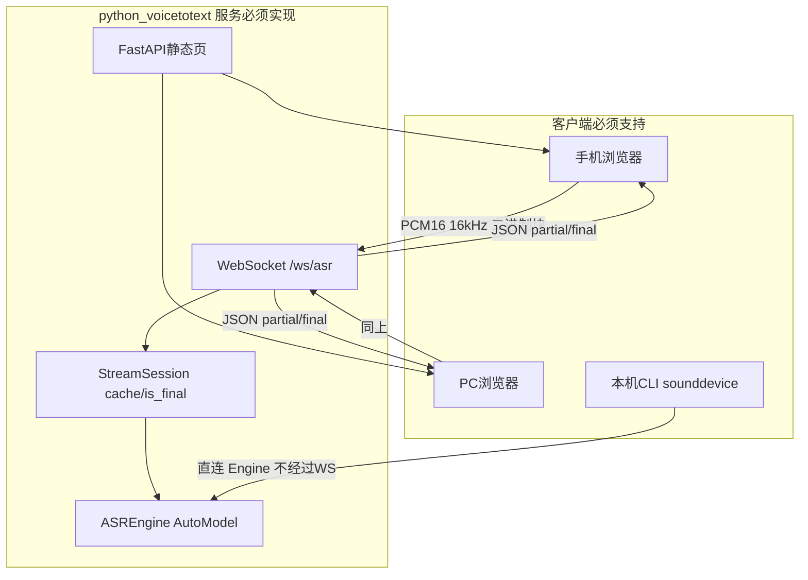

# FunASR 局域网实时语音识别（含手机 Web）实施计划

## 一、背景

- 仓库 [`C:\python\workspace\python_voicetotext`](C:\python\workspace\python_voicetotext) 当前仅有空文件 [`README`](C:\python\workspace\python_voicetotext\README)，**无 Python 源码、无依赖清单、无服务与前端**。
- 业务目标：在 **Windows 开发机** 上运行 Python 服务，同一局域网内 **手机/PC 浏览器** 通过 `http://<主机IP>:<端口>` 打开页面，使用麦克风进行 **FunASR 流式中文语音识别**，边说边显示文本。
- 后续将服务部署到 **Linux 服务器**；本计划代码与配置须 **Windows/Linux 双平台可运行**（路径、`pathlib`、设备自动检测、启动脚本说明）。

## 二、实施目的

| 目的 | 说明 |
|------|------|
| 实时转写 | 使用 `paraformer-zh-streaming` 流式模型，延迟配置 `chunk_size=[0,10,5]`（约 600ms 步长） |
| 多端访问 | 手机浏览器 + PC 浏览器共用同一 Web 页面与 WebSocket |
| 局域网部署 | 服务绑定 `0.0.0.0`，不引入 mkcert/公网/域名等额外部署链 |
| 可维护交付 | 模块化 Python 包、配置外置、测试脚本、**实施完成后 doc/ 文档归档** |
| 跨平台 | 开发 Windows、发布 Linux，文档写明两平台启动与防火墙步骤 |

## 三、方案内容（必须实现的系统边界）



**不采用** FunASR 官方 `runtime/python/websocket/funasr_wss_server.py` 作为运行时依赖（避免 ONNX runtime 双栈、Docker、SSL 证书链）；**采用** `pip install funasr` 的 `AutoModel` 在进程内推理，**自研 WebSocket 协议**（字段设计参考 FunASR 2pass 思路：在线 partial + 句末 final，见下文协议节）。

## 四、达到要求（验收标准，全部必须满足）

### 4.1 功能验收

1. **服务启动**：在项目根目录执行统一入口命令后，控制台打印监听地址 `http://0.0.0.0:<port>`，无未捕获异常。
2. **PC 浏览器**：访问 `http://127.0.0.1:<port>`，点击「开始识别」后出现麦克风授权，说话后 **3 秒内** 页面出现递增文本；点击「停止识别」后输出句末 final 文本且 WebSocket 正常关闭。
3. **手机浏览器（同 WiFi）**：访问 `http://<开发机局域网IP>:<port>`，同样完成开始/停止与实时文字显示（若某平台系统拒绝 HTTP 麦克风，须在 [`doc/平台兼容性.md`](doc/平台兼容性.md) **如实记录** 复现步骤与结果，不得省略该文档）。
4. **流式正确性**：连续说话 ≥30 秒，`cache` 不串句；停止后再次开始，`cache` 已重置。
5. **句末收尾**：停止识别或发送 `is_speaking:false` 后，服务端对最后一块调用 `is_final=True`，最后一字/词必须输出。
6. **VAD**：集成 `fsmn-vad`：静音超过配置阈值（默认 800ms）视为句末，触发 `is_final` 与 `cache` 重置逻辑。
7. **标点**：句末对 final 文本调用 `ct-punc` 模型补标点，Web 端展示带标点 final 行。
8. **CLI 调试**：不启动 Web 时，可通过 CLI 用本机麦克风完成同等流式识别（用于 Windows 上无浏览器时的模型验证）。
9. **WAV 回归**：CLI 支持 `--wav <file>` 按 chunk 模拟流式，输出与官方分块逻辑一致。
10. **配置**：所有端口、设备、chunk、VAD 阈值、模型名均来自 [`config.yaml`](config.yaml)，禁止硬编码在业务逻辑中（常量仅允许默认值回退一次）。

### 4.2 非功能验收

1. **音频格式**：上行必须为 **单声道 PCM s16le、16000Hz**；前端负责从 48kHz 重采样到 16kHz。
2. **块对齐**：每块样本数 = `chunk_size[1] * 960`（600ms → 9600 样本）。
3. **设备**：`config.yaml` 中 `device: auto` 时，有 CUDA 用 `cuda:0`，否则 `cpu`；Windows/Linux 行为一致。
4. **依赖**：[`requirements.txt`](requirements.txt) 固定主要包版本范围；README 写明先装 `torch/torchaudio` 再 `pip install -r requirements.txt`。
5. **日志**：结构化日志（连接建立/断开、推理耗时、异常栈），写入 `logs/app.log`（目录自动创建）。
6. **实施文档**：计划全部 todo 完成后，在 [`doc/`](doc/) 生成 5 份 markdown（见第十一节），内容与真实代码一致。

## 五、已有代码 vs 新开发代码

| 类型 | 路径 | 说明 |
|------|------|------|
| **已有（不可复用为业务）** | [`README`](C:\python\workspace\python_voicetotext\README) | 空文件，实施时 **重写** 为完整安装/启动说明 |
| **已有（外部，不纳入本仓库）** | FunASR 官方库 / ModelScope 模型权重 | 通过 `pip` 与首次运行自动下载，**不复制** `funasr_wss_server.py` 进仓库 |
| **新开发（100%）** | 下文「目录与文件清单」全部文件 | 包、服务、前端、配置、测试、脚本、doc |

**结论**：本仓库 **无** 可粘贴复用的 ASR/Web/WS 代码；仅复用 **FunASR Python API 调用模式**（`AutoModel.generate` + `cache` + `chunk_size`），属外部库用法，非本项目已有文件。

## 六、目录与文件清单（全部新建）

```
python_voicetotext/
├── README.md                         # 替换原 README：安装、Windows/Linux 启动、手机访问 IP、防火墙
├── requirements.txt
├── config.yaml
├── pyproject.toml                    # 包入口 python -m voicetotext
├── logs/                             # .gitignore 忽略内容，保留 .gitkeep
├── src/voicetotext/
│   ├── __init__.py
│   ├── config.py                     # 加载 yaml、device auto、校验端口
│   ├── asr_engine.py                 # AutoModel 封装：streaming / vad / punc
│   ├── stream_session.py             # per-connection cache、is_final、句末标点
│   ├── logging_setup.py
│   ├── cli.py                        # 麦克风 + --wav
│   └── server/
│       ├── __init__.py
│       ├── app.py                    # FastAPI + StaticFiles + WebSocket
│       └── ws_protocol.py            # JSON 消息编解码、状态机
├── web/
│   ├── index.html                    # 移动端优先 UI
│   ├── app.js                        # getUserMedia、重采样、WS、UI 状态机
│   └── style.css
├── tests/
│   ├── test_stream_session.py
│   └── test_ws_protocol.py
├── scripts/
│   └── run_server.py                 # uvicorn 启动包装（读取 config）
└── doc/                              # 实施完成后写入（实施前仅占位 .gitkeep）
    ├── 方案与实施说明.md
    ├── 架构与数据流.md
    ├── WebSocket协议.md
    ├── 功能影响记录.md
    ├── 验收清单.md
    └── 平台兼容性.md
```

## 七、WebSocket 协议（必须实现，前后端一致）

**端点**：`ws://<host>:<port>/ws/asr`（与页面同源，HTTP 环境用 `ws`）

### 7.1 客户端 → 服务端（JSON 文本帧）

**握手（连接后第一条）**：

```json
{
  "type": "start",
  "wav_name": "web_mic",
  "audio_fs": 16000,
  "wav_format": "pcm",
  "chunk_size": [0, 10, 5],
  "itn": false
}
```

**结束说话（停止按钮或句末）**：

```json
{ "type": "end", "is_speaking": false }
```

### 7.2 客户端 → 服务端（二进制帧）

- 紧握手后发送；内容为 **PCM s16le** 裸字节，长度 = `9600 * 2` 字节（600ms）。
- 不足一块时 **禁止** 发送，前端缓冲凑满再发。

### 7.3 服务端 → 客户端（JSON 文本帧）

**流式中间结果**：

```json
{ "type": "partial", "mode": "online", "text": "...", "is_final": false }
```

**句末结果（含标点）**：

```json
{ "type": "final", "mode": "offline_punc", "text": "...", "is_final": true }
```

**错误**：

```json
{ "type": "error", "code": "...", "message": "..." }
```

### 7.4 服务端状态机（必须）

1. `start` → 新建 `StreamSession`，清空 `cache`
2. 每个二进制块 → `ASREngine.transcribe_chunk(..., is_final=False)` → 有文本则 `partial`
3. `end` 或 VAD 句末 → 最后一块 `is_final=True` → `punc` → `final` → `session.reset()`
4. 异常 → `error` 并关闭连接（代码 1000）

## 八、核心模块设计（追加代码要点）

### 8.1 [`src/voicetotext/asr_engine.py`](src/voicetotext/asr_engine.py)（新开发）

- 初始化：

```python
AutoModel(
    model=config.asr_model,           # paraformer-zh-streaming
    vad_model=config.vad_model,       # fsmn-vad
    punc_model=config.punc_model,     # ct-punc
    device=resolved_device,
    disable_update=True,
)
```

- `transcribe_chunk(audio: np.ndarray, cache: dict, *, is_final: bool) -> str`：调用 `generate`，传入 `chunk_size`、`encoder_chunk_look_back=4`、`decoder_chunk_look_back=1`
- `add_punctuation(text: str) -> str`：句末对 final 字符串调用 punc（若 `generate` 已带标点则去重合并逻辑写在 `stream_session`）

### 8.2 [`src/voicetotext/stream_session.py`](src/voicetotext/stream_session.py)（新开发）

- 字段：`cache`、`confirmed`、`partial`、`last_voice_ts`
- 方法：`feed_pcm(bytes)`、`finalize()`、`reset()`
- VAD：依赖 `asr_engine` 的 vad 输出或静音计时；静音 ≥ `vad_silence_ms` 触发 `finalize()`

### 8.3 [`src/voicetotext/server/app.py`](src/voicetotext/server/app.py)（新开发）

- `FastAPI` 挂载 `web/` 为静态根路径
- 单例 `ASREngine`（进程级加载一次模型，禁止每连接 reload）
- WebSocket 循环：`receive` → 区分 `text`/`bytes` → 委托 `ws_protocol.handle_*`

### 8.4 [`web/app.js`](web/app.js)（新开发）

- `navigator.mediaDevices.getUserMedia({ audio: true })`
- `AudioContext` + 自定义重采样至 16kHz（线性插值或 `OfflineAudioContext`，必须写单元测试说明在 doc）
- `ScriptProcessorNode` 或 `AudioWorklet`（二选一，**计划锁定 ScriptProcessor** 以降低兼容性风险，在 doc 记录）
- Float32 → Int16 PCM；缓冲至 9600 样本发 WS binary
- UI 状态：`idle` / `listening` / `error`；显示 `partial` 与 `final` 分区
- 停止时先发 JSON `end`，等待 `final` 后 `ws.close()`

### 8.5 [`src/voicetotext/cli.py`](src/voicetotext/cli.py)（新开发）

- 子命令等价：`python -m voicetotext.cli mic` / `python -m voicetotext.cli wav --path`
- 与 `StreamSession` 共用逻辑，不经过 FastAPI

### 8.6 [`config.yaml`](config.yaml)（新开发，必须字段）

```yaml
host: "0.0.0.0"
port: 8765
asr_model: "paraformer-zh-streaming"
vad_model: "fsmn-vad"
punc_model: "ct-punc"
device: "auto"          # auto | cpu | cuda:0
chunk_size: [0, 10, 5]
encoder_chunk_look_back: 4
decoder_chunk_look_back: 1
vad_silence_ms: 800
log_dir: "logs"
```

## 九、实施步骤（严格顺序）

| 步骤 | 内容 | 产出验证 |
|------|------|----------|
| S1 | 创建 `requirements.txt`、`pyproject.toml`、`config.yaml`、包骨架 `src/voicetotext/` | `pip install -e .` 成功 |
| S2 | 实现 `config.py`、`logging_setup.py` | 加载配置与写日志 |
| S3 | 实现 `asr_engine.py`，用示例 wav（FunASR 自带或下载）跑通分块 `generate` | CLI `wav` 有输出 |
| S4 | 实现 `stream_session.py` + 单元测试 `tests/test_stream_session.py` | `pytest` 通过 |
| S5 | 实现 `cli.py` 麦克风路径（`sounddevice`） | Windows 本机说话有字 |
| S6 | 实现 `ws_protocol.py`、`server/app.py` | `websockets` 测试客户端或 `pytest` 模拟收发 |
| S7 | 实现 `web/` 三文件并挂载静态 | PC 浏览器验收 4.2-2 |
| S8 | 绑定 `0.0.0.0`，README 写防火墙与局域网 IP 获取命令 | 手机同网访问验收 4.2-3 |
| S9 | 集成 VAD 句末 + `ct-punc` final | final 行含标点 |
| S10 | 编写 `tests/test_ws_protocol.py`，全量 `pytest` | CI 本地通过 |
| S11 | 重写 `README.md`（Windows + Linux 章节） | 按文档可从零启动 |
| S12 | 填写 `doc/` 六份文档（见下节），勾选验收清单 | doc 与代码一致 |

**统一启动命令（必须实现并写入 README）**：

```bash
python scripts/run_server.py
# 或
python -m uvicorn voicetotext.server.app:app --host 0.0.0.0 --port 8765
```

## 十、修改对象说明

| 对象 | 操作 |
|------|------|
| [`README`](C:\python\workspace\python_voicetotext\README) | **删除或重命名**为 `README.md` 并写入完整说明 |
| 无其他既有源码 | 无修改，仅 **新增** 上节全部文件 |
| `.gitignore` | **新建**：忽略 `logs/*`、`__pycache__`、`.venv`、`*.pyc`、模型缓存目录（若配置本地 `model_dir`） |

## 十一、功能影响记录（实施时必须维护 [`doc/功能影响记录.md`](doc/功能影响记录.md)）

| 影响域 | 变更 | 风险与缓解 |
|--------|------|------------|
| 本机资源 | 首次运行下载约 220M+ 模型，内存占用上升 | README 注明磁盘与 RAM；`device: auto` |
| 网络 | 服务监听 `0.0.0.0`，局域网内设备可访问 | 文档声明仅限可信局域网，无鉴权 |
| 麦克风权限 | 浏览器策略可能导致 HTTP 非 localhost 无法录音 | `doc/平台兼容性.md` 必测记录 |
| 防火墙 | Windows/Linux 需放行 `port` | README 提供 `netsh` / `ufw` 示例命令 |
| 并发 | 单进程单模型，多连接共享 GPU/CPU | 文档写明当前 **单连接推荐**；多连接排队（Session 独立 cache，Engine 加 `asyncio.Lock` 串行推理） |
| 后续 Linux 部署 | 路径分隔符、CUDA 驱动差异 | `config.yaml` + README Linux 专章 |

## 十二、实施完成后 doc/ 文档（必须一次性写全）

| 文档 | 必须包含 |
|------|----------|
| [`doc/方案与实施说明.md`](doc/方案与实施说明.md) | 背景、目的、最终方案、与讨论差异说明（HTTP 局域网、无公网 HTTPS） |
| [`doc/架构与数据流.md`](doc/架构与数据流.md) | mermaid 图、模块职责、启动流程 |
| [`doc/WebSocket协议.md`](doc/WebSocket协议.md) | 第七节完整协议 + 时序图 + 错误码表 |
| [`doc/功能影响记录.md`](doc/功能影响记录.md) | 第十一节表格 + 实际观测数据 |
| [`doc/验收清单.md`](doc/验收清单.md) | 第四节每条勾选结果（通过/失败+备注） |
| [`doc/平台兼容性.md`](doc/平台兼容性.md) | Android Chrome / iOS Safari / PC Chrome 的 HTTP 麦克风测试结果 |

## 十三、Todo 表（实施过程必须逐项勾选并保留在 doc/验收清单.md）

实施时代理须在 `doc/验收清单.md` 末尾维护与本计划 todos **相同 ID** 的勾选状态。
