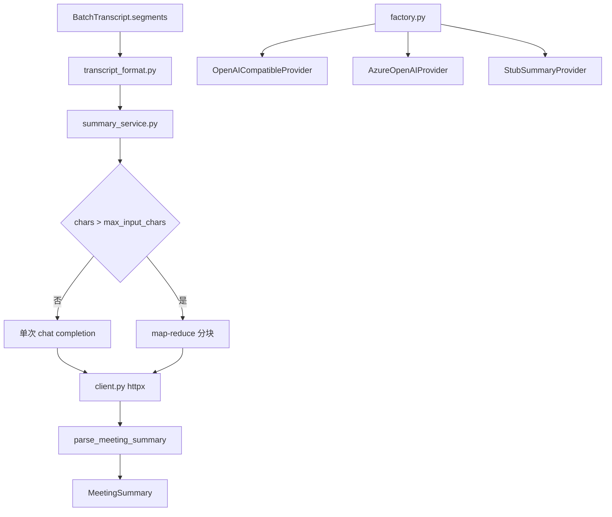
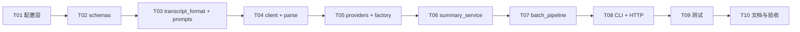

# LLM 会议纪要完整实施计划

## 一、背景

企业离线批处理已具备：日文/中文转写、说话人分离（Diar-First）、段级时间戳、JSON/MD/SRT 导出。转写产物 schema 已预留 `summary` 字段，但当前固定为 `null`；[`src/voicetotext/llm/summary.py`](src/voicetotext/llm/summary.py) 仅有 `StubSummaryProvider`，[`POST /api/v1/summarize`](src/voicetotext/server/batch_app.py) 固定返回 501。

用户已在 [`config.yaml`](config.yaml) 配置 DashScope（`qwen-plus`），并要求 **API 密钥写在 `config.yaml` 的 `llm.api_key`**，不迁移到 secrets。

## 二、实施目的

1. 转写完成后自动调用 LLM 生成**结构化会议纪要**（标题、概要、议题、决议、待办、未决问题、Markdown 全文）。
2. 提供独立 `POST /api/v1/summarize` 接口，支持对已有 transcript 重新生成纪要。
3. 产物落盘：`{job_id}.json` 的 `summary` 非 null；额外生成 `{job_id}.summary.md`。
4. 长会议（最长 4h 配置上限）通过 map-reduce 分块摘要，保证可处理。
5. LLM 失败时默认**不阻断转写**（`on_failure: warn`），同时实现 `on_failure: fail` 严格模式。
6. 实施完成后在 [`doc/batch/`](doc/batch/) 写入方案、实施总结、验收结果，并更新 [`doc/功能影响记录.md`](doc/功能影响记录.md)。

## 三、方案内容（全部必须实现）

### 3.1 配置层

扩展 [`src/voicetotext/config.py`](src/voicetotext/config.py)：

**`AppConfig` 新增字段（全部解析入库）：**

| 字段 | 来源 | 默认值 |
|------|------|--------|
| `llm_api_url` | `llm.api_url` | — |
| `llm_api_key` | `llm.api_key`（主来源，写在 config.yaml） | — |
| `llm_temperature` | `llm.temperature` | `0.3` |
| `llm_max_tokens` | `llm.max_tokens` | `4096` |
| `llm_timeout_sec` | `llm.timeout` 或 `llm.timeout_sec` | `120` |
| `llm_max_input_chars` | `llm.max_input_chars` | `120000` |
| `llm_chunk_chars` | `llm.chunk_chars` | `30000` |
| `llm_retry_max` | `llm.retry_max` | `2` |
| `llm_retry_backoff_sec` | `llm.retry_backoff_sec` | `2.0` |
| `llm_on_failure` | `llm.on_failure` | `"warn"` |
| `llm_output_summary_md` | `llm.output_summary_md` | `true` |
| `llm_api_version` | `llm.api_version` | `null` |
| `llm_deployment` | `llm.deployment` | `null` |

**`provider` 推断规则（必须实现）：**
- `llm.deployment` 非空 → `azure`
- `llm.api_url` 非空且 enabled → `openai_compatible`
- `llm.enabled: false` → `stub`

**校验 `_validate_llm()`（必须）：**
- `enabled=true` 且非 stub：必须有有效 `api_url`、`model`、`api_key`（拒绝占位符）
- `temperature` ∈ [0, 2]；`max_tokens` ∈ [256, 32768]；`timeout_sec` ∈ [5, 600]
- `on_failure` 仅 `warn` | `fail`
- `provider=azure`：必须 `deployment` + `api_version`

**同步更新 [`config.yaml`](config.yaml)（必须补全字段）：**

```yaml
llm:
  enabled: true
  api_url: "https://dashscope.aliyuncs.com/compatible-mode/v1"
  model: "qwen-plus"
  api_key: "sk-..."          # 用户要求：就写在这里
  temperature: 0.3
  max_tokens: 8096
  timeout: 120               # 由 30 改为 120（长纪要必须）
  max_input_chars: 120000
  chunk_chars: 30000
  retry_max: 2
  retry_backoff_sec: 2
  on_failure: warn
  output_summary_md: true
  api_version: ""
  deployment: ""
```

环境变量 `DASHSCOPE_API_KEY` 仅作为**运行时覆盖**（测试/调试），不作为主配置来源。

### 3.2 LLM 模块（全新开发）



**新建文件（全部必须）：**

| 文件 | 职责 |
|------|------|
| [`src/voicetotext/llm/transcript_format.py`](src/voicetotext/llm/transcript_format.py) | segments → `[HH:MM:SS] SPEAKER_xx: text`；空段过滤；按段边界分块 |
| [`src/voicetotext/llm/prompts.py`](src/voicetotext/llm/prompts.py) | `ja`/`zh` 系统 Prompt + 用户模板；强制 JSON 输出约束 |
| [`src/voicetotext/llm/client.py`](src/voicetotext/llm/client.py) | `httpx` 同步 POST `/chat/completions`；401/429/5xx/timeout 分类；指数退避重试 |
| [`src/voicetotext/llm/parse.py`](src/voicetotext/llm/parse.py) | 解析 LLM JSON → `MeetingSummary`；剥离 markdown 代码块；缺字段兜底 |
| [`src/voicetotext/llm/summary_service.py`](src/voicetotext/llm/summary_service.py) | 单次/map-reduce 编排；JSON repair 二次调用（解析失败时） |
| [`src/voicetotext/llm/providers/openai_compatible.py`](src/voicetotext/llm/providers/openai_compatible.py) | DashScope/Qwen 主路径 |
| [`src/voicetotext/llm/providers/azure.py`](src/voicetotext/llm/providers/azure.py) | Azure OpenAI 路径（deployment + api-version） |
| [`src/voicetotext/llm/factory.py`](src/voicetotext/llm/factory.py) | `create_summary_provider(config)` |

**修改文件（全部必须）：**

| 文件 | 改动 |
|------|------|
| [`src/voicetotext/llm/schemas.py`](src/voicetotext/llm/schemas.py) | 新增 `MeetingSummary` dataclass；`SummaryResponse.summary` 改为结构化对象；增加 `error`、`meta` 字段 |
| [`src/voicetotext/llm/summary.py`](src/voicetotext/llm/summary.py) | 保留 `SummaryProvider` Protocol、`StubSummaryProvider`、`SummaryNotImplementedError`；导出工厂入口 |
| [`src/voicetotext/llm/__init__.py`](src/voicetotext/llm/__init__.py) | 导出 `create_summary_provider`、`MeetingSummary` |

**`summary` JSON 落库结构（必须）：**

```json
{
  "title": "会议标题",
  "overview": "2-4句概要",
  "topics": [{"subject": "", "discussion": "", "conclusion": ""}],
  "decisions": ["..."],
  "action_items": [{"owner": "SPEAKER_01", "task": "", "due": ""}],
  "open_questions": ["..."],
  "markdown": "## 概要\n..."
}
```

**`meta.llm` 字段（必须写入 transcript）：**

```json
{
  "enabled": true,
  "provider": "openai_compatible",
  "model": "qwen-plus",
  "status": "ok",
  "latency_ms": 3200,
  "chunks": 1
}
```

失败时：`summary: null`，`meta.llm.status: "error"`，`meta.llm.error: "..."`。

### 3.3 管线集成

修改 [`src/voicetotext/asr/batch_pipeline.py`](src/voicetotext/asr/batch_pipeline.py)：

1. `BatchTranscript.summary` 类型改为 `dict[str, Any] | None`。
2. `BatchPipeline.__init__(config, *, skip_summary: bool = False)` 注入 `create_summary_provider(config)`。
3. `process_file()` 在 polish 完成、export 之前插入阶段 `summary`（progress 95）：
   - 条件：`config.llm_enabled and not skip_summary`
   - 构建 `SummaryRequest(job_id, language, segments)`
   - 调用 provider → 填充 `transcript.summary` 与 `meta.llm`
   - 异常：`on_failure=fail` 抛错；`on_failure=warn` 记日志 + `summary=null`
4. `export()` 新增：当 `llm_output_summary_md=true` 且 summary 非空，写 `{job_id}.summary.md`（从 `summary.markdown` 渲染，含 title/overview/待办节）。

**时间戳格式必须与现有 md 导出一致**（复用 `_ms_to_srt` 逻辑或抽取共用 `format_timestamp(ms)` 到 `transcript_format.py`）。

### 3.4 CLI

修改 [`scripts/run_batch.py`](scripts/run_batch.py)：

- 新增 `--no-summary`：强制跳过 LLM（即使 `llm.enabled=true`）
- 完成时打印 `summary.md` 路径（若生成）
- `llm.enabled=true` 且非 `--no-summary` 时，启动校验 `llm_api_key` 有效（直接读 config，不读 secrets）

### 3.5 HTTP API

修改 [`src/voicetotext/server/batch_app.py`](src/voicetotext/server/batch_app.py)：

1. 用 `create_summary_provider(_cfg())` 替换全局 `_summary_stub`。
2. **`POST /api/v1/summarize`（必须完整实现）：**
   - 请求体支持 `segments` 数组（主路径）或仅 `job_id`（从 `out/`、`out/jobs/` 读 `{job_id}.json`）
   - `llm.enabled=false` → 501 `llm_disabled`
   - 成功 → 200 + `summary` + `meta`
   - segments 空 / json 不存在 → 400
   - LLM 上游错误 → 502；超时 → 504
3. **`_run_job_sync`**：job 完成时把 `transcript.summary` 写入 `_jobs[job_id]`
4. **`GET /api/v1/jobs/{job_id}/status`** 与 **`GET /api/v1/jobs/{job_id}`**：响应增加 `summary` 字段
5. **`GET /ready`**：`detail.llm` 增加 `{enabled, ready, provider, model}`（LLM 未配置不影响 ASR ready）

### 3.6 依赖

[`requirements.txt`](requirements.txt) 与 [`pyproject.toml`](pyproject.toml) 必须追加：

```
httpx>=0.27.0,<1.0.0
```

### 3.7 测试（全部必须，无真实 API 调用）

| 测试文件 | 覆盖 |
|----------|------|
| [`tests/test_llm_config.py`](tests/test_llm_config.py)（新建） | 全字段解析；enabled+无 key 报错；azure 缺 deployment 报错；api_key 占位符拒绝 |
| [`tests/test_llm_transcript_format.py`](tests/test_llm_transcript_format.py)（新建） | 时间戳；空段过滤；chunk 段边界 |
| [`tests/test_llm_parse.py`](tests/test_llm_parse.py)（新建） | 合法 JSON；```包裹；缺字段兜底 |
| [`tests/test_llm_client.py`](tests/test_llm_client.py)（新建） | mock httpx：200/401/429 重试/timeout |
| [`tests/test_llm_provider.py`](tests/test_llm_provider.py)（新建） | factory 选型；openai_compatible/azure mock 端到端 |
| [`tests/test_llm_map_reduce.py`](tests/test_llm_map_reduce.py)（新建） | 超长 transcript 触发 2+ 次 HTTP |
| [`tests/test_llm_pipeline.py`](tests/test_llm_pipeline.py)（新建） | enabled 时 summary 非 null；`skip_summary`；on_failure=warn/fail |
| [`tests/test_llm_api.py`](tests/test_llm_api.py)（新建） | `/summarize` 200/400/501/502；job status 含 summary |
| 更新 [`tests/test_llm_stub.py`](tests/test_llm_stub.py) | disabled → 501；enabled+mock → 200 |
| 更新 [`tests/test_config.py`](tests/test_config.py) | 当前 `config.yaml` 已 `llm.enabled: true`，断言改为 `True` 并验证 llm 字段 |
| 更新 [`tests/test_batch_pipeline.py`](tests/test_batch_pipeline.py) | mock summary provider；验证 summary 集成与 export summary.md |
| 更新 [`tests/test_regression_acceptance.py`](tests/test_regression_acceptance.py) | schema 仍含 `summary` 键（可为 dict 或 null） |

测试配置：使用 `tests/fixtures/config_llm_test.yaml`（含假 key，mock HTTP，不调用 DashScope）。

**验收门槛：pytest 全通过（现有 + 新增全部 green）。**

### 3.8 达到要求（验收标准 A1–A12，全部必须满足）

| ID | 要求 |
|----|------|
| A1 | `load_config()` 正确读取 `llm` 全字段含 `api_key` |
| A2 | `llm.enabled=true` 跑 CLI 后 `summary` 为结构化对象非 null |
| A3 | `summary` 含 title/overview/topics/decisions/action_items/open_questions/markdown |
| A4 | 对 `125a4f41` 类转写，纪要提取「金曜夕方まで展開」「レビュー会議火曜午後」等关键点 |
| A5 | 生成 `{job_id}.summary.md` |
| A6 | `--no-summary` 时 `summary=null` 且无 summary.md |
| A7 | `on_failure=warn` + mock 502：json/md/srt 转写正常，`meta.llm.status=error` |
| A8 | `on_failure=fail` + mock 502：整个 job 失败 |
| A9 | `POST /api/v1/summarize` 传 segments 返回 200 |
| A10 | `POST /api/v1/summarize` 仅 job_id 可从磁盘 json 读取 segments |
| A11 | 异步 job status 含 `summary` |
| A12 | pytest 全通过 |

人工 UAT（实施文档中记录）：对真实 m4a 跑一次，确认 DashScope 返回有效纪要。

## 四、已有可用代码 vs 新开发代码

### 4.1 已有可用（直接复用/扩展）

| 模块 | 路径 | 复用方式 |
|------|------|----------|
| LLM Schema 骨架 | [`src/voicetotext/llm/schemas.py`](src/voicetotext/llm/schemas.py) | 扩展 `MeetingSummary`，保留 `SummaryRequest`/`SummarySegment` |
| Provider Protocol + Stub | [`src/voicetotext/llm/summary.py`](src/voicetotext/llm/summary.py) | 保留接口，新增真实 Provider |
| BatchTranscript schema | [`src/voicetotext/asr/batch_pipeline.py`](src/voicetotext/asr/batch_pipeline.py) | 已有 `summary` 字段与 `to_dict()`，改类型并接线 |
| 时间戳格式化 | `batch_pipeline.export()` / `transcript_to_plain()` | 逻辑复用到 `transcript_format.py` |
| 配置加载框架 | [`src/voicetotext/config.py`](src/voicetotext/config.py) | 扩展 `_parse_llm`、`_validate_config` |
| HTTP 鉴权 | [`src/voicetotext/server/auth.py`](src/voicetotext/server/auth.py) | summarize 端点继续 `verify_api_key` |
| CLI 入口 | [`scripts/run_batch.py`](scripts/run_batch.py) | 追加参数与打印 |
| 测试基础设施 | pytest + `TestClient` | 沿用 [`tests/test_llm_stub.py`](tests/test_llm_stub.py) 模式 |

### 4.2 必须新开发

| 模块 | 路径 |
|------|------|
| transcript 格式化 | `llm/transcript_format.py` |
| Prompt 模板 | `llm/prompts.py` |
| HTTP 客户端 | `llm/client.py` |
| JSON 解析 | `llm/parse.py` |
| 摘要编排（含 map-reduce） | `llm/summary_service.py` |
| OpenAI 兼容 Provider | `llm/providers/openai_compatible.py` |
| Azure Provider | `llm/providers/azure.py` |
| Provider 工厂 | `llm/factory.py` |
| LLM 测试夹具 | `tests/fixtures/config_llm_test.yaml` |
| 8 个新测试文件 | 见 3.7 |

## 五、实施步骤（严格顺序）



1. **T01** 扩展 `config.py` + 补全 `config.yaml` llm 字段 + 添加 `httpx` 依赖
2. **T02** 扩展 `schemas.py`（`MeetingSummary`、结构化 `SummaryResponse`）
3. **T03** 实现 `transcript_format.py`、`prompts.py`（ja/zh）
4. **T04** 实现 `client.py`（重试/错误分类）、`parse.py`
5. **T05** 实现 `providers/openai_compatible.py`、`providers/azure.py`、`factory.py`；更新 `summary.py`/`__init__.py`
6. **T06** 实现 `summary_service.py`（单次 + map-reduce + JSON repair）
7. **T07** 改造 `batch_pipeline.py`（集成 LLM、export summary.md、`skip_summary`）
8. **T08** 改造 `run_batch.py`（`--no-summary`）；改造 `batch_app.py`（summarize/job/ready）
9. **T09** 编写/更新全部测试；`pytest` 全绿
10. **T10** 人工 UAT（真实音频）；撰写 doc；更新功能影响记录与验收清单

## 六、功能影响记录（实施时必须写入）

更新 [`doc/功能影响记录.md`](doc/功能影响记录.md)，记录：

- **行为变更**：`llm.enabled=true` 时 CLI/HTTP 转写完成后自动调用 LLM；产物新增 `summary` 对象与 `summary.md`
- **API 变更**：`POST /api/v1/summarize` 由 501 改为 200（enabled 时）；job status 新增 `summary` 字段
- **配置变更**：`config.yaml` llm 段扩展 10+ 字段；`api_key` 写在 config.yaml
- **不变项**：转写管线 Diar-First 逻辑不变；HF token 仍走 secrets；`segments` schema 不变；`--no-summary` 可完全关闭 LLM
- **破坏性**：`tests/test_config.py` 中 `llm_enabled is False` 断言必须更新；F9 验收项由「501」改为「200（enabled）/501（disabled）」

## 七、实施完成后文档交付（全部必须，保存到 doc/）

| 文档 | 路径 | 内容 |
|------|------|------|
| LLM 方案 | [`doc/batch/LLM纪要方案.md`](doc/batch/LLM纪要方案.md) | 背景、目的、架构、配置说明、Prompt 约束、map-reduce、失败策略 |
| LLM 实施总结 | [`doc/batch/LLM实施总结.md`](doc/batch/LLM实施总结.md) | 改动文件清单、已有/新建对照、配置示例、UAT 结果 |
| 架构更新 | [`doc/batch/架构与数据流.md`](doc/batch/架构与数据流.md) | mermaid 中 `LLMStub` 改为 `LLM Summary`；summary schema 示例 |
| 验收清单更新 | [`doc/batch/验收清单.md`](doc/batch/验收清单.md) | 新增 F14–F23（LLM 相关）、A1–A12 结果列 |
| 功能影响 | [`doc/功能影响记录.md`](doc/功能影响记录.md) | 新增「2026-06-05 LLM 会议纪要」条目 |
| README | [`README.md`](README.md) | LLM 配置、`--no-summary`、`summary.md` 产物说明 |

实施总结中必须包含 **Todo 完成状态表**（与下方 todos 一一对应，每项标记 pass/fail + 证据文件/测试名）。

## 八、安全约束（实施时必须遵守）

- 日志与错误响应**禁止**输出 `api_key` 或完整 transcript（仅记 char 数、job_id、latency）
- `config.yaml` 中的 key 按用户要求保留，但不在任何导出产物中出现
