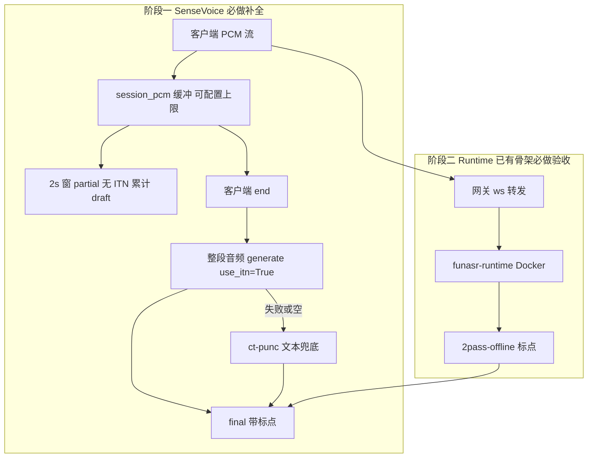

# 企业公开发布 ASR 定稿与验收实施计划

## 一、背景

- 仓库 [`python_voicetotext`](c:\python\workspace\python_voicetotext) 已完成企业日语双阶段骨架：SenseVoice 嵌入式（[`config.yaml`](c:\python\workspace\python_voicetotext\config.yaml)）、Runtime 侧车（[`config.runtime.yaml`](c:\python\workspace\python_voicetotext\config.runtime.yaml)）、API Key、[`GET /ready`](c:\python\workspace\python_voicetotext\src\voicetotext\server\app.py)、AI Chat 集成说明（[`doc/AI_Chat集成与内网部署.md`](c:\python\workspace\python_voicetotext\doc\AI_Chat集成与内网部署.md)）。
- 公开使用场景：**手机浏览器 H5 AI Chat**（内网 HTTPS）+ 独立语音服务；`partial` 预览、`final` 为唯一业务提交。
- 已暴露问题：窗级 ITN 导致句中乱标点（已通过 [`text_utils.merge_utterance_segments`](c:\python\workspace\python_voicetotext\src\voicetotext\text_utils.py) + 流式 `use_itn=False` 缓解）；关闭窗级 ITN 后 **停止仍无标点**，因 [`SenseVoiceEngine.finalize_text`](c:\python\workspace\python_voicetotext\src\voicetotext\asr\sensevoice_engine.py) 仅 `rich_transcription_postprocess`，**无整段音频重识别、无 ct-punc**。
- 企业准确度结论（讨论共识）：SenseVoice 阶段 **停止时对整段 PCM 再识别（方案 B）**；**必须** 配置 `ct-punc` 兜底路径；生产终态仍为 **Runtime 2pass**。



---

## 二、实施目的

| 目的 | 说明 |
|------|------|
| 定稿准确度 | 停止/end 后输出带 **，、。？！** 等的中文/日文全文，满足公开发布与 AI Chat 输入 |
| 流式可用 | 识别中 continuous draft **无句中乱句号**，不触发静音拆句（`auto_finalize_on_silence: false` 保持） |
| 企业可运维 | 可配置单次最长 10 分钟 PCM（默认 600s）、超限拒绝并日志、会话结束释放缓冲 |
| 契约清晰 | `partial` 仅预览；`final` 权威；文档与验收清单可勾选 |
| 双阶段闭环 | SenseVoice 补全 + Runtime 实测验收写入 doc，无「可选」项 |

---

## 三、达到要求（全部必做，验收可勾选）

### 3.1 SenseVoice 定稿（公开发布阻塞项）

1. 每轮 WS 会话在服务端累积 **完整 PCM**（16kHz s16le mono），上限 **`session_pcm_max_seconds`（默认 600，可配置）**；超限返回 `error` 并关闭。
2. `feed_pcm` 仍提供 **累计 draft** 的 `partial`（无窗级 ITN、合并去段末标点）——**已有逻辑保持**。
3. `finalize`（客户端 `end`）时：**优先** 对缓冲整段音频 `generate(language, use_itn=True, is_final=True)` + `rich_transcription_postprocess` 作为 `final`。
4. 若整段识别失败/空/无意义：**必须** 走 [`punc_model`](c:\python\workspace\python_voicetotext\config.enterprise.yaml)（企业配置固定为 `ct-punc`）对 draft 全文 `task=punc` 兜底；仍失败则记录 error 日志并返回最佳 draft。
5. `finalize` 后 **清空** PCM 缓冲与 draft（隐私与内存）。
6. `POST /api/transcribe` 批处理：**必须** 与整段识别同路径（`use_itn=True` + 标点兜底），保证与 WS final 一致策略。

### 3.2 企业与公开部署（已有项，本计划强制再验收）

1. [`config.enterprise.yaml`](c:\python\workspace\python_voicetotext\config.enterprise.yaml)：`api_key`、`language`、`auto_finalize_on_silence: false`、`punc_model: ct-punc`（兜底用）。
2. HTTPS + `/ready` + WS 鉴权 + `max_ws_connections` — **代码已有，UAT 必测**。
3. Runtime：`deploy/docker-compose.yml` 启动顺序文档化；`asr_backend=runtime` 时 2pass-offline → `final` — **代码已有，UAT 必测**。

### 3.3 文档与测试

1. 新建 [`doc/企业公开发布实施方案.md`](c:\python\workspace\python_voicetotext\doc\企业公开发布实施方案.md)（实施后写入：背景、方案、已有/新增代码对照、影响、验收结果）。
2. 更新 [`doc/验收清单.md`](c:\python\workspace\python_voicetotext\doc\验收清单.md)、[`doc/阶段一SenseVoice验收.md`](c:\python\workspace\python_voicetotext\doc\阶段一SenseVoice验收.md)、[`doc/功能影响记录.md`](c:\python\workspace\python_voicetotext\doc\功能影响记录.md)、[`doc/AI_Chat集成与内网部署.md`](c:\python\workspace\python_voicetotext\doc\AI_Chat集成与内网部署.md)、[`README.md`](c:\python\workspace\python_voicetotext\README.md)。
3. `pytest` 全通过，新增用例覆盖：PCM 上限、整段 finalize mock、ct-punc 兜底 mock。

---

## 四、已有可复用代码 vs 必须新开发

| 类型 | 路径 | 状态 |
|------|------|------|
| **已有** | [`asr/`](c:\python\workspace\python_voicetotext\src\voicetotext\asr\)、[`factory.py`](c:\python\workspace\python_voicetotext\src\voicetotext\asr\factory.py) | 直接复用 |
| **已有** | [`stream_session.py`](c:\python\workspace\python_voicetotext\src\voicetotext\stream_session.py) draft 累计、能量门控、`merge_utterance_segments` | 扩展 PCM 缓冲与 finalize 分支 |
| **已有** | [`sensevoice_engine.py`](c:\python\workspace\python_voicetotext\src\voicetotext\asr\sensevoice_engine.py) 窗级 `transcribe_window` | 新增 `transcribe_utterance` |
| **已有** | [`paraformer_engine.py`](c:\python\workspace\python_voicetotext\src\voicetotext\asr\paraformer_engine.py) `task=punc` 参考实现 | 抽到共用模块 |
| **已有** | [`server/app.py`](c:\python\workspace\python_voicetotext\src\voicetotext\server\app.py)、[`auth.py`](c:\python\workspace\python_voicetotext\src\voicetotext\server\auth.py)、[`ws_protocol.py`](c:\python\workspace\python_voicetotext\src\voicetotext\server\ws_protocol.py) | 扩展超限 error |
| **已有** | [`runtime_client.py`](c:\python\workspace\python_voicetotext\src\voicetotext\asr\runtime_client.py)、[`deploy/`](c:\python\workspace\python_voicetotext\deploy) | 验收与文档更新 |
| **已有** | [`web/app.js`](c:\python\workspace\python_voicetotext\web\app.js) `setSessionFinal` | 停止后同步显示 final 全文（含标点） |
| **新开发** | `asr/punc_restorer.py` | 懒加载 `ct-punc`，`restore(text)->str` |
| **新开发** | `SenseVoiceEngine.transcribe_utterance` + `finalize_utterance` 编排 | 整段 ITN 定稿 |
| **新开发** | `StreamSession._session_pcm` + 上限校验 | 方案 B 核心 |
| **新开发** | `tests/test_finalize_utterance.py`、`tests/test_pcm_buffer.py` | 必做测试 |
| **新开发** | `doc/企业公开发布实施方案.md` + 验收清单 Todo 表 | 交付物 |

---

## 五、配置变更（必做）

在 [`config.py`](c:\python\workspace\python_voicetotext\src\voicetotext\config.py) 与 **全部** yaml 增加：

```yaml
session_pcm_max_seconds: 600   # 默认 10 分钟，可改
```

[`config.enterprise.yaml`](c:\python\workspace\python_voicetotext\config.enterprise.yaml) **必须** 设置：

```yaml
punc_model: "ct-punc"           # 定稿兜底，与 SenseVoice 主模型并存（独立懒加载）
auto_finalize_on_silence: false
```

[`config.yaml`](c:\python\workspace\python_voicetotext\config.yaml) 开发默认：`punc_model: "ct-punc"`（保证本地/公开测试可验证兜底）。

---

## 六、核心实现设计

### 6.1 `StreamSession`（修改 [`stream_session.py`](c:\python\workspace\python_voicetotext\src\voicetotext\stream_session.py)）

- 字段 `_session_pcm: bytearray`；`feed_pcm` 在通过 stride 处理后 **append 原始 pcm_bytes**（与识别窗并行）。
- `reset` / `finalize` 末尾清空 `_session_pcm`。
- 超过 `session_pcm_max_seconds * sample_rate * 2` 字节：返回可检测标志或抛给 `ws_protocol` 发 `error` code `session_too_long`。
- `finalize`（仅 `asr_backend=sensevoice`）：
  1. `audio = float32(整段 _session_pcm)`
  2. `final = engine.finalize_utterance(audio)`（新 API，见下）
  3. 若无效：`final = punc_restorer.restore(draft)`；日志 `warning`
  4. 仍无效：`final = draft` + `error` 级日志
- Runtime 模式：**不** 累积 PCM（网关转发），保持现有 `RuntimeWSSession`。

### 6.2 `SenseVoiceEngine`（修改 [`sensevoice_engine.py`](c:\python\workspace\python_voicetotext\src\voicetotext\asr\sensevoice_engine.py)）

- `transcribe_utterance(audio: np.ndarray) -> str`：整段一次 `generate(..., use_itn=True, is_final=True)` + `_postprocess`。
- `finalize_utterance(audio, draft_fallback: str) -> str`：
  - 有语音的整段 → `transcribe_utterance`
  - 失败 → 调用 [`PuncRestorer`](c:\python\workspace\python_voicetotext\src\voicetotext\asr\punc_restorer.py) 处理 `draft_fallback`
- `transcribe_file`：改为调用 `transcribe_utterance`（与 WS final 一致）。

### 6.3 `PuncRestorer`（新建 [`asr/punc_restorer.py`](c:\python\workspace\python_voicetotext\src\voicetotext\asr\punc_restorer.py)）

- 读取 `config.punc_model`（企业必为 `ct-punc`）；`AutoModel(model=punc_model)` 懒加载。
- `restore(text) -> str`：`generate(input=text, task="punc")`（与 Paraformer 逻辑一致）。
- 在 `factory` 或 `app` lifespan **不** 预加载（避免拖慢启动）；首次 finalize 兜底时加载并打日志。

### 6.4 `ASRBackend` 协议（修改 [`asr/base.py`](c:\python\workspace\python_voicetotext\src\voicetotext\asr\base.py)）

- 增加 `finalize_utterance(self, audio: np.ndarray, draft_fallback: str) -> str`（Runtime/Paraformer 可实现为降级：仅 `finalize_text(draft)` 或 Paraformer 窗级合并）。

### 6.5 Web 演示（修改 [`web/app.js`](c:\python\workspace\python_voicetotext\web\app.js)）

- 收到 `final`：除 `setSessionFinal` 外，将 **同一段文字** 写入 `partialText`（用户停止后可见标点全文）。
- 处理 `session_too_long` error 提示。

### 6.6 功能影响记录（必写 [`doc/功能影响记录.md`](c:\python\workspace\python_voicetotext\doc\功能影响记录.md)）

| 影响域 | 变更 |
|--------|------|
| 内存 | 每连接最多 `session_pcm_max_seconds`  PCM（默认 10min ≈ 19MB） |
| final 与 partial | 停止后 final 可能与 partial 措辞略有差异（以 final 为准） |
| 延迟 | 停止后增加整段推理 1～N 秒（CPU 更明显） |
| 隐私 | 会话结束即丢弃 PCM；文档明确不落盘 |

---

## 七、实施步骤（严格顺序）

| 步骤 | 内容 | 验证 |
|------|------|------|
| E1 | 配置项 `session_pcm_max_seconds` + enterprise `punc_model` | `load_config` 测试 |
| E2 | `PuncRestorer` + 单元测试 mock | pytest |
| E3 | `SenseVoiceEngine.transcribe_utterance` / `finalize_utterance` | pytest mock |
| E4 | `ASRBackend` 协议 + Paraformer/Runtime 最小实现 | import 无环 |
| E5 | `StreamSession` PCM 缓冲、超限、finalize 编排 | pytest |
| E6 | `ws_protocol` 超限 error；`routes_transcribe` 对齐整段策略 | 手工/测试 |
| E7 | `web/app.js` final 展示与 error | 手机 HTTPS 实测 |
| E8 | 全量 pytest + README/企业文档更新 | 33+ passed |
| E9 | UAT：中文 1～3 分钟连续说 → 停止后 **有标点**；无句中乱句号 | 勾选验收 doc |
| E10 | UAT：Runtime 模式 PC/手机日语或中文 2pass | 勾选阶段二 doc |
| E11 | 编写 [`doc/企业公开发布实施方案.md`](c:\python\workspace\python_voicetotext\doc\企业公开发布实施方案.md) 实施总结 | 文档齐 |

---

## 八、修改对象清单

| 文件 | 操作 |
|------|------|
| [`config.py`](c:\python\workspace\python_voicetotext\src\voicetotext\config.py) | 修改 |
| [`config.yaml`](c:\python\workspace\python_voicetotext\config.yaml)、[`config.enterprise.yaml`](c:\python\workspace\python_voicetotext\config.enterprise.yaml)、[`config.runtime.yaml`](c:\python\workspace\python_voicetotext\config.runtime.yaml) | 修改 |
| [`stream_session.py`](c:\python\workspace\python_voicetotext\src\voicetotext\stream_session.py) | 修改 |
| [`asr/sensevoice_engine.py`](c:\python\workspace\python_voicetotext\src\voicetotext\asr\sensevoice_engine.py) | 修改 |
| [`asr/base.py`](c:\python\workspace\python_voicetotext\src\voicetotext\asr\base.py) | 修改 |
| [`asr/punc_restorer.py`](c:\python\workspace\python_voicetotext\src\voicetotext\asr\punc_restorer.py) | **新建** |
| [`asr/paraformer_engine.py`](c:\python\workspace\python_voicetotext\src\voicetotext\asr\paraformer_engine.py)、[`asr/runtime_gateway.py`](c:\python\workspace\python_voicetotext\src\voicetotext\asr\runtime_gateway.py) | 修改（协议实现） |
| [`server/ws_protocol.py`](c:\python\workspace\python_voicetotext\src\voicetotext\server\ws_protocol.py) | 修改 |
| [`server/routes_transcribe.py`](c:\python\workspace\python_voicetotext\src\voicetotext\server\routes_transcribe.py) | 修改 |
| [`web/app.js`](c:\python\workspace\python_voicetotext\web\app.js) | 修改 |
| `tests/test_pcm_buffer.py`、`tests/test_finalize_utterance.py`、`tests/test_punc_restorer.py` | **新建** |
| `tests/test_stream_session.py`、`tests/test_config.py` | 修改 |
| [`doc/企业公开发布实施方案.md`](c:\python\workspace\python_voicetotext\doc\企业公开发布实施方案.md) | **新建**（实施后填结果） |
| [`doc/验收清单.md`](c:\python\workspace\python_voicetotext\doc\验收清单.md) 等 | 更新 |

---

## 九、Todo 表（与 doc/验收清单 同步勾选）

| ID | 内容 | 类型 |
|----|------|------|
| e1-config-pcm-cap | `session_pcm_max_seconds` 默认 600 + yaml | 必做 |
| e2-punc-restorer | 新建 `punc_restorer.py` + 测试 | 新开发 |
| e3-sv-utterance | `transcribe_utterance` / `finalize_utterance` | 新开发 |
| e4-asr-protocol | `ASRBackend.finalize_utterance` 各后端实现 | 修改 |
| e5-session-pcm | `StreamSession` 缓冲、超限、finalize 编排 | 修改 |
| e6-ws-transcribe | ws 超限错误；批处理对齐整段定稿 | 修改 |
| e7-web-final-ui | `app.js` 停止后展示带标点 final | 修改 |
| e8-pytest-docs | 全量测试 + README/集成 doc 更新 | 必做 |
| e9-uat-sensevoice | 阶段一 UAT：无句中句号、停止后有标点 | 必做实测 |
| e10-uat-runtime | 阶段二 UAT：Runtime 2pass PC/手机 | 必做实测 |
| e11-doc-release | `doc/企业公开发布实施方案.md` 实施总结 | 新开发 |

---

## 十、实施后文档交付（doc/ 必写全）

| 文档 | 内容 |
|------|------|
| **新建** [`doc/企业公开发布实施方案.md`](c:\python\workspace\python_voicetotext\doc\企业公开发布实施方案.md) | 背景、目的、方案 B+兜底、已有/新增对照、影响、UAT 结果、运维参数 |
| 更新 [`doc/验收清单.md`](c:\python\workspace\python_voicetotext\doc\验收清单.md) | 含 e1–e11 Todo 勾选栏 |
| 更新 [`doc/阶段一SenseVoice验收.md`](c:\python\workspace\python_voicetotext\doc\阶段一SenseVoice验收.md) | 增加标点/定稿/10 分钟上限项 |
| 更新 [`doc/功能影响记录.md`](c:\python\workspace\python_voicetotext\doc\功能影响记录.md) | 内存、延迟、final 权威 |
| 更新 [`doc/AI_Chat集成与内网部署.md`](c:\python\workspace\python_voicetotext\doc\AI_Chat集成与内网部署.md) | partial vs final 契约 |

无省略项；未列入本计划的内容视为 **不在公开发布范围内**。
