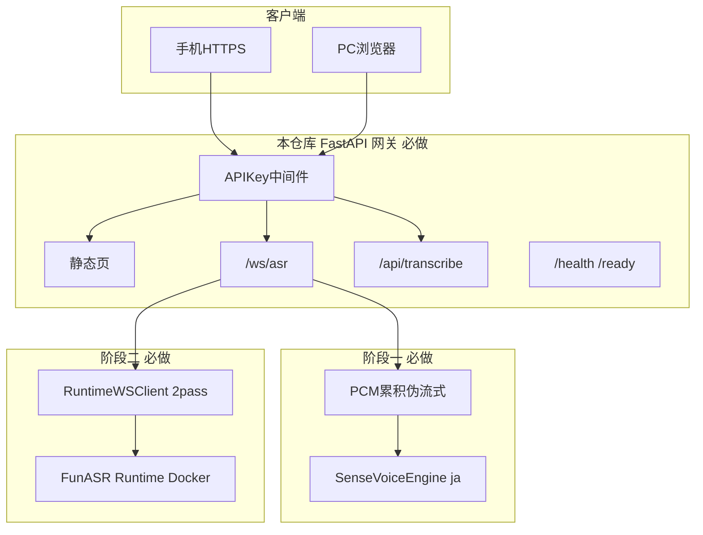

# 企业日语实时语音识别（双阶段必做）实施计划

## 一、背景

- 已有 [`python_voicetotext`](c:\python\workspace\python_voicetotext) PoC：FastAPI + 自研 WebSocket + [`web/`](c:\python\workspace\python_voicetotext\web) + 进程内 `AutoModel`（当前默认 [`paraformer-zh-streaming`](c:\python\workspace\python_voicetotext\config.yaml)）。
- 已修复：VAD/`chunk_size` 冲突（[`asr_engine.py`](c:\python\workspace\python_voicetotext\src\voicetotext\asr_engine.py) 不再捆绑 fsmn-vad）、HTTPS/mkcert 手机麦克风、[`README.md`](c:\python\workspace\python_voicetotext\README.md) 安装手顺。
- 新需求（讨论结论）：**企业生产、必须稳定**、**日语识别**、手机/PC Web 实时、后续 **Linux GPU** 部署；ASR 路径确定为 **两阶段均必做**：先 **SenseVoice 嵌入式**，再 **FunASR Runtime 2pass 侧车 + 配置切换**。

## 二、实施目的

| 目的 | 说明 |
|------|------|
| 日语准确稳定 | 默认 `language=ja`，弃用 `paraformer-zh-streaming` + `ct-punc` 生产默认 |
| 企业可运维 | 固定依赖版本、`/health`+`/ready`、API Key、连接/推理限流、结构化日志 |
| 实时 Web 保留 | 现有 `/ws/asr` 协议与 [`web/app.js`](c:\python\workspace\python_voicetotext\web\app.js) 前端不推翻，仅适配后端 |
| 生产可扩展 | 阶段二 Runtime 侧车为官方生产路径，本仓库作网关，同一 Web 入口 |
| 可验收交付 | doc/ 六份更新 + 阶段验收记录 + README 企业章节 |

## 三、方案内容（系统边界）



**配置切换（必做）**：[`config.yaml`](c:\python\workspace\python_voicetotext\config.yaml) 增加 `asr_backend: sensevoice | runtime`，生产默认先 `sensevoice`，阶段二完成后支持 `runtime` 且文档写明切换步骤。

**不在范围**：微信小程序、公网多租户 SaaS、MP4 内嵌播放器（批处理仅支持 **上传 WAV/经 ffmpeg 转 WAV**）。

## 四、达到要求（验收标准，全部必做）

### 4.1 阶段一（SenseVoice 嵌入式）

1. `asr_backend=sensevoice`，`language=ja`，`punc_model` 为空，不使用 `ct-punc`。
2. PC `https://127.0.0.1:8765`：麦克风日语说话，**5 秒内**出现 partial，句末有 final（含 SenseVoice ITN 后处理）。
3. 手机同 WiFi `https://<IP>:8765`：完成证书信任后可识别日语（与 [`doc/平台兼容性.md`](c:\python\workspace\python_voicetotext\doc\平台兼容性.md) 一致）。
4. 无 `list/int` VAD 类错误；连续识别 30 分钟服务不崩溃（内存无持续增长）。
5. 无 API Key 时 WebSocket 返回 `error` 并关闭；配置 Key 后正常。
6. `GET /ready` 在模型未加载时 503，加载后 200。
7. `POST /api/transcribe` 接受 16kHz WAV，返回 JSON 全文（日语）。
8. `pytest` 全通过（含新增 SenseVoice mock 测试，不依赖 GPU 下载）。

### 4.2 阶段二（Runtime 2pass 侧车）

1. [`deploy/docker-compose.yml`](c:\python\workspace\python_voicetotext\deploy\docker-compose.yml) 启动 Runtime（日语 online + 2pass 模型目录按 FunASR 文档配置）。
2. `asr_backend=runtime` 时，网关 **不** 进程内加载 SenseVoice，仅连接 Runtime WebSocket。
3. 2pass 协议映射：Runtime `2pass-online` → 客户端 `partial`，`2pass-offline` → 客户端 `final`（与现有 [`doc/WebSocket协议.md`](c:\python\workspace\python_voicetotext\doc\WebSocket协议.md) 对齐）。
4. PC/手机在 `runtime` 模式下日语识别验收通过。
5. `runtime` 不可达时 `/ready` 503，日志明确原因。
6. Linux 部署文档（README + doc）含 Docker 启动顺序：先 Runtime，再 gateway。

### 4.3 文档与版本

1. 锁定 [`requirements.txt`](c:\python\workspace\python_voicetotext\requirements.txt) 精确版本（funasr、torch 范围写明）。
2. doc/ 更新六份 + 新增 **企业日语生产方案**、**阶段一/二验收记录**。
3. [`doc/验收清单.md`](c:\python\workspace\python_voicetotext\doc\验收清单.md) 含全部 todo ID 勾选栏。

## 五、已有代码 vs 新开发代码

| 类型 | 路径 | 说明 |
|------|------|------|
| **已有可复用** | [`web/index.html`](c:\python\workspace\python_voicetotext\web\index.html)、[`web/app.js`](c:\python\workspace\python_voicetotext\web\app.js)、[`web/style.css`](c:\python\workspace\python_voicetotext\web\style.css) | UI、16k 重采样、WSS、mediaDevices 检测 |
| **已有可复用** | [`server/ws_protocol.py`](c:\python\workspace\python_voicetotext\src\voicetotext\server\ws_protocol.py)、[`server/app.py`](c:\python\workspace\python_voicetotext\src\voicetotext\server\app.py) 骨架 | WS 状态机、lifespan、静态挂载 |
| **已有可复用** | [`stream_session.py`](c:\python\workspace\python_voicetotext\src\voicetotext\stream_session.py) | 能量 VAD、finalize、reset（将改依赖注入引擎接口） |
| **已有可复用** | [`config.py`](c:\python\workspace\python_voicetotext\src\voicetotext\config.py)、[`logging_setup.py`](c:\python\workspace\python_voicetotext\src\voicetotext\logging_setup.py) | 扩展字段，非重写 |
| **已有可复用** | [`scripts/run_server.py`](c:\python\workspace\python_voicetotext\scripts\run_server.py)、[`scripts/generate_cert.py`](c:\python\workspace\python_voicetotext\scripts\generate_cert.py) | HTTPS 启动、证书生成 |
| **已有可复用** | [`cli.py`](c:\python\workspace\python_voicetotext\src\voicetotext\cli.py) | 改接统一引擎工厂 |
| **已有可复用** | [`tests/test_ws_protocol.py`](c:\python\workspace\python_voicetotext\tests\test_ws_protocol.py) 等 | 扩展，不删除 |
| **已有需重构** | [`asr_engine.py`](c:\python\workspace\python_voicetotext\src\voicetotext\asr_engine.py) | 拆为 `ParaformerEngine`（仅 dev 回归）或移除默认；生产不用 |
| **新开发** | `src/voicetotext/asr/base.py` | `ASRBackend` 协议：`load/transcribe_window/finalize_postprocess` |
| **新开发** | `src/voicetotext/asr/sensevoice_engine.py` | SenseVoiceSmall、`language=ja`、`trust_remote_code`、`rich_transcription_postprocess` |
| **新开发** | `src/voicetotext/asr/runtime_client.py` | FunASR 2pass WebSocket 客户端（二进制 PCM + JSON） |
| **新开发** | `src/voicetotext/asr/factory.py` | 按 `asr_backend` 构造引擎 |
| **新开发** | `src/voicetotext/server/auth.py` | API Key：Header `X-API-Key` 或 WS 首包 auth |
| **新开发** | `src/voicetotext/server/routes_transcribe.py` | `POST /api/transcribe` 批处理 |
| **新开发** | `src/voicetotext/stream_session_sv.py` | SenseVoice 累积窗口（`stream_window_ms` 默认 2000） |
| **新开发** | `deploy/docker-compose.yml`、`deploy/runtime.env.example` | Runtime 侧车 |
| **新开发** | `config.enterprise.yaml` | 企业生产默认：`sensevoice` + `ja` + api_key 占位 |
| **新开发** | `tests/test_sensevoice_engine.py`、`tests/test_runtime_client.py`、`tests/test_auth.py` | mock 测试 |
| **新开发** | doc 企业/阶段验收 md | 见第十二节 |

## 六、核心设计（必做细节）

### 6.1 SenseVoice 伪流式（阶段一）

- Web 仍发送 **600ms / 19200 字节** 块（不改前端协议）。
- 服务端 [`stream_session`](c:\python\workspace\python_voicetotext\src\voicetotext\stream_session.py) 累积至 `stream_window_ms`（配置默认 **2000ms**）再调用 SenseVoice `generate`，输出 partial。
- 静音 `vad_silence_ms` 触发 finalize，整段日语 + `rich_transcription_postprocess` → final。
- **禁止** 对 SenseVoice 传 `chunk_size=[0,10,5]`（Paraformer 专用）。

### 6.2 Runtime 网关（阶段二）

- 参考 FunASR [`websocket_protocol.md`](https://github.com/modelscope/FunASR/blob/main/runtime/docs/websocket_protocol.md)：`mode=2pass`，PCM 二进制，句末 `is_speaking:false`。
- [`runtime_client.py`](c:\python\workspace\python_voicetotext\src\voicetotext\asr\runtime_client.py) 维护与 Runtime 的单连接会话；[`ws_protocol.py`](c:\python\workspace\python_voicetotext\src\voicetotext\server\ws_protocol.py) 在 `asr_backend=runtime` 时转发。
- Docker Compose：服务名 `funasr-runtime`（端口如 10095）+ `voicetotext-gateway`（8765）。

### 6.3 企业加固（两阶段均启用）

- `api_key` 非空时启用鉴权（WebSocket start 消息增加 `api_key` 字段，与 Header 二选一）。
- `max_ws_connections` 默认 20，超出拒绝。
- `inference_lock` 保留，串行推理。
- `requirements` 增加 `funasr==1.3.9`（与当前环境一致，写死 patch 范围）。

### 6.4 配置新增字段（[`config.yaml`](c:\python\workspace\python_voicetotext\config.yaml) 必做）

```yaml
asr_backend: "sensevoice"      # sensevoice | runtime
language: "ja"
asr_model: "iic/SenseVoiceSmall"
punc_model: ""
trust_remote_code: true
stream_window_ms: 2000
api_key: "change-me-in-production"
max_ws_connections: 20
runtime_host: "127.0.0.1"
runtime_port: 10095
runtime_mode: "2pass"
runtime_chunk_size: "5,10,5"
model_hub: "ms"
```

## 七、实施步骤（严格顺序）

| 步骤 | 内容 | 验证 |
|------|------|------|
| P1-S1 | 新增 `asr/` 包、`ASRBackend`、`factory` | import 无环 |
| P1-S2 | 实现 `SenseVoiceEngine` + 单元测试 mock | pytest |
| P1-S3 | `stream_session` 改为依赖 `ASRBackend`；新增 SenseVoice 累积逻辑 | pytest stream |
| P1-S4 | 更新 `config.py` / `config.yaml` / `config.enterprise.yaml` | load_config |
| P1-S5 | `app.py` 使用 factory；`/ready`；`auth` 中间件 | curl /ready |
| P1-S6 | `routes_transcribe.py` WAV 批处理 | curl POST |
| P1-S7 | `ws_protocol` 支持 start 鉴权 | WS 测试 |
| P1-S8 | 更新 `cli.py` 走 SenseVoice | cli mic 日语 |
| P1-S9 | 锁定 requirements；README 企业+日语章节 | pip install |
| P1-S10 | doc 阶段一验收 + 功能影响记录 | 文档齐 |
| P2-S1 | `runtime_client.py` + 协议映射测试 | pytest |
| P2-S2 | `ws_protocol` runtime 分支；`app` lifespan 按 backend 分支加载 | 切换 config |
| P2-S3 | `deploy/docker-compose.yml` + `runtime.env.example` + 启动脚本 | docker compose up |
| P2-S4 | Linux 部署章节、Runtime 模型挂载说明 | 文档 |
| P2-S5 | 阶段二验收：runtime 模式 PC+手机日语 | doc 勾选 |
| P2-S6 | 汇总更新 `doc/企业日语生产方案.md`、`doc/架构与数据流.md` | 与代码一致 |

## 八、修改对象清单

| 文件 | 操作 |
|------|------|
| [`config.yaml`](c:\python\workspace\python_voicetotext\config.yaml) | 修改：日语 SenseVoice 默认 + 企业字段 |
| `config.enterprise.yaml` | 新建 |
| [`src/voicetotext/config.py`](c:\python\workspace\python_voicetotext\src\voicetotext\config.py) | 修改：新字段解析 |
| [`src/voicetotext/asr_engine.py`](c:\python\workspace\python_voicetotext\src\voicetotext\asr_engine.py) | 重构为 `asr/paraformer_engine.py` 或标记 deprecated |
| [`src/voicetotext/stream_session.py`](c:\python\workspace\python_voicetotext\src\voicetotext\stream_session.py) | 修改：后端抽象 + 窗口累积 |
| [`src/voicetotext/server/app.py`](c:\python\workspace\python_voicetotext\src\voicetotext\server\app.py) | 修改：factory、ready、路由挂载 |
| [`src/voicetotext/server/ws_protocol.py`](c:\python\workspace\python_voicetotext\src\voicetotext\server\ws_protocol.py) | 修改：鉴权、runtime 分支 |
| [`src/voicetotext/cli.py`](c:\python\workspace\python_voicetotext\src\voicetotext\cli.py) | 修改 |
| [`web/app.js`](c:\python\workspace\python_voicetotext\web\app.js) | 修改：start 消息带 `api_key`（从 query `?key=` 读取） |
| [`requirements.txt`](c:\python\workspace\python_voicetotext\requirements.txt) | 修改：锁版本 |
| [`README.md`](c:\python\workspace\python_voicetotext\README.md) | 修改：企业+两阶段+runtime |
| [`scripts/run_server.py`](c:\python\workspace\python_voicetotext\scripts\run_server.py) | 修改：支持 `--config config.enterprise.yaml` |
| `deploy/*`、`tests/*`、`doc/*` | 新建/更新见第五节 |

## 九、功能影响记录（实施时写入 doc）

| 影响域 | 变更 | 缓解 |
|--------|------|------|
| 识别语言 | 默认中文 → 日语 SenseVoice | 配置 `language` 固定 `ja` |
| 延迟 | 伪流式 2s 窗口，高于 600ms Paraformer | 阶段二 Runtime 2pass 降低延迟 |
| 模型体积 | SenseVoice + Runtime 镜像 | 内网预拉模型目录 |
| 鉴权 | 强制 API Key（enterprise 配置） | 部署时轮换 Key |
| 兼容性 | Paraformer 代码路径仅测试保留 | 生产 config 不用 |
| 运维 | 双进程（阶段二） | Compose 健康检查、启动顺序文档 |

## 十、实施完成后 doc/ 文档（必写全）

| 文档 | 内容 |
|------|------|
| [`doc/企业日语生产方案.md`](c:\python\workspace\python_voicetotext\doc\企业日语生产方案.md) | 背景、目的、两阶段方案、与 PoC 差异、部署拓扑 |
| [`doc/方案与实施说明.md`](c:\python\workspace\python_voicetotext\doc\方案与实施说明.md) | 更新为最终实施说明 |
| [`doc/架构与数据流.md`](c:\python\workspace\python_voicetotext\doc\架构与数据流.md) | sensevoice + runtime 双模式 mermaid |
| [`doc/WebSocket协议.md`](c:\python\workspace\python_voicetotext\doc\WebSocket协议.md) | 增加 `api_key`、runtime 映射表 |
| [`doc/功能影响记录.md`](c:\python\workspace\python_voicetotext\doc\功能影响记录.md) | 第九节实测数据 |
| [`doc/阶段一SenseVoice验收.md`](c:\python\workspace\python_voicetotext\doc\阶段一SenseVoice验收.md) | 4.1 逐项勾选 |
| [`doc/阶段二Runtime验收.md`](c:\python\workspace\python_voicetotext\doc\阶段二Runtime验收.md) | 4.2 逐项勾选 |
| [`doc/验收清单.md`](c:\python\workspace\python_voicetotext\doc\验收清单.md) | 全部 todo ID + 总验收 |

## 十一、Todo 表（与 doc/验收清单.md 同 ID）

实施过程中必须在 [`doc/验收清单.md`](c:\python\workspace\python_voicetotext\doc\验收清单.md) 逐项勾选。
