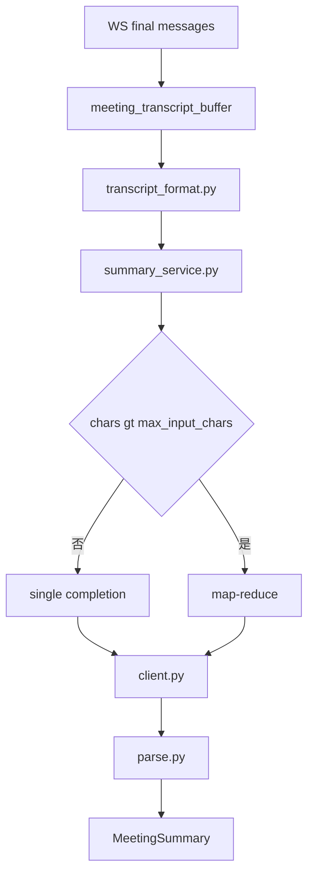
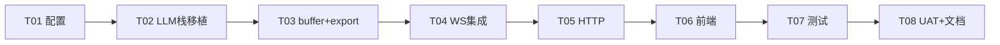

# 会议实时转写 LLM 会议纪要完整实施计划

## 一、背景

会议 v3 已具备：WebSocket v2 实时字幕（partial/final + `speaker_id`）、SenseVoice + FSMN-VAD + Pyannote、[`config.meeting.yaml`](config.meeting.yaml) 生产配置。

用户已在配置中写入 LLM 段（73–88 行），但当前代码**未接通**：

| 缺口 | 现状 |
|------|------|
| 配置 | [`config.py`](src/voicetotext/config.py) **无** `llm` 字段解析（yaml 写了也不生效） |
| LLM 模块 | [`src/voicetotext/llm/`](src/voicetotext/llm/) 仅有占位文件，**无** client/provider/summary_service |
| Transcript | 服务端只推送 final，**不累积**整场记录 |
| 协议 | [`WebSocket协议v2.md`](doc/meeting/WebSocket协议v2.md) 无纪要消息类型 |
| HTTP | [`meeting_app.py`](src/voicetotext/server/meeting_app.py) 无 summarize 端点 |
| 前端 | [`web/meeting.js`](web/meeting.js) 仅 DOM 字幕，无纪要面板 |
| 依赖 | [`requirements-meeting.txt`](requirements-meeting.txt) 无 `httpx` |

与批处理分支差异：**不能在会中调 LLM**（单次纪要 ~30s，会破坏实时 SLA）。纪要必须在 **`end` / 断开连接后** 异步生成。

批处理分支已实现的 LLM 栈（client/parse/prompts/summary_service/providers/factory）为本分支**移植来源**。

## 二、实施目的

1. `llm.enabled: true` 时，会议结束后自动生成结构化会议纪要（title/overview/topics/decisions/action_items/open_questions/markdown）。
2. 服务端在整场会议中累积 `final` 段，不依赖前端回传。
3. 客户端发 `end` 后 **WebSocket 保持连接**，服务端推送 `summary_progress` → `meeting_summary`，再关闭。
4. 落盘 `{session_id}.json` + `{session_id}.summary.md` 到 `out/meetings/`。
5. 提供 `POST /api/v1/meeting/summarize` 与 `GET /api/v1/meeting/sessions/{session_id}` 供重试与集成。
6. 长会话（`meeting_session_max_seconds: 7200`）通过 map-reduce 分块处理。
7. `on_failure: warn` 不否定已产出的字幕；同时实现 `on_failure: fail` 严格模式。
8. API 密钥写在 `config.meeting.yaml` 的 `llm.api_key`（用户明确要求）。
9. 实施完成后在 [`doc/meeting/`](doc/meeting/) 写入方案、实施总结、验收结果，并更新 [`doc/功能影响记录.md`](doc/功能影响记录.md)。

## 三、方案内容（全部必须实现）

### 3.1 配置层

扩展 [`src/voicetotext/config.py`](src/voicetotext/config.py)：

**`AppConfig` 新增字段（与批处理 LLM 对齐 + 会议专用）：**

| 字段 | 来源 | 默认值 |
|------|------|--------|
| `llm_enabled` | `llm.enabled` | `false` |
| `llm_provider` | 推断规则 | `stub` |
| `llm_model` | `llm.model` | — |
| `llm_api_url` | `llm.api_url` | — |
| `llm_api_key` | `llm.api_key`（主来源，写在 yaml） | — |
| `llm_temperature` | `llm.temperature` | `0.3` |
| `llm_max_tokens` | `llm.max_tokens` | `4096` |
| `llm_timeout_sec` | `llm.timeout` / `timeout_sec` | `120` |
| `llm_max_input_chars` | `llm.max_input_chars` | `120000` |
| `llm_chunk_chars` | `llm.chunk_chars` | `30000` |
| `llm_retry_max` | `llm.retry_max` | `2` |
| `llm_retry_backoff_sec` | `llm.retry_backoff_sec` | `2.0` |
| `llm_on_failure` | `llm.on_failure` | `"warn"` |
| `llm_output_summary_md` | `llm.output_summary_md` | `true` |
| `llm_api_version` / `llm_deployment` | azure 专用 | `null` |
| `llm_meeting_output_dir` | `llm.meeting_output_dir` | `"out/meetings"` |
| `llm_meeting_ws_wait_sec` | `llm.meeting_ws_wait_sec` | `180` |

**provider 推断（必须）：** `deployment` 非空 → `azure`；`api_url` 非空且 enabled → `openai_compatible`；`enabled: false` → `stub`。

**校验 `_validate_llm()`（必须）：** enabled 时必须有有效 api_url/model/api_key；temperature/max_tokens/timeout/on_failure/azure 规则与批处理一致。

**更新 [`config.meeting.yaml`](config.meeting.yaml)（在现有 73–88 行基础上补全）：**

```yaml
llm:
  enabled: true
  api_url: "https://dashscope.aliyuncs.com/compatible-mode/v1"
  model: "qwen-plus"
  api_key: "sk-..."              # 就写在这里
  temperature: 0.3
  max_tokens: 8096
  timeout: 120
  max_input_chars: 120000
  chunk_chars: 30000
  retry_max: 2
  retry_backoff_sec: 2
  on_failure: warn
  output_summary_md: true
  meeting_output_dir: "out/meetings"
  meeting_ws_wait_sec: 180
  api_version: ""
  deployment: ""
```

**启动：** [`scripts/run_meeting.py`](scripts/run_meeting.py) 在 `llm.enabled=true` 时调用 `require_llm_api_key()`。

**依赖：** `requirements-meeting.txt` 追加 `httpx>=0.27.0,<1.0.0`。

### 3.2 LLM 核心模块（移植批处理 + 会议适配）



**必须新建/移植的文件：**

| 文件 | 职责 |
|------|------|
| [`llm/transcript_format.py`](src/voicetotext/llm/transcript_format.py) | `[HH:MM:SS] SPEAKER_xx: text`；空段过滤；段边界分块 |
| [`llm/prompts.py`](src/voicetotext/llm/prompts.py) | ja/zh 系统 Prompt；强制 JSON 输出 |
| [`llm/client.py`](src/voicetotext/llm/client.py) | httpx POST `/chat/completions`；401/429/5xx/timeout；指数退避 |
| [`llm/parse.py`](src/voicetotext/llm/parse.py) | JSON → `MeetingSummary`；代码块剥离；repair 兜底 |
| [`llm/summary_service.py`](src/voicetotext/llm/summary_service.py) | 单次 + map-reduce + JSON repair |
| [`llm/providers/openai_compatible.py`](src/voicetotext/llm/providers/openai_compatible.py) | DashScope 主路径 |
| [`llm/providers/azure.py`](src/voicetotext/llm/providers/azure.py) | Azure OpenAI |
| [`llm/factory.py`](src/voicetotext/llm/factory.py) | `create_summary_provider(config)` |
| [`llm/meeting_transcript_buffer.py`](src/voicetotext/llm/meeting_transcript_buffer.py) | **会议专用**：累积 final；`speaker_id: int` → `SPEAKER_{id:02d}` |
| [`llm/meeting_export.py`](src/voicetotext/llm/meeting_export.py) | 写 `{session_id}.json` + `.summary.md` |

**必须扩展的文件：**

| 文件 | 改动 |
|------|------|
| [`llm/schemas.py`](src/voicetotext/llm/schemas.py) | `MeetingSummary`；结构化 `SummaryResponse`；`MeetingTranscript` dataclass |
| [`llm/summary.py`](src/voicetotext/llm/summary.py) | 保留 Protocol/Stub；导出工厂 |
| [`llm/__init__.py`](src/voicetotext/llm/__init__.py) | 导出公共 API |

**说话人映射（必须）：** `speaker_id=0` → `SPEAKER_00`；`single` 模式全部 `SPEAKER_00`。

**summary JSON 结构（必须，与批处理一致）：**

```json
{
  "title": "", "overview": "",
  "topics": [{"subject":"","discussion":"","conclusion":""}],
  "decisions": [], "action_items": [{"owner":"","task":"","due":""}],
  "open_questions": [], "markdown": "## 概要\n..."
}
```

### 3.3 实时会话集成

修改 [`meeting_ws_protocol.py`](src/voicetotext/server/meeting_ws_protocol.py) 中 `MeetingWSSession`：

1. 构造时创建 `MeetingTranscriptBuffer(session_id, language)`。
2. `_send_messages()`：每条 `type=final` 出站前 `buffer.append(msg)`。
3. 新增 `_run_meeting_summary(skip_summary: bool)`：
   - 条件：`config.llm_enabled and not skip_summary and buffer非空`
   - 发送 `summary_progress`（stage=generating）
   - `asyncio.to_thread(provider.summarize, ...)` 调用 LLM
   - 调用 `meeting_export.write(session_id, segments, summary, meta)`
   - 发送 `meeting_summary`（status=ok/error + files 路径）
   - 超时 `llm_meeting_ws_wait_sec` 发 error 并落盘 `summary=null`
4. `MeetingWSProtocolHandler._handle_end()`：解析 `skip_summary`；`end()` flush 后调用 `_run_meeting_summary`；**保持 WS 直到纪要完成**再 `return False` 断连。
5. `cleanup()`：若未走过 `_handle_end` 且 buffer 非空，同样调用 `_run_meeting_summary(skip_summary=false)`（用户直接关页仍有纪要）。

**会中绝不调用 LLM**（验收 M-A12 硬性要求）。

### 3.4 WebSocket 协议扩展（v2 向后兼容）

更新 [`doc/meeting/WebSocket协议v2.md`](doc/meeting/WebSocket协议v2.md)：

**客户端 `end` 扩展：**
```json
{"type":"end","is_speaking":false,"skip_summary":false}
```

**服务端新增消息：**
- `summary_progress`：`{"type":"summary_progress","protocol_version":2,"stage":"generating"}`
- `meeting_summary` 成功：`status=ok` + `summary` 对象 + `meta` + `files.json/summary_md`
- `meeting_summary` 失败：`status=error` + `error` 字段，`summary=null`

旧客户端忽略未知 type，字幕功能不受影响。

### 3.5 HTTP API

修改 [`meeting_app.py`](src/voicetotext/server/meeting_app.py)：

| 端点 | 行为 |
|------|------|
| `POST /api/v1/meeting/summarize` | 传 `segments` 或 `session_id`（读 `out/meetings/{id}.json`）；鉴权 meeting scope |
| `GET /api/v1/meeting/sessions/{session_id}` | 返回已落盘 transcript+summary |
| `GET /ready` | `detail.llm` 增加 `{enabled, ready, provider, model}` |

错误码：disabled→501；segments 空/json 不存在→400；上游错误→502；超时→504。

### 3.6 前端

修改 [`web/meeting.html`](web/meeting.html) + [`web/meeting.js`](web/meeting.js)：

1. 新增 `#summaryPanel` 纪要区域（标题、概要、待办列表）。
2. 处理 `summary_progress` → 状态「纪要生成中…」。
3. 处理 `meeting_summary` → 渲染 `summary.markdown`。
4. `btnStop` 发 `end` 后**不立即关 WS**，等待 `meeting_summary` 或 `meeting_ws_wait_sec` 超时。
5. 新增「复制纪要」「下载 .md」按钮（Blob 下载）。
6. 失败显示 error，字幕列表不受影响。

### 3.7 失败策略（必须实现两种）

| `on_failure` | 行为 |
|--------------|------|
| `warn`（默认） | 字幕正常；`meeting_summary.status=error`；json 中 `summary=null` |
| `fail` | `end` 阶段返回 `server_error`，不落 summary |

## 四、已有可用代码 vs 必须新开发

### 4.1 已有可用（复用/扩展）

| 模块 | 路径 | 复用方式 |
|------|------|----------|
| WS 协议框架 | [`meeting_ws_protocol.py`](src/voicetotext/server/meeting_ws_protocol.py) | `end`/`cleanup` 挂纪要 |
| Final 消息产出 | [`meeting_stream_session.py`](src/voicetotext/asr/meeting_stream_session.py) | 不改 ASR，拦截 outbound final |
| HTTP 应用 | [`meeting_app.py`](src/voicetotext/server/meeting_app.py) | 追加 REST 端点 |
| 鉴权 | [`auth.py`](src/voicetotext/server/auth.py) | `validate_meeting_api_key` + `require_http_api_key` |
| 配置加载 | [`config.py`](src/voicetotext/config.py) | 扩展 llm 解析 |
| 启动脚本 | [`run_meeting.py`](scripts/run_meeting.py) | llm key 校验 |
| 测试基础设施 | `tests/test_meeting_ws_handler.py` 等 9 个文件 | 扩展 mock 模式 |
| 批处理 LLM 栈 | 另一分支已实现 | **整包移植**到 meeting 分支 |

### 4.2 必须新开发

| 模块 | 路径 |
|------|------|
| 完整 llm 栈（8+ 文件） | 见 3.2 |
| 会议 transcript buffer | `llm/meeting_transcript_buffer.py` |
| 会议落盘导出 | `llm/meeting_export.py` |
| WS 协议 3 个新 type | 协议文档 + handler 实现 |
| HTTP 2 端点 | meeting_app.py |
| 前端纪要面板 | meeting.html/js + style.css |
| 测试夹具 | `tests/fixtures/config_meeting_llm_test.yaml` |
| 8 个新测试文件 | 见 3.8 |
| 文档 5 份 | 见第七节 |

## 五、实施步骤



| 步骤 | 任务 |
|------|------|
| T01 | 扩展 config.py + config.meeting.yaml 补字段 + httpx 依赖 + require_llm_api_key |
| T02 | 移植/实现 llm 全栈（schemas/client/parse/prompts/summary_service/providers/factory） |
| T03 | meeting_transcript_buffer.py + meeting_export.py |
| T04 | MeetingWSSession buffer 累积 + end/cleanup 异步纪要 + WS 新消息 |
| T05 | meeting_app.py HTTP 端点 + /ready llm 状态 |
| T06 | meeting.html/js 纪要面板 + end 后等待推送 |
| T07 | 全部测试 + pytest 全绿 |
| T08 | 人工 UAT + doc/meeting 文档 + 功能影响记录 |

## 六、测试矩阵（全部必须，无真实 API）

| 测试文件 | 覆盖 |
|----------|------|
| `tests/test_meeting_llm_config.py`（新建） | 全字段解析；enabled+无 key；azure 缺 deployment；占位符拒绝 |
| `tests/test_meeting_transcript_buffer.py`（新建） | final 累积；speaker 映射；空 text 过滤 |
| `tests/test_meeting_llm_client.py`（新建） | mock httpx：200/401/429/timeout |
| `tests/test_meeting_llm_summarize.py`（新建） | provider mock 端到端 |
| `tests/test_meeting_llm_map_reduce.py`（新建） | 超长 transcript 2+ HTTP |
| `tests/test_meeting_ws_summary.py`（新建） | end → summary_progress → meeting_summary 200 |
| `tests/test_meeting_ws_skip_summary.py`（新建） | end.skip_summary=true 不调 LLM |
| `tests/test_meeting_llm_disconnect.py`（新建） | 无 end 断开仍生成纪要 |
| `tests/test_meeting_llm_api.py`（新建） | HTTP summarize/session GET |
| `tests/test_meeting_llm_export.py`（新建） | json + summary.md 落盘 |
| 更新 `tests/test_meeting_config.py` | llm 字段断言 |
| 更新 `tests/test_meeting_ws_handler.py` | 现有 start/final 不被破坏 |

夹具：`tests/fixtures/config_meeting_llm_test.yaml`（假 key，mock HTTP）。

**门槛：pytest 全通过（现有会议测试 + 新增全部 green）。**

## 七、达到要求（验收 M-A1–M-A12，全部必须）

| ID | 要求 |
|----|------|
| M-A1 | `load_config(config.meeting.yaml)` 读取 llm 全字段含 api_key |
| M-A2 | `llm.enabled=true` 会议 end 后收到 `meeting_summary` 且 summary 非 null |
| M-A3 | summary 含 title/overview/topics/decisions/action_items/open_questions/markdown |
| M-A4 | 中文/日文会议能提取关键决议与待办 |
| M-A5 | 生成 `out/meetings/{session_id}.summary.md` |
| M-A6 | `end.skip_summary=true` 时不调 LLM、无 summary.md |
| M-A7 | on_failure=warn + mock 502：字幕正常，meeting_summary.status=error |
| M-A8 | on_failure=fail + mock 502：end 返回 server_error |
| M-A9 | POST /api/v1/meeting/summarize 传 segments 返回 200 |
| M-A10 | 传 session_id 可从磁盘 json 再摘要 |
| M-A11 | 前端纪要面板展示 markdown |
| M-A12 | pytest 全通过；会中无 LLM 调用（partial/final 时序不变） |

人工 UAT：真实会议录音 → end → 页面显示纪要 + 磁盘有 json/md。

## 八、功能影响记录（实施时必须写入）

更新 [`doc/功能影响记录.md`](doc/功能影响记录.md)，新增「会议 LLM 会议纪要」条目：

- **行为变更**：`llm.enabled=true` 时会后自动生成纪要；WS 新增 3 种消息；落盘 `out/meetings/`
- **协议变更**：v2 扩展 `summary_progress`、`meeting_summary`；`end` 可选 `skip_summary`
- **配置变更**：`config.meeting.yaml` llm 段；api_key 写在 yaml
- **不变项**：会中 partial/final 时序、PCM 19200 字节、FSMN+SenseVoice+Pyannote、HF token 走 secrets
- **主开关**：`llm.enabled`（非命令行）；跳过纪要仅 `end.skip_summary=true`

## 九、实施完成后文档交付（全部必须，保存到 doc/）

| 文档 | 路径 | 内容 |
|------|------|------|
| 会议 LLM 方案 | [`doc/meeting/LLM纪要方案.md`](doc/meeting/LLM纪要方案.md) | 背景、目的、架构、配置、协议、失败策略 |
| 会议 LLM 实施总结 | [`doc/meeting/LLM实施总结.md`](doc/meeting/LLM实施总结.md) | 改动清单、已有/新建对照、Todo 完成表、UAT 结果 |
| 协议更新 | [`doc/meeting/WebSocket协议v2.md`](doc/meeting/WebSocket协议v2.md) | 新消息类型 + end 扩展 |
| 架构更新 | [`doc/meeting/架构与数据流.md`](doc/meeting/架构与数据流.md) | mermaid 增加 MeetingSummary 节点 |
| 验收清单更新 | [`doc/meeting/v3验收清单.md`](doc/meeting/v3验收清单.md) | 新增 F10–F19、M-A1–M-A12 |
| 功能影响 | [`doc/功能影响记录.md`](doc/功能影响记录.md) | 会议 LLM 条目 |
| README | 会议启动 + LLM 配置说明 |

实施总结中必须包含 **Todo 完成状态表**（T01–T08，每项 pass/fail + 证据测试名）。

## 十、安全约束（实施时必须遵守）

- 日志与错误响应禁止输出 `api_key` 或完整 transcript（仅记 char 数、session_id、latency）
- 导出产物中不出现 api_key
