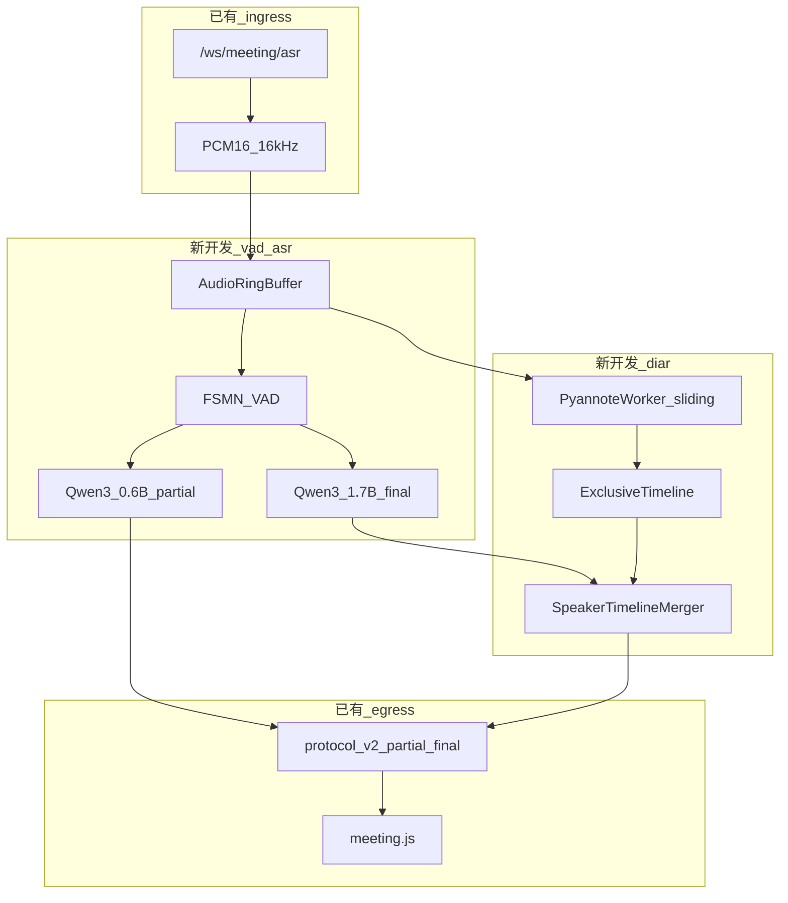

# 多人会议 ASR v2 全量实施计划

## 一、背景

| 项 | 说明 |
|----|------|
| 现状 | 仓库为**仅会议服务**：[`config.meeting.yaml`](config.meeting.yaml) 使用 `SenseVoiceSmall` + 能量 VAD + [`meeting_speaker.py`](src/voicetotext/asr/meeting_speaker.py) 对**整句 utterance** 做 cam++ 声纹聚类；[`meeting_stream_session.py`](src/voicetotext/asr/meeting_stream_session.py) 在定稿后贴 `speaker_id` |
| 问题 | 单麦多人场景下 ASR 切段与说话人切段不同步，短插话/重叠说话导致 `speaker_id` 系统性错误 |
| 目标环境 | **本地 Windows**：Python + [`web/meeting.html`](web/meeting.html) 调试，HTTPS 内网手机访问；**将来**：Apache 反代同一服务（与 [`doc/meeting/架构与数据流.md`](doc/meeting/架构与数据流.md) 中 8766 规划一致） |
| 硬件约束 | 开发机**无 GPU**，但必须与服务器 **同一套代码与配置结构**；通过 `device: cpu` / `device: cuda` 切换，禁止维护两套业务逻辑 |

## 二、实施目的

1. 用 **FSMN-VAD** 统一句界，废除能量阈值主切段。
2. 用 **Qwen3-ASR** 承担识别：0.6B 负责 partial，1.7B 负责 final（同一代码路径，服务器 GPU 满足实时，本地 CPU 允许延迟升高但行为一致）。
3. 用 **Pyannote Community-1** 的 `exclusive_speaker_diarization` 作为**唯一**说话人时间轴来源，废除 cam++ 句后聚类。
4. **FunASR `AutoModel`** 作为 ASR/VAD 加载与推理外壳（方案 A），Pyannote 独立进程内线程池，结果经时间轴合并模块写入协议 v2。
5. 保留并继续使用现有 **WebSocket 协议 v2**、鉴权、HTTPS 证书脚本、会议前端；实施结束后在 **`doc/meeting/`** 输出方案说明、架构、验收勾选、实施总结，并更新 [`doc/功能影响记录.md`](doc/功能影响记录.md)。

## 三、方案内容（模型组合与分工）

| 组件 | 模型 ID / 路径 | 分工 |
|------|----------------|------|
| VAD | `fsmn-vad`（FunASR） | 语音活动检测、句/段边界；驱动 utterance 缓冲与 finalize |
| ASR partial | `Qwen/Qwen3-ASR-0.6B` | 流式/准流式中间字幕，`partial` 下行 |
| ASR final | `Qwen/Qwen3-ASR-1.7B` | 句末对同一段音频重识别，`final` 下行 |
| 说话人 | `pyannote/speaker-diarization-community-1` | 滑窗 diarization → `exclusive_speaker_diarization` → 对齐 ASR 时间戳 → `speaker_id` |
| 胶水 | FunASR `AutoModel` | 加载 Qwen3 + VAD；`hub=hf`, `trust_remote_code=True` |
| 语言 | 配置项 `language: ja` / `zh` | 一次会议一种语言；默认 `ja`，会议 `start` 可带 `language` 覆盖 |

**不实施声分离模型**（MossFormer2 等）：本计划边界为 diarization + ASR；重叠段通过 Pyannote 标 overlap 并延迟 final，不在本阶段做盲源分离。



## 四、达到要求（全部必达，无「可选」）

### 4.1 功能

| # | 要求 |
|---|------|
| F1 | 端点仍为 `/ws/meeting/asr`，协议 v2 字段不变：`partial`/`final`/`speaker_change`/`pong`/`error`，见 [`doc/meeting/WebSocket协议v2.md`](doc/meeting/WebSocket协议v2.md) |
| F2 | `start.mode=meeting`，`protocol_version=2`；`language` 支持 `ja`、`zh`，配置默认 `ja` |
| F3 | partial：有语音后 **本地 CPU ≤8s**、**服务器 CUDA ≤2s** 出现首字（在验收环境分别记录） |
| F4 | final：句末静音（FSMN-VAD 驱动，保留 `vad_silence_ms` / `vad_silence_long_ms` 语义）后输出带 `speaker_id` 的 final |
| F5 | `speaker_id` **仅**来自 Pyannote 时间轴与 ASR 时间戳合并，禁止再调用 cam++ |
| F6 | 2 人交替无重叠录音 30min：`speaker_id` 段级与人工标注一致率 **≥85%**（验收清单写明录音来源） |
| F7 | 会话最长 `meeting_session_max_seconds: 7200`，超限发 `session_too_long` |
| F8 | API Key `meeting` scope、HTTPS（[`scripts/generate_cert.py`](scripts/generate_cert.py)）、手机同 WiFi 访问 `https://<LAN-IP>:8766` 完成开始/停止 |
| F9 | `device` 为 `cpu` 或 `cuda` 时**同一代码路径**，仅性能不同；禁止 `if cuda` 分支两套业务实现 |

### 4.2 工程

| # | 要求 |
|---|------|
| E1 | 新增依赖锁定文件（`requirements-meeting.txt` 或 `pyproject.toml` extras），版本写入 [`doc/meeting/模型与依赖.md`](doc/meeting/模型与依赖.md) |
| E2 | Pyannote 使用 HF token（环境变量 `HF_TOKEN`），启动时缺失则 `/ready` 为 false 并返回明确错误码 |
| E3 | pytest 全量通过；会议相关测试 **≥24** 条（含合并逻辑、配置校验、WS 映射） |
| E4 | 删除或停用 SenseVoice/cam++ 会议路径，[`doc/功能影响记录.md`](doc/功能影响记录.md) 记录破坏性变更 |
| E5 | 实施完成后提交 **`doc/meeting/`** 六份文档（见第十一节），验收清单全部勾选 |

### 4.3 部署（Apache 将来）

| # | 要求 |
|---|------|
| D1 | 服务监听 `0.0.0.0:8766`，与现有 [`scripts/run_meeting.py`](scripts/run_meeting.py) 一致 |
| D2 | 编写 [`doc/meeting/Apache部署.md`](doc/meeting/Apache部署.md)：443 → `wss://127.0.0.1:8766/ws/meeting/asr`，静态页反代规则 |
| D3 | 服务器 `config.meeting.yaml` 中 `device: cuda`；Windows 本地 `device: cpu` |

---

## 五、已有可用代码 vs 新开发代码

### 5.1 已有可用（保留，仅做必要接线修改）

| 模块 | 路径 | 用途 |
|------|------|------|
| WS 协议处理 | [`src/voicetotext/server/meeting_ws_protocol.py`](src/voicetotext/server/meeting_ws_protocol.py) | 握手、PCM 接收、下行 JSON |
| FastAPI 应用 | [`src/voicetotext/server/meeting_app.py`](src/voicetotext/server/meeting_app.py) | 路由、`/health`、`/ready`、静态 `web/` |
| 鉴权 | [`src/voicetotext/server/auth.py`](src/voicetotext/server/auth.py) | API Key scope |
| 协议工具 | [`src/voicetotext/server/protocol_common.py`](src/voicetotext/server/protocol_common.py) | `seg_id` 等 |
| ASR 抽象 | [`src/voicetotext/asr/base.py`](src/voicetotext/asr/base.py) | 引擎接口（扩展方法） |
| 工厂 | [`src/voicetotext/asr/factory.py`](src/voicetotext/asr/factory.py) | 创建引擎（改注册表） |
| 配置加载 | [`src/voicetotext/config.py`](src/voicetotext/config.py) | 扩展 meeting/qwen/pyannote 字段 |
| 日志 | [`src/voicetotext/logging_setup.py`](src/voicetotext/logging_setup.py) | 不变 |
| 前端 | [`web/meeting.html`](web/meeting.html)、[`web/meeting.js`](web/meeting.js)、[`web/style.css`](web/style.css) | 字幕 UI；**必须**改：显示 `speaker_id`、处理 `speaker_change` 修正 |
| 启动脚本 | [`scripts/run_meeting.py`](scripts/run_meeting.py)、[`scripts/run_meeting.ps1`](scripts/run_meeting.ps1) | 不变入口 |
| 证书 | [`scripts/generate_cert.py`](scripts/generate_cert.py) | HTTPS |
| 测试骨架 | [`tests/test_meeting_*.py`](tests/test_meeting_protocol.py)、[`tests/test_auth.py`](tests/test_auth.py) | 扩展而非重写 |

### 5.2 必须新开发

| 模块 | 路径 | 职责 |
|------|------|------|
| FunASR VAD 封装 | `src/voicetotext/asr/funasr_vad.py` | 加载 `fsmn-vad`，`detect_speech` / 段边界事件 |
| Qwen partial 引擎 | `src/voicetotext/asr/qwen_partial_engine.py` | 0.6B，`transcribe_window(..., is_final=False)` |
| Qwen final 引擎 | `src/voicetotext/asr/qwen_final_engine.py` | 1.7B，`finalize_utterance` |
| 会议组合引擎 | `src/voicetotext/asr/meeting_qwen_engine.py` | 实现 `ASRBackend`，组合 VAD+partial+final |
| Pyannote 工作器 | `src/voicetotext/asr/pyannote_worker.py` | 滑窗（默认 10s、步长 5s）、加载 Community-1、输出 exclusive 段 |
| 时间轴合并 | `src/voicetotext/asr/speaker_timeline.py` | ASR `[t_start,t_end]` 与 diarization 段求交，定 `speaker_id`；支持 `speaker_change` |
| 配置校验 | 扩展 `config.py` | 禁止 `sensevoice`/`campplus` 与 v2 同时启用；校验 `HF_TOKEN` |
| 测试 | `tests/test_funasr_vad.py`、`tests/test_speaker_timeline.py`、`tests/test_pyannote_worker.py`、`tests/test_meeting_qwen_engine.py` | 见实施步骤 |

### 5.3 必须修改（替换实现）

| 模块 | 路径 | 变更 |
|------|------|------|
| 流式会话 | [`src/voicetotext/asr/meeting_stream_session.py`](src/voicetotext/asr/meeting_stream_session.py) | 接入 `MeetingQwenEngine`；partial 可先 `speaker_id=last`；final 必须经 `SpeakerTimelineMerger` |
| 说话人 | [`src/voicetotext/asr/meeting_speaker.py`](src/voicetotext/asr/meeting_speaker.py) | **删除 cam++ 逻辑**；仅保留 `parse_runtime_timestamps` 等工具函数，或迁入 `speaker_timeline.py` 后删文件 |
| 旧嵌入式引擎 | [`src/voicetotext/asr/embedded_engine.py`](src/voicetotext/asr/embedded_engine.py) | 会议路径**禁止引用**；文件可保留供测试迁移或整文件删除（删除须在功能影响记录中写明） |
| 会议配置 | `config.meeting.yaml` | 新模型键、`device`、`language`、`pyannote_*`、`qwen_*` |
| 工厂 | [`src/voicetotext/asr/factory.py`](src/voicetotext/asr/factory.py) | `asr_backend: meeting_qwen`（或扩展 `embedded` 语义为 v2 栈） |

### 5.4 必须删除或停用的配置项

- `meeting_spk_model`（cam++）
- `meeting_spk_similarity_threshold` / `meeting_spk_new_speaker_max_sim`
- `asr_model: iic/SenseVoiceSmall`
- `vad_energy_threshold` 作为主 VAD（可保留仅作 debug 对比，**不得**用于生产切段）

---

## 六、配置设计（`config.meeting.yaml` 必含字段）

```yaml
service_mode: meeting
asr_backend: meeting_qwen
device: cpu          # 本地；服务器改为 cuda
language: ja         # ja | zh，会议 start 可覆盖

vad_model: fsmn-vad
qwen_partial_model: Qwen/Qwen3-ASR-0.6B
qwen_final_model: Qwen/Qwen3-ASR-1.7B
funasr_hub: hf
trust_remote_code: true

pyannote_model: pyannote/speaker-diarization-community-1
pyannote_window_sec: 10
pyannote_step_sec: 5
pyannote_hf_token_env: HF_TOKEN
meeting_max_speakers: 8

# 保留现有 meeting 行为参数
vad_silence_ms: 1500
vad_silence_long_ms: 2600
meeting_emit_partial: true
meeting_partial_interval_ms: 2000
meeting_session_max_seconds: 7200
ssl_certfile / ssl_keyfile / api_key / port 8766
```

---

## 七、实施步骤（按顺序执行）

### M0：文档与基线（实施前）

- 新建 [`doc/meeting/v2方案与背景.md`](doc/meeting/v2方案与背景.md)（背景、目的、模型分工、与 v1 差异）
- 复制 [`doc/meeting/验收清单.md`](doc/meeting/验收清单.md) → [`doc/meeting/v2验收清单.md`](doc/meeting/v2验收清单.md)，填入 F1–F9、E1–E5、D1–D3

### M1：依赖与环境

- 新增 `requirements-meeting.txt`：`funasr>=1.3.3`、`pyannote.audio>=4.0`、`torch`、`torchaudio`、`fastapi`、`uvicorn` 等
- 文档 [`doc/meeting/模型与依赖.md`](doc/meeting/模型与依赖.md)：Windows 安装、HF 模型许可接受、`HF_TOKEN` 设置
- `meeting_app` `/ready`：检测 Qwen/VAD/Pyannote 模型可加载

### M2：ASR+VAD 引擎（新开发）

- 实现 `funasr_vad.py`、`qwen_partial_engine.py`、`qwen_final_engine.py`、`meeting_qwen_engine.py`
- 扩展 [`src/voicetotext/asr/base.py`](src/voicetotext/asr/base.py)：`pcm_bytes_to_float32`、`detect_speech`、`transcribe_window`、`finalize_utterance`
- 更新 `factory.py`、`config.py` 校验
- 测试：`test_funasr_vad.py`、`test_meeting_qwen_engine.py`（mock 或短 wav）

### M3：Pyannote + 时间轴合并（新开发）

- 实现 `pyannote_worker.py`（线程安全队列，从 ring buffer 取音频）
- 实现 `speaker_timeline.py`：`assign_speaker(t_start, t_end) -> speaker_id`
- 测试：`test_pyannote_worker.py`（固定 wav + 预期段数）、`test_speaker_timeline.py`（纯逻辑交集）

### M4：会话层接线（修改）

- 重写 [`meeting_stream_session.py`](src/voicetotext/asr/meeting_stream_session.py) 数据流：
  - `feed_pcm` → ring → VAD → partial（0.6B）→ 下行 partial（`speaker_id` 用 `_last_speaker`）
  - finalize → 1.7B final → merger → 下行 final + 必要时 `speaker_change`
- 移除对 `MeetingSpeakerAssigner` cam++ 的调用
- 更新 [`tests/test_meeting_stream_session.py`](tests/test_meeting_stream_session.py)、[`tests/test_meeting_defer_finalize.py`](tests/test_meeting_defer_finalize.py)

### M5：前端与协议（修改）

- [`web/meeting.js`](web/meeting.js)：`speaker_change` 时更新当前行标签；final 覆盖 partial 同行
- 握手支持客户端传 `language`，写入会话上下文

### M6：配置、启动、HTTPS 验收

- 更新 `config.meeting.yaml`
- Windows：`generate_cert` → `run_meeting.ps1` → 手机 HTTPS UAT
- 记录 CPU 延迟基线到 v2验收清单

### M7：测试与 Apache 文档

- pytest 全绿，计数 ≥24
- 编写 [`doc/meeting/Apache部署.md`](doc/meeting/Apache部署.md)
- 更新 [`doc/meeting/架构与数据流.md`](doc/meeting/架构与数据流.md)（去掉 Runtime 10096/cam++，改为本方案图）
- 更新 [`doc/功能影响记录.md`](doc/功能影响记录.md)

### M8：实施总结（实施后必做）

- 编写 [`doc/meeting/v2实施总结.md`](doc/meeting/v2实施总结.md)：对照 Todo 逐项、UAT 结果、已知 CPU 限制与服务器 CUDA 切换说明
- v2验收清单**全部勾选**

---

## 八、修改对象清单

| 类型 | 路径 |
|------|------|
| 新建 | `src/voicetotext/asr/funasr_vad.py` |
| 新建 | `src/voicetotext/asr/qwen_partial_engine.py` |
| 新建 | `src/voicetotext/asr/qwen_final_engine.py` |
| 新建 | `src/voicetotext/asr/meeting_qwen_engine.py` |
| 新建 | `src/voicetotext/asr/pyannote_worker.py` |
| 新建 | `src/voicetotext/asr/speaker_timeline.py` |
| 新建 | `requirements-meeting.txt` |
| 新建 | `tests/test_funasr_vad.py` 等 4 个测试文件 |
| 新建 | `doc/meeting/v2方案与背景.md` 等 6 份文档 |
| 修改 | `config.meeting.yaml`、`src/voicetotext/config.py` |
| 修改 | `src/voicetotext/asr/factory.py`、`meeting_stream_session.py` |
| 修改 | `src/voicetotext/server/meeting_app.py`（ready 检查） |
| 修改 | `web/meeting.js` |
| 修改 | `doc/功能影响记录.md`、`doc/meeting/架构与数据流.md` |
| 删除/清空 | `meeting_speaker.py` 中 cam++ 注册表逻辑（或删文件并迁工具函数） |
| 停用 | 会议路径对 `embedded_engine.py`（SenseVoice）的引用 |

---

## 九、功能影响记录（实施时写入）

在 [`doc/功能影响记录.md`](doc/功能影响记录.md) 新增章节 **「会议 ASR v2」**：

| 影响项 | 说明 |
|--------|------|
| 模型 | SenseVoice、campplus 不再用于会议 |
| 配置 | 旧 `meeting_spk_*` 键移除；新增 `qwen_*`、`pyannote_*` |
| 依赖 | 需 `HF_TOKEN`、Pyannote 许可接受 |
| 性能 | CPU 下 partial/final/diarization 延迟显著高于 CUDA |
| 协议 | v2 不变；`speaker_change` 语义改为 Pyannote 纠错 |
| 部署 | Apache 仅反代，无新端口 |

---

## 十、实施完成后 doc 目录交付物

| 文档 | 内容 |
|------|------|
| [`doc/meeting/v2方案与背景.md`](doc/meeting/v2方案与背景.md) | 背景、目的、方案、模型分工 |
| [`doc/meeting/架构与数据流.md`](doc/meeting/架构与数据流.md) | 更新为 v2 管线（覆盖旧 Runtime 描述） |
| [`doc/meeting/模型与依赖.md`](doc/meeting/模型与依赖.md) | 版本、HF、Windows/服务器 |
| [`doc/meeting/v2验收清单.md`](doc/meeting/v2验收清单.md) | F/E/D 全部项 + 勾选结果 |
| [`doc/meeting/v2实施总结.md`](doc/meeting/v2实施总结.md) | Todo 对照、测试数、UAT 截图说明 |
| [`doc/meeting/Apache部署.md`](doc/meeting/Apache部署.md) | 反代与 wss |
| [`doc/功能影响记录.md`](doc/功能影响记录.md) | 破坏性变更 |

---

## 十一、Todo 表（实施与结果管理）

实施过程中用 Cursor Plan todos 跟踪；**每项完成后**在 `v2实施总结.md` 记录证据（命令输出 / 测试名 / 验收编号）。

| ID | 任务 | 类型 | 完成标准 |
|----|------|------|----------|
| m0-doc | 编写 v2方案与背景 + v2验收清单 | 文档 | 文件存在且含 F1–F9 |
| m1-deps | requirements-meeting + 模型与依赖.md | 工程 | pip install 成功说明 |
| m1-ready | meeting_app /ready 检查三模型 | 修改 | 无 token 时 ready=false |
| m2-vad | funasr_vad.py + 测试 | 新开发 | test_funasr_vad 通过 |
| m2-qwen | qwen partial/final + meeting_qwen_engine | 新开发 | test_meeting_qwen_engine 通过 |
| m2-factory | factory + config 校验 | 修改 | test_meeting_config 通过 |
| m3-pyannote | pyannote_worker.py + 测试 | 新开发 | 固定 wav 输出段 |
| m3-merge | speaker_timeline.py + 测试 | 新开发 | test_speaker_timeline 通过 |
| m4-session | meeting_stream_session 接线 | 修改 | test_meeting_stream_session 通过 |
| m4-remove-camp | 移除 cam++/SenseVoice 会议引用 | 修改 | grep 无 campplus 会议路径 |
| m5-web | meeting.js speaker_change | 修改 | 手机 HTTPS 可见话者切换 |
| m6-config | config.meeting.yaml 新字段 | 修改 | ja/zh 切换验收 |
| m6-uat-win | Windows CPU HTTPS UAT | 验收 | v2验收清单 CPU 项勾选 |
| m7-pytest | 全量 pytest ≥24 会议相关 | 测试 | CI 本地全绿 |
| m7-apache-doc | Apache部署.md | 文档 | 含 wss 配置示例 |
| m7-arch-doc | 架构与数据流更新 | 文档 | 与 mermaid 一致 |
| m7-impact | 功能影响记录 | 文档 | 含破坏性说明 |
| m8-summary | v2实施总结 + 验收勾选 | 文档 | 全部 Todo ID 有结论 |

---

## 十二、风险与统一架构约束（必须在实施总结中写明）

| 风险 | 对策 |
|------|------|
| 本地无 GPU，Qwen3/Pyannote 慢 | **不**拆两套逻辑；验收分「CPU 基线」与「CUDA 目标」两栏，服务器切换仅改 `device: cuda` |
| Qwen3 FunASR 流式 API 与 vLLM 差异 | M2  spike：用 10s 样例验证 `AutoModel.generate` 增量行为；不满足则在同一 `meeting_qwen_engine` 内用 **chunk 循环** 模拟流式（仍属方案 A，不引入第二套服务） |
| Pyannote 非流式 | 滑窗 + final 时强制 merge；允许 speaker 延迟 ≤15s |
| 日语精度 | v2验收清单含 ja、zh 各 1 段 5min 录音 |

---

## 十三、与旧计划关系

- 废弃 [`doc/meeting/实施总结.md`](doc/meeting/实施总结.md) 中 SenseVoice/cam++/Runtime 10096 结论作为**当前生产路径**的描述；v2 总结写入 `v2实施总结.md`，旧文件顶部加「已被 v2 取代」说明（实施 M8 时完成）。
