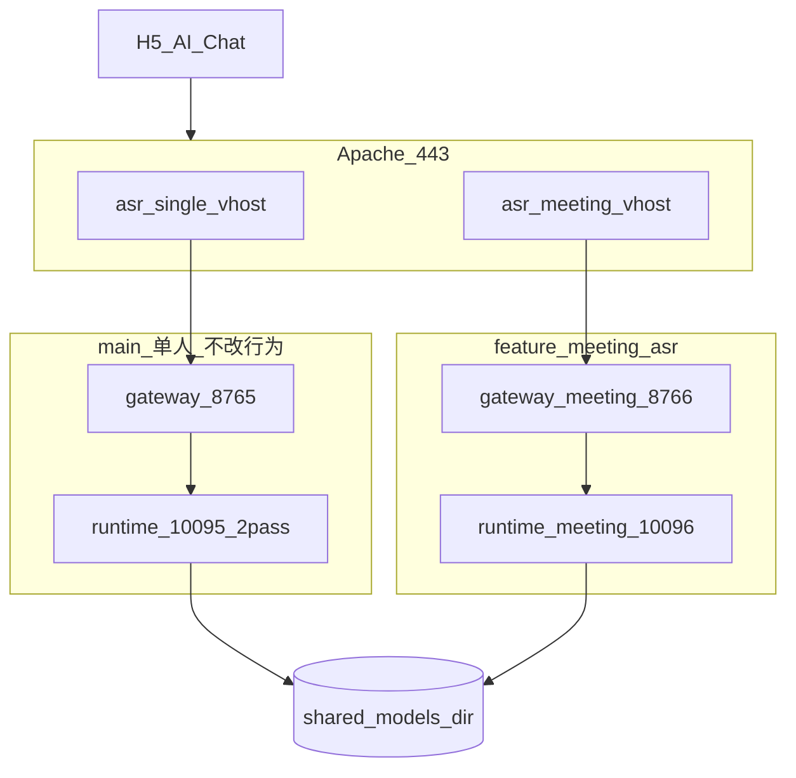

# 多人实时字幕（Meeting ASR）全量实施计划

**分支**：`feature/meeting-asr`（仅本分支开发；**禁止**修改 main 上 [`/ws/asr`](src/voicetotext/server/app.py) v1 行为与 [`config.enterprise.yaml`](config.enterprise.yaml) 默认语义）

---

## 一、背景

| 项 | 说明 |
|----|------|
| 现状 | 仓库已完成 **单人** 公开发布：SenseVoice 嵌入式 + Runtime 2pass 网关转发；端点 `/ws/asr`，协议见 [`doc/WebSocket协议.md`](doc/WebSocket协议.md) |
| 缺口 | 无 `speaker_id`、无会议长连接语义、[`StreamSession`](src/voicetotext/stream_session.py) 的 `_session_pcm` 与 600s 上限面向单人定稿 |
| 业务场景 | 同一话筒 2 人及以上日语对话；**实时字幕**（partial 滚动 + final 句末修正）；企业 HTTPS 对外；Apache **双服务**（单人 8765 / 多人 8766） |
| 模型目录 | 单人/多人 Runtime **共用** 宿主机 [`deploy/runtime.env.example`](deploy/runtime.env.example) 中 `RUNTIME_MODEL_DIR=./models` 根目录，不同 `RUNTIME_MODEL_PATH` 子路径 |

---

## 二、实施目的

1. 交付可对外开放的 **多人专用** WebSocket 服务（`/ws/meeting/asr`，协议 v2）。
2. 与单人服务 **运行隔离**（独立端口、独立 Runtime 容器、独立配置），共享 `models/` 目录结构。
3. 满足企业基线：API Key（含 `meeting` scope）、`/health` `/ready`、完整错误码、pytest 门禁、UAT 清单、功能影响记录。
4. 实施结束后在 **`doc/meeting/`** 输出方案说明、协议、验收结果、**实施总结**（对照本计划逐项勾选）。

---

## 三、达到要求（全部必达，无「可选」）

### 3.1 功能

- 日语 `language: ja`；`start.mode` 必须为 `meeting`；`protocol_version` 必须为 `2`。
- 下行含：`partial` / `final`（含 `seg_id`、`speaker_id`、`t_start_ms`；final 含 `t_end_ms`）、`speaker_change`、`pong`；错误码表 3.3 全部实现。
- 长连接：客户端每 30s 发 `ping`；会话设计目标 **7200s（2h）** 无 OOM（`meeting_session_max_seconds: 7200`，超限发 `session_too_long`）。
- **禁止** Meeting 路径使用 `StreamSession`、`_session_pcm`、`SenseVoiceEngine` 推理。
- 演示页 [`web/meeting.html`](web/meeting.html) + [`web/meeting.js`](web/meeting.js) 可完成 2 人 30min 字幕演示。

### 3.2 部署

- [`deploy/docker-compose.meeting.yml`](deploy/docker-compose.meeting.yml)：`funasr-runtime-meeting` **10096** + `voicetotext-gateway-meeting` **8766**。
- [`deploy/runtime.meeting.env.example`](deploy/runtime.meeting.env.example)：`RUNTIME_MODEL_DIR` 与单人相同根目录；会议模型路径 **以 M0 文档为准** 写入。
- [`doc/meeting/Apache双服务部署.md`](doc/meeting/Apache双服务部署.md)：双 `ProxyPass` / 双 vhost + WebSocket Upgrade + 超时。

### 3.3 错误码（全部实现并写入协议文档）

`unauthorized`、`too_many_connections`、`invalid_json`、`not_started`、`invalid_chunk`、`protocol_mismatch`、`runtime_unavailable`、`runtime_error`、`session_too_long`、`unsupported_language`、`unknown_type`、`server_error`。

鉴权/协议类错误：**关闭连接**；`runtime_error`：**关闭连接**（文档与实现一致）。

### 3.4 测试与文档

- 新增 meeting 相关 pytest **不少于 18 条**；全仓库 `pytest tests/ -q` 必须通过。
- 更新 [`doc/功能影响记录.md`](doc/功能影响记录.md)「多人会议」章节。
- `doc/meeting/` 下 **8 个** 交付文档（见第七节）；其中 **`doc/meeting/实施总结.md`** 仅在全部 Todo 完成后编写。

### 3.5 UAT（实施总结中必须附勾选表，全部勾选才可合并 main）

M1–M7、N1–N5、S1–S3（与下文 Todo `uat-*` 一一对应）。

---

## 四、架构（必做部署形态）



---

## 五、已有可用代码 vs 必须新开发

### 5.1 已有可用（直接复用或扩展，不重写）

| 模块 | 路径 | 复用方式 |
|------|------|----------|
| 配置加载 | [`config.py`](src/voicetotext/config.py) `load_config` | **扩展**字段，不破坏现有字段默认值 |
| Runtime 连通检测 | [`runtime_client.py`](src/voicetotext/asr/runtime_client.py) `ping_ready`、`connect`/`send_pcm`/`recv_message` 模式 | **新类** `MeetingRuntimeWSClient` 继承或组合复用 |
| v1 映射逻辑参考 | `RuntimeWSClient.map_runtime_to_client` | 仅作参考；会议用 **新** `map_runtime_to_meeting` |
| Runtime 网关引擎 | [`runtime_gateway.py`](src/voicetotext/asr/runtime_gateway.py) | meeting 进程 `asr_backend=runtime` **复用** `RuntimeGatewayEngine` |
| 工厂 | [`factory.py`](src/voicetotext/asr/factory.py) | meeting 配置仍 `runtime`，**不新增** backend 枚举 |
| WS 工具 | [`ws_protocol.py`](src/voicetotext/server/ws_protocol.py) `encode_message`、`parse_client_message`、`send_error` | **原样复用** |
| 鉴权骨架 | [`auth.py`](src/voicetotext/server/auth.py) `extract_ws_api_key`、`validate_api_key` | **扩展** scope；v1 逻辑保持不变 |
| 连接上限模式 | [`app.py`](src/voicetotext/server/app.py) `_active_ws_connections` | meeting 路由 **复制同一计数模式**（独立全局计数器） |
| 启动脚本 | [`scripts/run_server.py`](scripts/run_server.py) | `--config config.meeting.yaml` **无需改代码** |
| Docker 网关镜像 | [`deploy/Dockerfile.gateway`](deploy/Dockerfile.gateway) | meeting compose **复用** Dockerfile，改 `VOICETOTEXT_CONFIG` |
| 单人 compose | [`deploy/docker-compose.yml`](deploy/docker-compose.yml) | **不修改**；meeting 新建 compose |
| chunk 大小 | `AppConfig.chunk_stride_bytes`（19200） | meeting **相同** |
| 现有 pytest | `test_runtime_client.py`、`test_auth.py`、`test_ws_protocol.py` 等 | **必须保持通过** |

### 5.2 必须新开发（本分支全部要实现）

| 类别 | 新文件/新类型 |
|------|----------------|
| 配置 | `config.meeting.yaml`；`config.py` 增加 `service_mode`、`meeting_max_speakers`、`meeting_session_max_seconds`、`api_key_scopes` |
| Runtime 客户端 | `src/voicetotext/asr/meeting_runtime_client.py`（handshake 参数、会议 JSON 映射、`seg_id` 生成） |
| WS 处理器 | `src/voicetotext/server/meeting_ws_protocol.py`（`MeetingWSProtocolHandler`：v2 start 校验、ping/pong、无 StreamSession） |
| 路由 | `app.py` 增加 `/ws/meeting/asr`；`health`/`ready` 含 `service_mode: meeting` |
| 鉴权 | `auth.py`：`validate_meeting_api_key`（scope 含 `meeting`） |
| 部署 | `docker-compose.meeting.yml`、`runtime.meeting.env.example` |
| 前端 | `web/meeting.html`、`web/meeting.js` |
| 测试 | `tests/test_meeting_*.py`（≥4 文件，≥18 cases） |
| 文档 | `doc/meeting/*` 全套 + 实施后 `实施总结.md` |
| M0 产出 | `doc/meeting/FunASR运行时调研.md`（选定二进制、模型列表、JSON 字段样例） |

### 5.3 明确不做的改动（避免影响单人）

- **不修改** [`WSProtocolHandler`](src/voicetotext/server/ws_protocol.py) 的 v1 逻辑。
- **不修改** [`web/app.js`](web/app.js) / [`web/index.html`](web/index.html)。
- **不将** meeting 合并进单人 Runtime 容器（10095）。

---

## 六、M0 技术结论（阻塞项，必须先完成）

**Todo `m0-spike` 完成前，禁止实现 M2 Runtime 映射。**

必须在 [`doc/meeting/FunASR运行时调研.md`](doc/meeting/FunASR运行时调研.md) 中 **书面锁定**（无「待定」）：

1. Runtime 镜像 tag（基于现有 `funasr-runtime-sdk-online-cpu-0.1.12` 或调研后的会议 capable 版本）。
2. 启动命令行（`funasr-wss-server-*` 名称及全部 `--model-dir` / spk 相关参数）。
3. 会议所需模型在 `models/` 下的 **完整相对路径列表**（含 VAD、ASR、说话人模型）。
4. Runtime 返回 JSON **样例 3 条**（含 speaker 字段名、时间字段名）。
5. 2 人 30min、2h 内存曲线 **记录表**（宿主机或容器 RSS）。

若官方会议 WebSocket 不可用：文档必须写明 **备用方案**（同文档内选定一种并作为唯一实现路径，例如 FunASR Python Pipeline 侧车进程 + 网关 IPC），且 M2 按该方案实现。**不允许** 计划中留两套并行实现。

---

## 七、实施步骤与修改对象

### 步骤 1：M0 调研文档（阻塞）

- **新建** [`doc/meeting/FunASR运行时调研.md`](doc/meeting/FunASR运行时调研.md)
- **新建** [`doc/meeting/方案与背景.md`](doc/meeting/方案与背景.md)（背景、目的、达到要求、架构图、与单人对比）

### 步骤 2：配置与协议文档

- **新建** [`config.meeting.yaml`](config.meeting.yaml)：`port: 8766`、`asr_backend: runtime`、`service_mode: meeting`、`runtime_port: 10096`、`language: ja`、`ja_apply_punctuation: false`、`punc_model: ""`、`meeting_max_speakers: 8`、`meeting_session_max_seconds: 7200`、`api_key` + `api_key_scopes: [meeting]`
- **修改** [`src/voicetotext/config.py`](src/voicetotext/config.py)：新增字段与校验（`service_mode=meeting` 时拒绝 `asr_backend=sensevoice`）
- **新建** [`doc/meeting/WebSocket协议v2.md`](doc/meeting/WebSocket协议v2.md)（完整 JSON、时序图、错误码）
- **新建** [`doc/meeting/SLA与限制说明.md`](doc/meeting/SLA与限制说明.md)

### 步骤 3：Runtime 会议客户端

- **新建** [`src/voicetotext/asr/meeting_runtime_client.py`](src/voicetotext/asr/meeting_runtime_client.py)
  - `MeetingRuntimeWSClient.connect(start_msg)`：按 M0 文档 handshake
  - `map_runtime_to_meeting(msg) -> dict`：输出 v2 partial/final/speaker_change
  - `new_seg_id()`：UUID4 短码
- **新建** [`src/voicetotext/server/meeting_ws_protocol.py`](src/voicetotext/server/meeting_ws_protocol.py)
  - `MeetingRuntimeWSSession`（仿 `RuntimeWSSession`，用 Meeting 客户端）
  - `MeetingWSProtocolHandler`：校验 `protocol_version==2`、`mode==meeting`；处理 `ping`/`end`；会话时长检查（不落 PCM）

### 步骤 4：应用入口与鉴权

- **修改** [`src/voicetotext/server/app.py`](src/voicetotext/server/app.py)：注册 `/ws/meeting/asr`；`_active_meeting_ws_connections`；`health`/`ready` 增加 `service_mode`
- **修改** [`src/voicetotext/server/auth.py`](src/voicetotext/server/auth.py)：`api_key_scopes` 解析；`validate_meeting_api_key`
- **修改** [`scripts/run_server.py`](scripts/run_server.py)：启动日志打印 `service_mode`（一行）

### 步骤 5：部署

- **新建** [`deploy/docker-compose.meeting.yml`](deploy/docker-compose.meeting.yml)
- **新建** [`deploy/runtime.meeting.env.example`](deploy/runtime.meeting.env.example)
- **修改** [`deploy/Dockerfile.gateway`](deploy/Dockerfile.gateway)：COPY `config.meeting.yaml`（供 meeting 容器使用）
- **新建** [`doc/meeting/Apache双服务部署.md`](doc/meeting/Apache双服务部署.md)
- **新建** [`doc/meeting/架构与数据流.md`](doc/meeting/架构与数据流.md)

### 步骤 6：演示前端

- **新建** [`web/meeting.html`](web/meeting.html)、[`web/meeting.js`](web/meeting.js)
  - 连接 `wss://host:8766/ws/meeting/asr`（或 Apache 反代路径）
  - 按 `seg_id` 更新 DOM 行；显示 `話者{n}`；30s `ping`；停止发 `end`

### 步骤 7：测试（门禁）

- **新建** `tests/test_meeting_config.py`
- **新建** `tests/test_meeting_protocol.py`
- **新建** `tests/test_meeting_runtime_map.py`
- **新建** `tests/test_meeting_auth.py`
- **新建** `tests/test_meeting_ws_handler.py`（mock WebSocket + mock Runtime）
- **修改** [`tests/test_config.py`](tests/test_config.py)：meeting 字段加载断言

### 步骤 8：影响记录与验收清单

- **修改** [`doc/功能影响记录.md`](doc/功能影响记录.md)：新增「多人会议服务」表（内存、协议、部署、对单人无影响声明）
- **新建** [`doc/meeting/验收清单.md`](doc/meeting/验收清单.md)（M1–M7、N1–N5、S1–S3 勾选项）
- **修改** [`README.md`](README.md)：增加「多人会议分支」章节，指向 `config.meeting.yaml` 与 `doc/meeting/`

### 步骤 9：UAT 执行与实施总结（最后一步）

- 按 [`doc/meeting/验收清单.md`](doc/meeting/验收清单.md) 执行 UAT，填写结果
- **新建** [`doc/meeting/实施总结.md`](doc/meeting/实施总结.md)：对照本计划 Todo 表逐项「完成/证据」；附 UAT 勾选截图或日志摘要；列出已有代码复用清单与新文件清单；已知限制引用 SLA 文档

---

## 八、协议 v2 要点（实现必遵）

**`start`（客户端）**

```json
{
  "type": "start",
  "protocol_version": 2,
  "mode": "meeting",
  "language": "ja",
  "wav_name": "room_001",
  "audio_fs": 16000,
  "wav_format": "pcm",
  "max_speakers": 8,
  "itn": true,
  "api_key": "...",
  "session_id": "client-uuid"
}
```

**`partial` / `final`（服务端）**：必须含 `protocol_version: 2`、`seg_id`、`speaker_id`、`t_start_ms`；final 含 `t_end_ms`。

**音频**：19200 字节/块，与 v1 相同（[`chunk_stride_bytes`](src/voicetotext/config.py)）。

---

## 九、功能影响记录（实施中必须维护）

在 [`doc/功能影响记录.md`](doc/功能影响记录.md) 追加表格，至少包含：

| 影响域 | 变更 | 对单人服务影响 |
|--------|------|----------------|
| 新端点 | `/ws/meeting/asr` | 无（独立端口/进程） |
| 配置 | `config.meeting.yaml` | 无（不改 enterprise 默认） |
| 模型目录 | 共用 `models/` | 仅增子目录；单人路径不变 |
| 依赖 | 会议 Runtime 镜像/模型体积 | 单人容器不加载会议模型 |
| API | `api_key_scopes` | 无 key 时 meeting 仍拒绝；单人 key 无 meeting scope 不能连 meeting |

---

## 十、实施 Todo 表（全部必做；用于 PR / 实施总结勾选）

| ID | 任务 | 类型 | 依赖 | 完成标准 |
|----|------|------|------|----------|
| m0-spike | FunASR 会议 Runtime 调研并锁定二进制与模型路径 | 文档+验证 | — | `FunASR运行时调研.md` 无待定项 |
| m0-doc-background | 编写 `方案与背景.md` | 文档 | m0-spike | 含背景/目的/要求/架构 |
| m1-config | `config.meeting.yaml` + `config.py` 扩展与校验 | 新开发+修改 | m0-spike | `load_config` 测试通过 |
| m1-protocol-doc | `WebSocket协议v2.md` + `SLA与限制说明.md` | 文档 | m1-config | 错误码与 v1 对比完整 |
| m2-meeting-runtime-client | `meeting_runtime_client.py` | 新开发 | m0-spike | 映射单测覆盖 M0 样例 JSON |
| m2-meeting-ws-handler | `meeting_ws_protocol.py` | 新开发 | m2-meeting-runtime-client | 不引用 StreamSession |
| m2-app-route | `app.py` meeting 路由与 health/ready | 修改 | m2-meeting-ws-handler | `/ws/meeting/asr` 可握手 |
| m2-auth-scope | `auth.py` meeting scope | 修改 | m1-config | 无 scope 返回 unauthorized |
| m3-compose | `docker-compose.meeting.yml` + `runtime.meeting.env.example` | 新开发 | m0-spike | `docker compose` 两容器 healthy |
| m3-dockerfile | Dockerfile 复制 meeting 配置 | 修改 | m3-compose | meeting 镜像可启动 |
| m3-apache-doc | `Apache双服务部署.md` | 文档 | m3-compose | 含 WS Upgrade 与双端口 |
| m3-arch-doc | `架构与数据流.md` | 文档 | m2-app-route | mermaid 与单人对比 |
| m4-web-meeting | `meeting.html` + `meeting.js` | 新开发 | m2-app-route | 2 人演示可看到 speaker 行 |
| m5-test-suite | meeting 测试 ≥18 + 全量 pytest 绿 | 新开发 | m2-* | CI 本地 `pytest -q` 0 failed |
| m5-impact-doc | 更新 `功能影响记录.md` | 文档 | m4-web-meeting | 表已追加 |
| m5-readme | README 多人章节 | 文档 | m3-apache-doc | 链接 doc/meeting |
| m5-acceptance-doc | `验收清单.md` | 文档 | m1-protocol-doc | 含 M/N/S 全部项 |
| uat-m1 | UAT：2 人轮流 30min | 实测 | m4-web-meeting | 清单勾选 |
| uat-m2 | UAT：3 人轮流 30min | 实测 | uat-m1 | 清单勾选 |
| uat-m3 | UAT：2h 长连接内存稳定 | 实测 | m3-compose | 清单勾选 |
| uat-m4 | UAT：手机 HTTPS | 实测 | m3-apache-doc | 清单勾选 |
| uat-m5 | UAT：轻度重叠 2min | 实测 | uat-m1 | 清单勾选+SLA 说明 |
| uat-m6 | UAT：end 挂断收 final | 实测 | m4-web-meeting | 清单勾选 |
| uat-m7 | UAT：停 Runtime → runtime_unavailable | 实测 | m2-app-route | 清单勾选 |
| uat-n1 | 记录 partial P95 延迟 | 实测 | uat-m1 | 写入验收清单 |
| uat-n2 | 记录 final P95 延迟 | 实测 | uat-m1 | 写入验收清单 |
| uat-n3 | 并发 5 路 30min 压测 | 实测 | m3-compose | 写入验收清单 |
| uat-n4 | pytest 全绿 | 实测 | m5-test-suite | 清单勾选 |
| uat-n5 | 单人 `/ws/asr` 回归 | 实测 | — | main 配置下 v1 仍通过 |
| uat-s1 | 无 api_key 拒绝 | 实测 | m2-auth-scope | 清单勾选 |
| uat-s2 | 单人 key 不能连 meeting | 实测 | m2-auth-scope | 清单勾选 |
| uat-s3 | TLS 经 Apache | 实测 | m3-apache-doc | 清单勾选 |
| m6-summary | `doc/meeting/实施总结.md` | 文档 | 全部 uat-* | Todo 表逐项「完成」+ 证据 |

---

## 十一、实施后 `doc/meeting/` 目录（必须存在）

| 文件 | 何时完成 |
|------|----------|
| `FunASR运行时调研.md` | m0-spike |
| `方案与背景.md` | m0-doc-background |
| `WebSocket协议v2.md` | m1-protocol-doc |
| `SLA与限制说明.md` | m1-protocol-doc |
| `架构与数据流.md` | m3-arch-doc |
| `Apache双服务部署.md` | m3-apache-doc |
| `验收清单.md` | m5-acceptance-doc（UAT 后填结果） |
| `实施总结.md` | m6-summary（**最后**，对照 Todo 与方案） |

---

## 十二、合并与分支策略

- 全部 Todo + UAT 勾选完成后，PR：`feature/meeting-asr` → `main`。
- 合并后仓库同时存在：`docker-compose.yml`（单人）与 `docker-compose.meeting.yml`（多人）；**不删除**单人路径。
- `models/` 在 `.gitignore` 中保持忽略（若需追加 `models/` 到 gitignore 仅当目录未忽略时检查 [.gitignore](.gitignore) 当前为 `model_cache/`）。

---

## 十三、风险与计划内封堵（非可选缓解）

| 风险 | 必做封堵 |
|------|----------|
| M0 未定论就写代码 | m2-* 依赖 m0-spike，PR 模板检查调研文档 |
| 单人回归被破坏 | uat-n5 必做；WS v1 文件零行为变更 |
| 长连接断 | ping/pong + Apache 超时文档调参 |
| 日语无标点 | `ja_apply_punctuation: false`；以 Runtime offline 为准；UAT 检查 `、` `。` |
| 模型混放 | 文档写明 `models/<org>/<model>/` 结构；meeting env 仅改子路径 |
