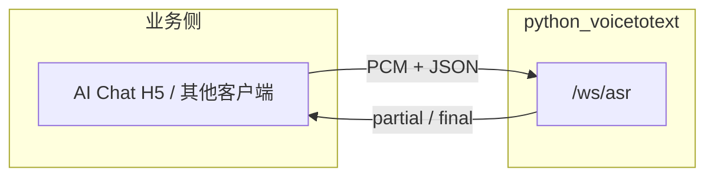

# AI Chat 集成与内网部署说明

本文档汇总 **第三方系统（含手机浏览器 H5 AI Chat）** 调用本语音识别服务时的架构选择、协议要点、语言配置、HTTPS 与内网 HTTP 限制。自带 `web/` 演示页 **可不使用**。

技术协议细节见 [`WebSocket协议.md`](WebSocket协议.md)；安装与证书见 [`README.md`](../README.md)。

---

## 一、服务定位

| 项目 | 说明 |
|------|------|
| 角色 | 独立 **实时语音转文字** 网关（SenseVoice / 可选 Runtime 侧车） |
| 对外接口 | `WS /ws/asr`（实时）、`GET /health`、`GET /ready`、`POST /api/transcribe`（WAV 批处理） |
| 自带页面 | `GET /` 仅演示；**生产可只用 API，不暴露给用户** |
| 典型用法 | 业务系统（AI Chat、门户 H5）内嵌话筒 → 实时字幕写入输入框 → 用户再点发送调大模型 |



---

## 二、语言配置 vs 模型下载

### 2.1 安装阶段不下载语音模型

`pip install -r requirements.txt` 只安装 **Python 依赖**（funasr、fastapi 等），**不会**下载中文/日文模型包。

### 2.2 首次启动服务时下载模型

```text
python scripts/run_server.py
```

出现 `Preloading ASR models` 时，按 `config.yaml` 的 **`asr_model`** 从 ModelScope 拉取权重（默认 `iic/SenseVoiceSmall`，约 1.5～2GB，缓存通常在 `%USERPROFILE%\.cache\modelscope\`）。

### 2.3 `language` 不是单独安装的模型

| 配置项 | 含义 |
|--------|------|
| `asr_model: iic/SenseVoiceSmall` | **一个**多语种模型（中/粤/英/日/韩等） |
| `language: ja` / `zh` / `auto` | 推理 **参数**，偏置识别语种，**不是**再下一个语言包 |

**切换语种（默认 SenseVoice）：**

1. 修改 `config.yaml` 中 `language`（如 `ja` → `zh` 或 `auto`）
2. **保存后重启** `python scripts/run_server.py`
3. 一般 **无需** 重新下载模型（仍是同一个 `SenseVoiceSmall`）

**会触发另下模型的情况：** 修改 `asr_model`，或 `asr_backend` 改为 `paraformer` / `runtime`（另一套机制）。

### 2.4 指定语种 vs 自动识别

| 方式 | 适用 | 说明 |
|------|------|------|
| **指定** `ja` / `zh` | 现场主说一种语言（企业生产日语） | 更稳，少误判语种；推荐默认 `ja` |
| **`auto`** | 中英日等混说、语种不固定 | SenseVoice 支持；短窗实时场景建议实测；改 yaml + 重启 |

本服务 **全局** 使用同一 `language`，WebSocket `start` **不传**  per-session 语言（若以后要按连接切换需改代码）。

---

## 三、AI Chat 交互（话筒 → 输入框 → 结束）

### 3.1 目标交互

1. Chat 页加 **话筒** 按钮，点击开始说话  
2. 说话过程中，识别结果 **实时显示在 HTML 输入框**（字幕效果）  
3. 点击 **结束说话**，停止采音并关闭本轮会话  
4. 用户编辑（可选）后，用现有 **发送** 按钮把文字交给 AI（**不要**每个 `partial` 都请求大模型）

### 3.2 与协议的对应关系

| 用户操作 | 客户端 | 服务端消息 |
|----------|--------|------------|
| 点话筒 | `getUserMedia` → 连接 `wss://.../ws/asr` → 发 `start` | — |
| 正在说 | 每 600ms 发二进制 PCM **19200 字节** | `type: partial` |
| 更新输入框 | `input.value = msg.text`（或 partial 覆盖、final 定稿） | `text` 字段 |
| 点结束 | 发 `end` → 停录音 → `close` WebSocket | `type: final`（**唯一业务定稿**，须等本条再提交大模型） |

### 3.3 `start` / `end` 示例

```json
{ "type": "start", "wav_name": "ai_chat_mic", "audio_fs": 16000, "wav_format": "pcm", "chunk_size": [0, 10, 5] }
```

企业鉴权开启时增加：`"api_key": "<与 config 一致>"`（或由登录态下发，勿写死在公开前端仓库）。

```json
{ "type": "end", "is_speaking": false }
```

### 3.4 音频格式（必须）

- PCM **s16le**，单声道，**16000 Hz**
- 每块 **19200 字节**（9600 样本 × 2），约 **600 ms**
- 须在 `start` **之后**发送；不足一块在客户端缓冲，勿发半块

### 3.5 前端状态机（示意）

```text
空闲 --点话筒--> 录音中 --partial--> 刷新输入框
录音中 --点结束--> 发 end --final--> 定稿 --关 WS--> 空闲
```

### 3.6 体验预期

- **首段 partial 延迟**：默认 `stream_window_ms: 2000`，约 **2～5 秒** 才可能有首字；UI 建议显示「正在识别…」
- **一条 growing 字幕**：同一轮 `start`～`end` 内，`partial.text` 为 **会话累计草稿**（非每 2 秒覆盖）；点结束后 `final` 为 **整段定稿**
- **partial vs final**：`partial.text` 仅为预览草稿；**停止/end 后的 `final.text` 为权威提交内容**（可能与 partial 措辞略有不同）
- **标点**：流式 `partial` 关闭窗级 ITN；**停止时**对会话缓冲整段 PCM `use_itn=True` 重识别，失败则 `ct-punc` 对 draft 兜底
- **时长上限**：默认单次录音 **600 秒**（`session_pcm_max_seconds`），超限服务端 `error` code `session_too_long`
- **静音/噪声**：整窗能量低于 `vad_energy_threshold`（默认 `0.02`）不推理；纯标点等由 `min_partial_chars` 过滤
- **静音判句**：默认 `auto_finalize_on_silence: false`，**仅** `end`/停止时发 `final`；停顿不会拆成多条
- **并发**：多连接共享 **串行推理**（`inference_lock`），用户多时可能排队；`max_ws_connections` 默认 20

### 3.7 参考实现

逻辑与 [`web/app.js`](../web/app.js) 相同（重采样、`ScriptProcessorNode`/ `AudioWorklet`、块大小）。业务 H5 **可复制协议**，不必引用演示页 UI。

---

## 四、部署形态对照

### 4.1 独立服务 + 其他系统调用

| 问题 | 答案 |
|------|------|
| 能否单独部署，仅供 AI Chat 调用？ | **可以** |
| 是否必须用本项目 `/` 页面？ | **否** |
| 实时字幕是否在调用方页面展示？ | **是**，调用方根据 `partial`/`final` 写输入框 |
| 批处理 | `POST /api/transcribe`（WAV），非实时话筒场景 |

### 4.2 内网 HTTP（`http://` + `ws://`）

| 客户端类型 | 连 ASR (`ws://内网IP:8765/ws/asr`) | 浏览器麦克风 |
|------------|-------------------------------------|--------------|
| 原生 App / 后端推 PCM | 通常 **可以** | 与浏览器无关 |
| **手机浏览器 H5**（`http://192.168.x.x`） | WS 可能通 | **基本不可用**（非安全上下文） |
| PC 浏览器 `http://内网IP` | 可能通 | 越来越严，**不可依赖** |

**结论：** 内网 **HTTP 跑 ASR 服务** 可以；**手机浏览器 Chat 页** 要在页内采音，**不能**长期依赖 `http://内网IP`，需 **HTTPS + WSS**（或 mkcert / 内网 CA，手机信任根证书，见 README 步骤 12）。

### 4.3 手机浏览器 H5 + 同一 WiFi（推荐拓扑）

```text
手机 Safari/Chrome
  https://<内网>/ai-chat          ← 登录系统 + Chat（HTTPS）
       │
       └── wss://<内网>/ws/asr   ← 建议反代到 ASR:8765，或 ASR 自身配同套证书
```

**避免：**

- Chat 为 `http://内网IP` → 话筒常失败  
- Chat 为 `https`、ASR 为 `ws://` 明文 → 混合内容，易被拦截  

**服务端 HTTP 配置：** `ssl_certfile` / `ssl_keyfile` 置空即用 HTTP；要给手机 H5 开麦，应对 **用户可见的 Chat 域名** 配 HTTPS，ASR 可用 **Nginx 反代** `wss` → 后端 `8765`。

### 4.4 鉴权（`config.enterprise.yaml`）

- `api_key` 非空时：WebSocket `start` 带 `api_key`，或握手 Header `X-API-Key`
- 批处理：`POST /api/transcribe` 带 Header `X-API-Key`
- 内网 HTTP 下密钥 **明文传输**，需评估；建议登录后由业务后端下发短期密钥，避免写死在前端

### 4.5 探活

| 端点 | 用途 |
|------|------|
| `GET /health` | 进程存活 |
| `GET /ready` | 模型已加载（SenseVoice）或 Runtime 可达；**503** 时不要开话筒 |

---

## 五、集成检查清单

### 5.1 服务端（内网）

- [ ] `host: 0.0.0.0`，防火墙放行 **8765**（Runtime 另放行 **10095**）
- [ ] 首次启动模型下载完成，`/ready` 返回 **200**
- [ ] `language` / `asr_backend` 与业务一致（默认 `sensevoice` + `ja`）
- [ ] 企业环境已改 `api_key` 并告知前端

### 5.2 手机浏览器 H5（AI Chat）

- [ ] Chat 访问地址为 **`https://`**（手机已信任内网 CA）
- [ ] WebSocket 为 **`wss://`**，路径 `/ws/asr` 可连
- [ ] 话筒 → `start` → PCM 块 **19200 字节** → `partial` 更新输入框
- [ ] 结束 → `end` → 收 `final` → 关闭 WS、释放音频
- [ ] 仅 **发送按钮** 触发 AI 对话，不在每个 `partial` 调 LLM
- [ ] UI 提示约 2s 级识别延迟

### 5.3 原生 App（若后续改为原生采音）

- [ ] 可用 `ws://` + 内网 HTTP（配置 Android 明文 / iOS ATS 例外）
- [ ] 协议与上一致，无需本项目 `web/`

---

## 六、常见问题

| 现象 | 原因 / 处理 |
|------|-------------|
| 手机点话筒无反应 / `getUserMedia` 报错 | Chat 为 **HTTP 内网 IP**；改为 **HTTPS** |
| WS 连上无字 | 未 `start`、块大小不对、或 `/ready` 仍为 503 |
| 有连接无 partial | 未满约 2s 窗口；或能量低于 `vad_energy_threshold` |
| partial 闪、只剩 `.` | 已会话累计+过滤标点；可调高 `vad_energy_threshold` |
| `unauthorized` | 企业 `api_key` 未在 `start` 或 Header 传入 |
| 改 `language` 无效 | 需 **重启服务**；非另装语言包 |
| 想中日混说 | 试 `language: auto` 并实测；或分会话/分服务指定 `zh`/`ja` |

---

## 七、相关文档

| 文档 | 内容 |
|------|------|
| [`WebSocket协议.md`](WebSocket协议.md) | 消息格式、Runtime 映射、`api_key` |
| [`企业日语生产方案.md`](企业日语生产方案.md) | 两阶段 sensevoice / runtime |
| [`平台兼容性.md`](平台兼容性.md) | 浏览器与 HTTPS |
| [`README.md`](../README.md) | 安装、mkcert、启动手顺 |

---

## 八、修订记录

| 日期 | 说明 |
|------|------|
| 2026-06-04 | 初版：汇总 AI Chat H5 集成、语言配置、内网 HTTP/HTTPS、独立服务调用 |
| 2026-06-04 | 流式：会话 draft 累计、能量门控、标点过滤、整段 finalize |
