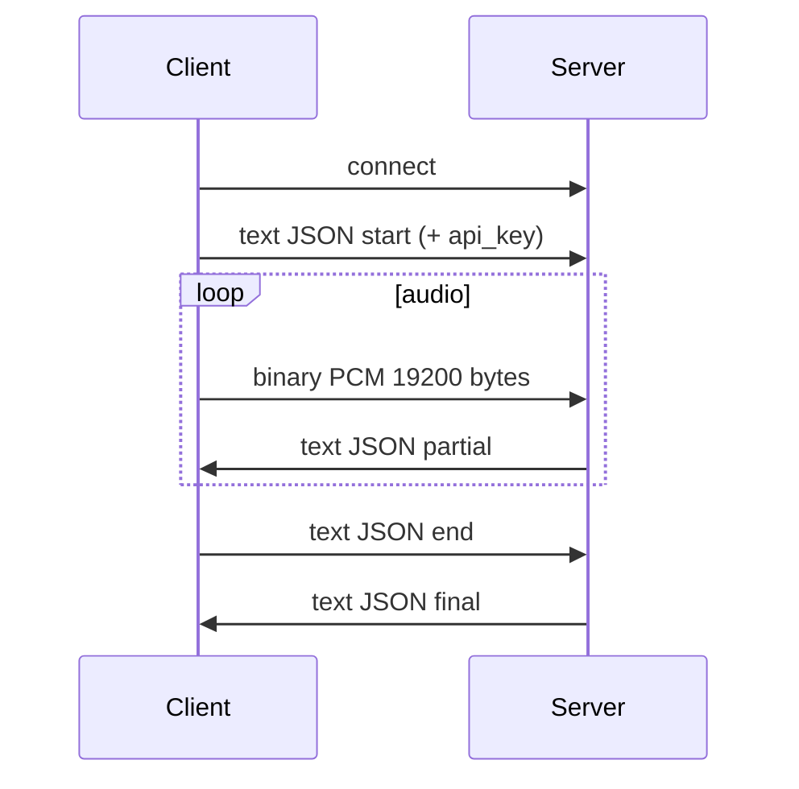

# WebSocket 协议

## 端点

- URL：`ws://<host>:<port>/ws/asr` 或 `wss://`（HTTPS 部署）
- 鉴权（`api_key` 非空时）：`start` 消息字段 `api_key`，或握手 Header `X-API-Key`

## 时序



## 客户端 → 服务端

### 1. 握手（首条文本帧）

```json
{
  "type": "start",
  "wav_name": "web_mic",
  "audio_fs": 16000,
  "wav_format": "pcm",
  "chunk_size": [0, 10, 5],
  "itn": false,
  "api_key": "optional-when-auth-enabled"
}
```

浏览器可从 URL 查询参数注入：`https://host:8765/?key=<api_key>`（`web/app.js` 写入 `start.api_key`）。

### 2. 音频（二进制帧）

- PCM **s16le**，16 kHz，单声道
- **19200 字节** / 块（600 ms）
- 须在 `start` 之后发送

### 3. 结束

```json
{ "type": "end", "is_speaking": false }
```

## 服务端 → 客户端

### partial

```json
{
  "type": "partial",
  "mode": "online",
  "text": "…",
  "is_final": false
}
```

### final

```json
{
  "type": "final",
  "mode": "offline_punc",
  "text": "…",
  "is_final": true
}
```

### error（鉴权失败等）

```json
{
  "type": "error",
  "code": "unauthorized",
  "message": "Invalid or missing API key"
}
```

收到 `error` 后连接关闭。

### session_too_long（SenseVoice 模式）

单次会话累积 PCM 超过 `session_pcm_max_seconds`（默认 600）：

```json
{
  "type": "error",
  "code": "session_too_long",
  "message": "Recording exceeds 600s limit"
}
```

客户端应提示用户分段录制。

## Runtime 模式映射（`asr_backend=runtime`）

网关转发至 FunASR Runtime 2pass，将 Runtime 消息映射为上述客户端格式：

| Runtime `mode` | 网关 `type` |
|----------------|-------------|
| `2pass-online` | `partial` |
| `2pass-offline` | `final` |

客户端无需感知 Runtime；块大小与 `start` 格式不变。

## 连接限制

超过 `max_ws_connections`（默认 20）时返回 `error`：`too_many_connections`。
