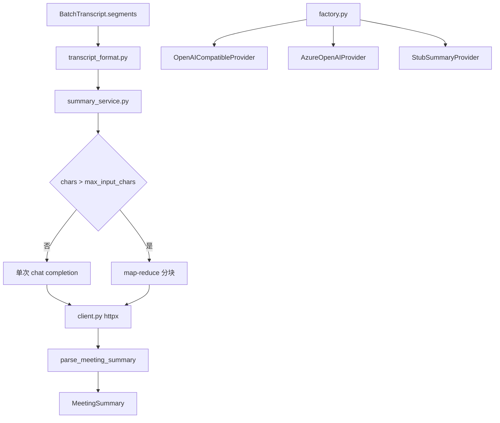

# LLM 会议纪要方案

## 背景

离线批处理已具备 Diar-First 转写（说话人分离 + 时间戳 + JSON/MD/SRT 导出）。此前 `summary` 字段固定为 `null`，`POST /api/v1/summarize` 返回 501。企业需要转写完成后自动生成可检索的会议纪要。

## 实施目的

1. 转写完成后自动调用 DashScope（Qwen OpenAI 兼容）生成结构化会议纪要。
2. 提供独立 `POST /api/v1/summarize` 接口，支持对已有 transcript 重新生成纪要。
3. 产物落盘：`{job_id}.json` 的 `summary` 非 null；额外生成 `{job_id}.summary.md`。
4. 长会议通过 map-reduce 分块摘要处理。
5. LLM 失败时默认不阻断转写（`on_failure: warn`），同时支持 `on_failure: fail` 严格模式。

## 架构



## 配置说明

`config.yaml` 的 `llm` 段（API 密钥写在 `llm.api_key`）：

| 字段 | 说明 |
|------|------|
| `enabled` | 是否启用 LLM 纪要 |
| `api_url` | DashScope 兼容端点 |
| `model` | 模型名（如 `qwen-plus`） |
| `api_key` | DashScope API Key |
| `temperature` | 采样温度 0~2 |
| `max_tokens` | 输出 token 上限 |
| `timeout` | HTTP 超时秒数 |
| `max_input_chars` | 单次送入字符上限 |
| `chunk_chars` | map-reduce 分块大小 |
| `retry_max` / `retry_backoff_sec` | 重试策略 |
| `on_failure` | `warn`（默认）或 `fail` |
| `output_summary_md` | 是否写 `{job_id}.summary.md` |
| `deployment` / `api_version` | Azure OpenAI 专用 |

`provider` 推断：`deployment` 非空 → `azure`；`api_url` 非空且 enabled → `openai_compatible`；`enabled: false` → `stub`。

环境变量 `DASHSCOPE_API_KEY` 可运行时覆盖 config 中的 key。

## Prompt 约束

- 系统 Prompt 要求 LLM 仅输出合法 JSON，不得编造 transcript 中未出现的事实。
- `action_items.owner` 只能使用 `SPEAKER_xx` 或「待定」/「未定」。
- 支持 `ja` / `zh` 两种语言模板。
- JSON 解析失败时触发 repair 二次调用。

## map-reduce

当 transcript 字符数超过 `max_input_chars` 时：

1. **Map**：按 `chunk_chars` 在段边界切分，每块生成局部摘要 JSON。
2. **Reduce**：合并所有局部 JSON，再调一次 LLM 生成最终 `MeetingSummary`。

## 失败策略

| `on_failure` | 行为 |
|--------------|------|
| `warn` | 转写正常完成；`summary=null`；`meta.llm.status=error` |
| `fail` | 整个 job 失败，不写出产物 |

## 输出 Schema

```json
{
  "summary": {
    "title": "会议标题",
    "overview": "概要",
    "topics": [{"subject": "", "discussion": "", "conclusion": ""}],
    "decisions": ["..."],
    "action_items": [{"owner": "SPEAKER_01", "task": "", "due": ""}],
    "open_questions": ["..."],
    "markdown": "## 概要\n..."
  },
  "meta": {
    "llm": {
      "enabled": true,
      "provider": "openai_compatible",
      "model": "qwen-plus",
      "status": "ok",
      "latency_ms": 3200,
      "chunks": 1
    }
  }
}
```

## CLI / HTTP

```powershell
# 默认跟随 llm.enabled 自动生成纪要
python scripts/run_batch.py meeting.wav -o out/

# 跳过 LLM
python scripts/run_batch.py meeting.wav -o out/ --no-summary
```

```http
POST /api/v1/summarize
{"job_id": "...", "segments": [...]}
```

或仅传 `job_id`，从 `out/` 或 `out/jobs/` 读取 `{job_id}.json`。
