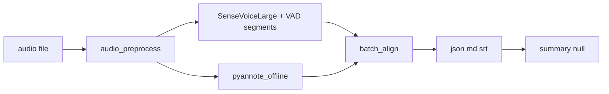

# 批处理架构与数据流



## 模块映射

| 模块 | 路径 |
|------|------|
| 预处理 | `src/voicetotext/asr/audio_preprocess.py` |
| VAD 分段 | `src/voicetotext/asr/funasr_vad.py` |
| ASR | `src/voicetotext/asr/sensevoice_funasr_engine.py` |
| 整文件 diar | `src/voicetotext/asr/pyannote_offline.py` |
| 对齐 | `src/voicetotext/asr/batch_align.py` |
| 编排 | `src/voicetotext/asr/batch_pipeline.py` |
| HTTP | `src/voicetotext/server/batch_app.py` |
| CLI | `scripts/run_batch.py` |
| LLM 占位 | `src/voicetotext/llm/summary.py` |

## 输出 Schema（BatchTranscript）

```json
{
  "job_id": "uuid",
  "language": "ja",
  "duration_ms": 3600000,
  "segments": [
    {"start_ms": 1230, "end_ms": 4500, "speaker_id": "SPEAKER_00", "text": "..."}
  ],
  "meta": {"asr_model": "iic/SenseVoiceLarge", "diarization": "community-1"},
  "summary": null
}
```
