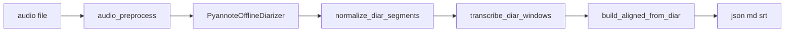

# 说话人分离改进方案（Diar-First）

## 背景

批处理原采用 **VAD-first + 后对齐** 架构：

1. FSMN-VAD 按语音活动切段（最长 30 秒硬切）
2. SenseVoice 对每段转写
3. Pyannote 整文件说话人分离
4. `align_batch_segments()` 按时间重叠给 ASR 段贴一个说话人

实测 `20260506_001.m4a`（约 101 秒）仅产出 **13 段**，其中一段长达 30 秒，混有提问方与回答方多轮对话，却整段标为同一说话人。根因是 **ASR 段粒度远粗于说话人切换粒度**，对齐只能「整段选一个重叠最多的说话人」。

## 实施目的

1. 导出 segment 的时间边界来源于 Pyannote 说话人段（经规范化）
2. `speaker_id` 直接来自 diar 标签，消除长段最大重叠与 `last_speaker_id` 连锁错误
3. 默认约束 2 人会议（`pyannote_min/max_speakers: 2`）
4. 保持 CLI / HTTP / 导出 Schema 不变

## 方案内容

**Diar-First** 完全替换 VAD-first 批处理路径：

### 处理步骤

| 步骤 | 模块 | 行为 |
|------|------|------|
| 1 | `pyannote_offline.py` | 整文件 diarization |
| 2 | `batch_diar_segments.py` | 排序 → 合并相邻同说话人 → 吸收极短段 → 切分超长段 |
| 3 | `batch_transcribe.py` | 每个 diar 窗口并行 ASR，丢弃空文本 |
| 4 | `batch_align.py` | `build_aligned_from_diar()` 直接映射 `SPEAKER_XX` |
| 5 | `batch_pipeline.py` | 导出 json/md/srt，`meta.pipeline = "diar_first"` |

### 错误处理

- diar 结果为空 → 抛出 `DiarizationEmptyError`，不静默回退
- ASR 空白窗口 → 跳过，不写入 segments

## 配置说明

`config.yaml` 新增/变更字段：

| 字段 | 默认值 | 说明 |
|------|--------|------|
| `pyannote_min_speakers` | `2` | 最少说话人数 |
| `pyannote_max_speakers` | `2` | 最多说话人数 |
| `batch_diar_merge_gap_ms` | `500` | 同说话人相邻段间隙 ≤ 此值则合并 |
| `batch_diar_min_segment_ms` | `300` | 短于此的 diar 段并入邻段 |
| `batch_max_segment_ms` | `30000` | 单条 diar 段最大时长（超长按边界切分，说话人不变） |
| `batch_asr_parallel_workers` | `4` | diar 窗口 ASR 线程池大小 |

非 2 人场景须在 `config.yaml` 手动调整 `pyannote_min_speakers` / `pyannote_max_speakers`。

## 验收标准

### 自动化

- `pytest tests/ -q` 全部通过（含 `test_batch_diar_segments`、`test_batch_transcribe`、`test_regression_acceptance`）

### 功能（`20260506_001.m4a`）

| ID | 要求 |
|----|------|
| A1 | segments 数量 > 13 |
| A2 | 不存在 ≥25s 且同时含「でしょうか」与「完了しました」的单段 |
| A3 | 问日程后「はい」不得与提问者同一说话人 |
| A4 | 结尾「こちらこそ…」不得与前面连续 4 段同为 SPEAKER_00 |
| A5 | 输出 Schema 不变 |
| A6 | `meta.pipeline == "diar_first"` |

验收检查逻辑见 `tests/test_regression_acceptance.py`。
