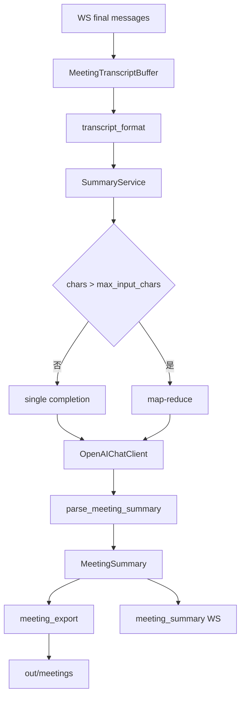

# 会议实时转写 LLM 会议纪要方案

## 背景

会议 v3 已具备 WebSocket v2 实时字幕（partial/final + `speaker_id`）、SenseVoice + FSMN-VAD + Pyannote。用户需要在会议结束后自动生成结构化纪要，而非会中调用 LLM（单次纪要约 30s，会破坏实时 SLA）。

## 目的

1. `llm.enabled: true` 时，会议结束后异步生成结构化会议纪要（title/overview/topics/decisions/action_items/open_questions/markdown）。
2. 服务端在整场会议中累积 `final` 段，不依赖前端回传。
3. 客户端发 `end` 后 WebSocket **保持连接**，服务端推送 `summary_progress` → `meeting_summary`，再关闭。
4. 落盘 `out/meetings/{session_id}.json` + `{session_id}.summary.md`。
5. 提供 `POST /api/v1/meeting/summarize` 与 `GET /api/v1/meeting/sessions/{session_id}` 供重试与集成。
6. 长会话通过 map-reduce 分块处理（`max_input_chars` / `chunk_chars`）。

## 架构



## 配置

主开关：`config.meeting.yaml` → `llm.enabled`（非命令行）。

```yaml
llm:
  enabled: true
  api_url: "https://dashscope.aliyuncs.com/compatible-mode/v1"
  model: "qwen-plus"
  api_key: "sk-..."          # 写在 yaml 内
  temperature: 0.3
  max_tokens: 8096
  timeout: 120
  max_input_chars: 120000
  chunk_chars: 30000
  retry_max: 2
  retry_backoff_sec: 2
  on_failure: warn           # 或 fail
  output_summary_md: true
  meeting_output_dir: "out/meetings"
  meeting_ws_wait_sec: 180
```

启动时 `scripts/run_meeting.py` 在 `llm.enabled=true` 时校验 `require_llm_api_key()`。

## WebSocket 协议扩展（v2 向后兼容）

### 客户端 `end` 扩展

```json
{"type":"end","is_speaking":false,"skip_summary":false}
```

`skip_summary: true` 跳过纪要生成。

### 服务端新增消息

- `summary_progress`：`{"type":"summary_progress","protocol_version":2,"stage":"generating"}`
- `meeting_summary` 成功：`status=ok` + `summary` 对象 + `meta` + `files`
- `meeting_summary` 失败：`status=error` + `error`，`summary=null`

旧客户端忽略未知 type，字幕功能不受影响。

## HTTP API

| 端点 | 行为 |
|------|------|
| `POST /api/v1/meeting/summarize` | 传 `segments` 或 `session_id`（读磁盘 json） |
| `GET /api/v1/meeting/sessions/{session_id}` | 返回已落盘 transcript+summary |
| `GET /ready` | `detail.llm` 含 `{enabled, ready, provider, model}` |

鉴权：`X-API-Key` + meeting scope。

## 失败策略

| `on_failure` | 行为 |
|--------------|------|
| `warn`（默认） | 字幕正常；`meeting_summary.status=error`；json 中 `summary=null` |
| `fail` | `end` 阶段返回 `server_error`，不落 summary |

## 安全

- 日志与错误响应不输出 `api_key` 或完整 transcript（仅记 char 数、session_id、latency）。
- 导出产物中不出现 api_key。

## 不变项

- 会中 partial/final 时序不变（会中绝不调用 LLM）。
- PCM 19200 字节、FSMN+SenseVoice+Pyannote、HF token 走 secrets。
