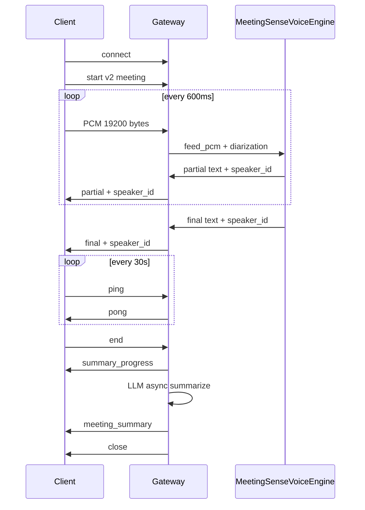

# WebSocket 协议 v2（多人会议）

## 端点

- URL：`wss://<host>:8766/ws/meeting/asr`（或 Apache 反代到同路径）
- 页面演示：`https://<host>:8766/meeting?key=<api_key>`
- 鉴权：`api_key` 须具备 **meeting** scope（见 `config.meeting.yaml`）

## 时序



后端 v3：`MeetingSenseVoiceEngine`（FSMN-VAD + SenseVoice + Pyannote），进程内推理，无独立 Runtime 容器。

## 客户端 → 服务端

### start（首条文本帧）

```json
{
  "type": "start",
  "protocol_version": 2,
  "mode": "meeting",
  "language": "ja",
  "wav_name": "room_001",
  "audio_fs": 16000,
  "wav_format": "pcm",
  "max_speakers": 8,
  "itn": true,
  "api_key": "...",
  "session_id": "uuid"
}
```

### 音频

- PCM s16le，16 kHz，mono
- **19200 字节/块**（600 ms）

### ping

```json
{ "type": "ping" }
```

### end

```json
{ "type": "end", "is_speaking": false, "skip_summary": false }
```

- `skip_summary: true` 时跳过会后纪要（不调 LLM、不落 summary.md）。
- 发 `end` 后客户端应保持连接，直至收到 `meeting_summary` 或服务端关闭（最长 `llm.meeting_ws_wait_sec`）。

## 服务端 → 客户端

### partial

```json
{
  "type": "partial",
  "protocol_version": 2,
  "seg_id": "a1b2c3d4e5f6",
  "speaker_id": 1,
  "text": "今日は",
  "t_start_ms": 120400,
  "mode": "online",
  "is_final": false
}
```

### final

```json
{
  "type": "final",
  "protocol_version": 2,
  "seg_id": "a1b2c3d4e5f6",
  "speaker_id": 1,
  "text": "今日は会議を始めます。",
  "t_start_ms": 120400,
  "t_end_ms": 125800,
  "mode": "offline_punc",
  "is_final": true
}
```

### speaker_change

```json
{
  "type": "speaker_change",
  "protocol_version": 2,
  "speaker_id": 2,
  "t_ms": 125800
}
```

### session_ready（start 成功后）

```json
{ "type": "session_ready", "protocol_version": 2, "message": "ok" }
```

客户端收到后再进入「字幕認識中」并开麦。

### pong

```json
{ "type": "pong", "protocol_version": 2 }
```

### summary_progress（`llm.enabled=true` 且未 skip）

```json
{ "type": "summary_progress", "protocol_version": 2, "stage": "generating" }
```

### meeting_summary（成功）

```json
{
  "type": "meeting_summary",
  "protocol_version": 2,
  "status": "ok",
  "session_id": "uuid",
  "summary": {
    "title": "",
    "overview": "",
    "topics": [{"subject":"","discussion":"","conclusion":""}],
    "decisions": [],
    "action_items": [{"owner":"","task":"","due":""}],
    "open_questions": [],
    "markdown": "## 概要\n..."
  },
  "meta": { "provider": "openai_compatible", "model": "qwen-plus" },
  "files": { "json": "out/meetings/uuid.json", "summary_md": "out/meetings/uuid.summary.md" }
}
```

### meeting_summary（失败，`on_failure=warn`）

```json
{
  "type": "meeting_summary",
  "protocol_version": 2,
  "status": "error",
  "session_id": "uuid",
  "error": "summary_failed",
  "summary": null,
  "files": { "json": "out/meetings/uuid.json" }
}
```

## 错误码

| code | 关闭连接 | 说明 |
|------|----------|------|
| unauthorized | 是 | API Key 无效或缺少 meeting scope |
| too_many_connections | 是 | 超过 max_ws_connections |
| invalid_json | 是 | JSON 非法 |
| not_started | 否* | 未 start 即发 PCM |
| invalid_chunk | 否* | 非 19200 字节 |
| protocol_mismatch | 是 | version≠2 或 mode≠meeting |
| runtime_unavailable | 是 | Runtime 10096 不可达 |
| runtime_error | 是 | Runtime 通信失败 |
| session_too_long | 是 | 超过 meeting_session_max_seconds |
| unsupported_language | 是 | 非 ja/zh/auto |
| unknown_type | 是 | 未知 type |
| server_error | 是 | 未捕获异常 |

\*实现中对部分非致命错误发送 error 后继续；协议类/鉴权类必关闭。

## 与 v1 单人协议差异

| 项 | v1 `/ws/asr` | v2 `/ws/meeting/asr` |
|----|--------------|----------------------|
| protocol_version | 无 | 必须为 2 |
| speaker_id | 无 | 有 |
| seg_id | 无 | 有 |
| draft 字段 | 有 | 无（字幕按 seg 更新） |
| ping/pong | 无 | 必须（30s） |
