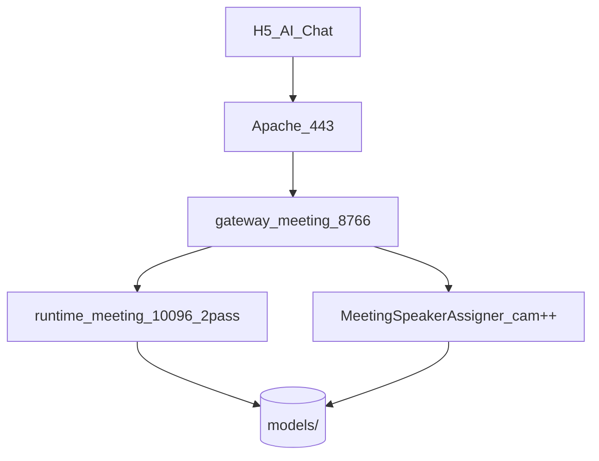

# 多人会议 ASR — 方案与背景

## 背景

- 单人服务已实现：`/ws/asr`、SenseVoice / Runtime 2pass，见 [企业公开发布实施方案.md](../企业公开发布实施方案.md)。
- 业务需要：**单麦、多人日语对话、实时字幕**，与单人「按住说话定稿」不同。
- 部署：Apache 双 upstream（8765 单人 / 8766 多人），模型共用 `models/` 目录。

## 实施目的

1. 对外提供 `/ws/meeting/asr` 协议 v2（`speaker_id`、`seg_id`、时间戳）。
2. 运行隔离：独立端口、独立 Runtime 容器、独立 `config.meeting.yaml`。
3. 企业基线：API Key `meeting` scope、完整错误码、pytest、UAT 文档。

## 达到要求

见 [验收清单.md](./验收清单.md) 与计划第三节；全部项必须勾选方可合并 main。

## 架构

## 与单人服务对比

| 项 | 单人 | 多人会议 |
|----|------|----------|
| 端点 | `/ws/asr` | `/ws/meeting/asr` |
| 协议 | v1 | v2 |
| 端口 | 8765 | 8766 |
| Runtime | 10095 | 10096 |
| PCM 整段缓冲 | SenseVoice 有 | **禁止** |
| 说话人 | 无 | `speaker_id` |

技术细节见 [FunASR运行时调研.md](./FunASR运行时调研.md)。
