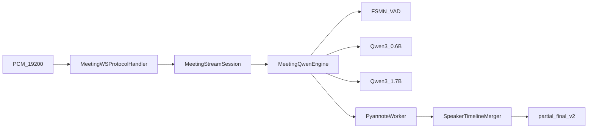

# 多人会议架构与数据流（v2）

## 组件

| 组件 | 端口 | 配置 |
|------|------|------|
| voicetotext-meeting | 8766 | `config.meeting.yaml` |
| Apache（将来） | 443 | 反代 HTTPS / WSS |

## 数据流

## 代码映射

| 职责 | 文件 |
|------|------|
| WS v2 | `src/voicetotext/server/meeting_ws_protocol.py` |
| 会话 | `src/voicetotext/asr/meeting_stream_session.py` |
| 引擎 | `src/voicetotext/asr/meeting_qwen_engine.py` |
| VAD | `src/voicetotext/asr/funasr_vad.py` |
| ASR | `src/voicetotext/asr/qwen_funasr_engine.py` |
| 说话人 | `src/voicetotext/asr/pyannote_worker.py` + `speaker_timeline.py` |
| 应用 | `src/voicetotext/server/meeting_app.py` |
| 路由 | `/ws/meeting/asr` |

## 设备切换

本地 Windows：`device: cpu`。服务器：`device: cuda`。**同一套 Python 代码**，无分支双实现。
