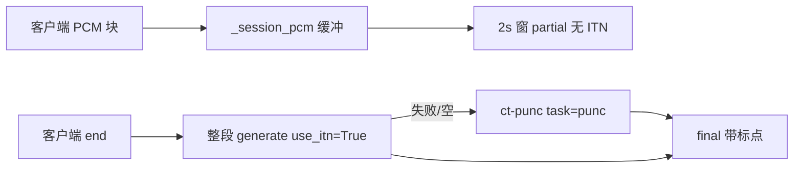

# 企业公开发布 ASR 定稿实施方案（实施总结）

## 一、背景

公开发布场景：**手机浏览器 H5 AI Chat**（内网 HTTPS）调用独立语音服务；`partial` 仅预览，`final` 为唯一业务提交。阶段一 SenseVoice 在流式关闭窗级 ITN 后，停止时若仅对 draft 做 `rich_transcription_postprocess`，**仍无标点**。本实施按「方案 B」补齐：**会话整段 PCM 重识别（`use_itn=True`）+ `ct-punc` 强制兜底**。

## 二、目的与结果

| 目的 | 实施结果 |
|------|----------|
| 定稿准确度 | `finalize` 对 `_session_pcm` 调用 `SenseVoiceEngine.finalize_utterance`；失败则 `PuncRestorer`（`ct-punc`） |
| 流式可用 | `partial` 仍无窗级 ITN + `merge_utterance_segments`；`auto_finalize_on_silence: false` |
| 可运维上限 | `session_pcm_max_seconds` 默认 **600**（10 分钟），超限 `error` code `session_too_long` |
| 契约 | `POST /api/transcribe` 与 WS `final` 同路径（`transcribe_file` → `finalize_utterance`） |
| 测试 | **41 passed**（含 PCM 上限、整段 mock、ct-punc mock） |

## 三、方案 B + 兜底（数据流）



## 四、已有 vs 新增代码

| 类型 | 路径 | 说明 |
|------|------|------|
| 已有 | `stream_session.py` draft 累计 | 扩展 `_session_pcm`、`session_too_long` |
| 已有 | `sensevoice_engine.py` 窗级识别 | 新增 `transcribe_utterance`、`finalize_utterance` |
| 已有 | `paraformer_engine.py` `task=punc` | 逻辑抽到共用模块 |
| **新增** | `asr/punc_restorer.py` | 懒加载 `ct-punc`，`restore(text)` |
| 修改 | `config.py` + 全部 yaml | `session_pcm_max_seconds`、`punc_model: ct-punc` |
| 修改 | `asr/base.py` | 协议 `finalize_utterance` |
| 修改 | `ws_protocol.py` | 超限 `session_too_long` |
| 修改 | `web/app.js` | `final` 同步 `partialText`；超长提示 |
| **新增测试** | `test_pcm_buffer`（合入 `test_stream_session`）、`test_finalize_utterance.py`、`test_punc_restorer.py` | mock 覆盖 |

## 五、配置（运维）

```yaml
session_pcm_max_seconds: 600   # 单次 WS 会话 PCM 上限，可改
punc_model: "ct-punc"          # 定稿兜底，与 SenseVoice 主模型独立懒加载
auto_finalize_on_silence: false
```

- 内存：每连接最多约 `session_pcm_max_seconds × 16kHz × 2` 字节（600s ≈ **19MB**）
- 延迟：停止后增加整段推理 1～N 秒（CPU 更明显）
- 隐私：会话 `finalize` / `reset` 后丢弃 PCM，不落盘

## 六、UAT 勾选（需本机实测）

### 阶段一 SenseVoice

| # | 项 | 结果 |
|---|-----|------|
| 1 | 连续说 1～3 分钟，停止后 `final` **有标点** | 待实测 |
| 2 | 识别中 `partial` **无句中乱句号** | 待实测 |
| 3 | 超过 `session_pcm_max_seconds` 返回 `session_too_long` | 待实测（可将 yaml 改为 5s 快速验） |

### 阶段二 Runtime

| # | 项 | 结果 |
|---|-----|------|
| 1 | `config.runtime.yaml` + Docker 2pass，`final` 带标点 | 待实测 |
| 2 | PC/手机 HTTPS 日语或中文 | 待实测 |

## 七、实施 Todo（e1–e11）

| ID | 内容 | 状态 |
|----|------|------|
| e1-config-pcm-cap | `session_pcm_max_seconds` + yaml | 完成 |
| e2-punc-restorer | `punc_restorer.py` + 测试 | 完成 |
| e3-sv-utterance | `transcribe_utterance` / `finalize_utterance` | 完成 |
| e4-asr-protocol | `ASRBackend.finalize_utterance` | 完成 |
| e5-session-pcm | `StreamSession` 缓冲与 finalize | 完成 |
| e6-ws-transcribe | ws 超限；批处理对齐 | 完成 |
| e7-web-final-ui | `app.js` final / error | 完成 |
| e8-pytest-docs | pytest + README/集成 doc | 完成 |
| e9-uat-sensevoice | 阶段一 UAT 表（上） | 待实测 |
| e10-uat-runtime | 阶段二 UAT 表（上） | 待实测 |
| e11-doc-release | 本文档 + 验收清单更新 | 完成 |
