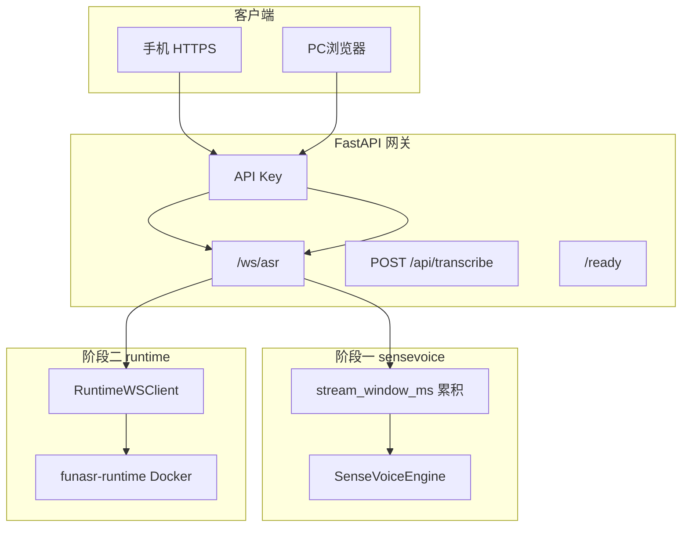

# 企业日语生产方案

## 背景

原 PoC 为中文 `paraformer-zh-streaming` + `ct-punc`，存在 VAD/`chunk_size` 冲突与手机 HTTP 麦克风限制。生产要求：**日语稳定识别**、企业可运维、保留现有 Web `/ws/asr` 协议。

## 目的

| 目标 | 实现 |
|------|------|
| 日语准确 | 默认 `language=ja`，`iic/SenseVoiceSmall` |
| 企业运维 | `/health`、`/ready`、API Key、连接上限、锁定 `funasr==1.3.9` |
| 实时 Web | `web/app.js` 协议不变，600ms PCM 块 |
| 可扩展 | 阶段二 FunASR Runtime 2pass 侧车，`asr_backend=runtime` 切换 |

## 部署拓扑

## 与 PoC 差异

| 项 | PoC | 生产 |
|----|-----|------|
| 语言/模型 | 中文 Paraformer | 日语 SenseVoice |
| 流式 | 600ms chunk 直推模型 | 2s 窗口累积再推理 |
| 标点 | ct-punc | SenseVoice ITN 后处理 |
| 鉴权 | 无 | `api_key` + WS `api_key` / Header |
| 批处理 | 无 | `POST /api/transcribe` WAV |
| 生产 ASR 路径 | 单进程 | 可选 Runtime 侧车 |

## 配置切换

**阶段一（默认）：** `config.yaml` 或 `config.enterprise.yaml`，`asr_backend: sensevoice`。

**阶段二：**

1. `deploy/runtime.env` 配置日语 2pass 模型路径。
2. `docker compose -f deploy/docker-compose.yml up -d funasr-runtime`
3. `python scripts/run_server.py --config config.runtime.yaml`（`asr_backend: runtime`）

网关进程内**不**加载 SenseVoice；`/ready` 探测 Runtime WebSocket 可达性。

## 验收文档

- [`阶段一SenseVoice验收.md`](阶段一SenseVoice验收.md)
- [`阶段二Runtime验收.md`](阶段二Runtime验收.md)
- [`验收清单.md`](验收清单.md)
- [`AI_Chat集成与内网部署.md`](AI_Chat集成与内网部署.md) — 第三方 / 手机 H5 集成、内网 HTTP/HTTPS
