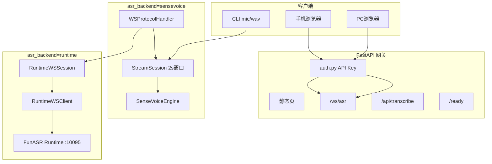
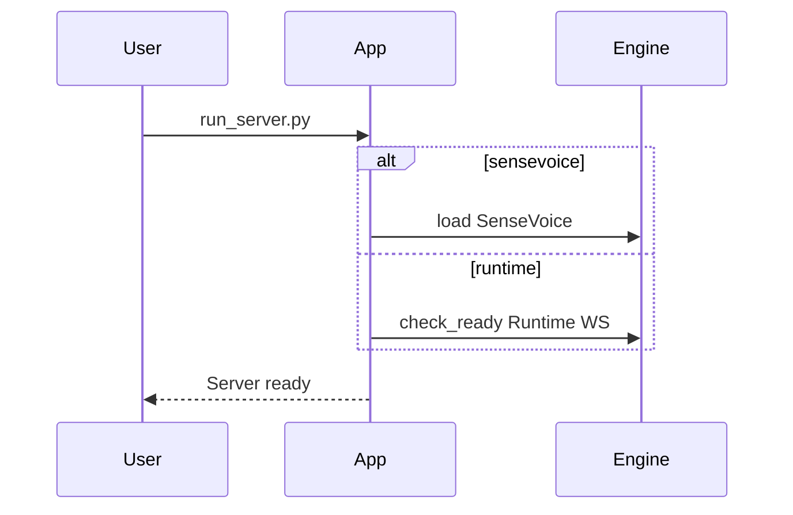

# 架构与数据流

## 系统架构（双模式）

## 模块职责

| 模块 | 路径 | 职责 |
|------|------|------|
| 配置 | `config.py` | 加载 yaml，企业/runtime 字段 |
| ASR 抽象 | `asr/base.py` | `ASRBackend` 协议 |
| 工厂 | `asr/factory.py` | 按 `asr_backend` 构造引擎 |
| SenseVoice | `asr/sensevoice_engine.py` | 日语窗口推理 + ITN 后处理 |
| Runtime 客户端 | `asr/runtime_client.py` | 2pass WebSocket 协议 |
| Runtime 网关引擎 | `asr/runtime_gateway.py` | 就绪探测，无进程内模型 |
| 会话 | `stream_session.py` | 窗口累积、能量 VAD、finalize |
| WS | `server/ws_protocol.py` | 鉴权、SenseVoice/Runtime 分支 |
| HTTP | `server/app.py` | lifespan、/ready、连接上限 |
| 批处理 | `server/routes_transcribe.py` | WAV 上传 |
| 鉴权 | `server/auth.py` | API Key |

## 启动流程

## SenseVoice 数据流

Web 仍发送 600ms（19200 字节）块；`StreamSession` 累积至 `stream_window_ms`（默认 2000ms）后调用 `transcribe_window` → JSON `partial`；静音 `vad_silence_ms` 触发 `finalize` → `final`。

## Runtime 数据流

客户端 PCM 块经 `RuntimeWSSession` 转发至 FunASR Runtime；Runtime 返回 `2pass-online` / `2pass-offline`，映射为网关 `partial` / `final`（与 Web 协议一致）。
